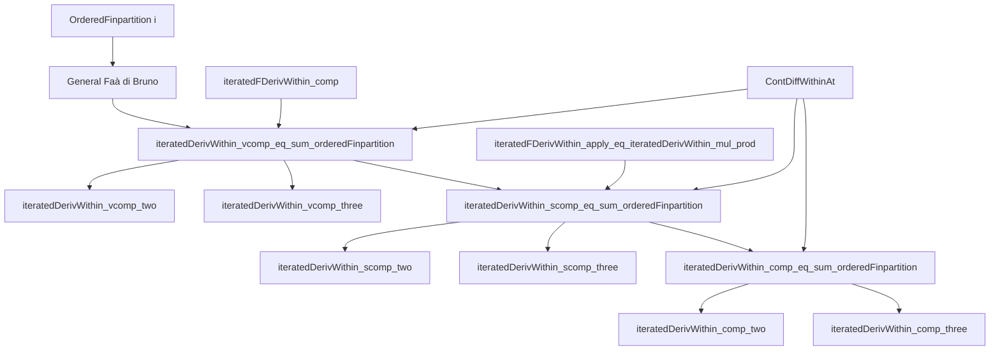
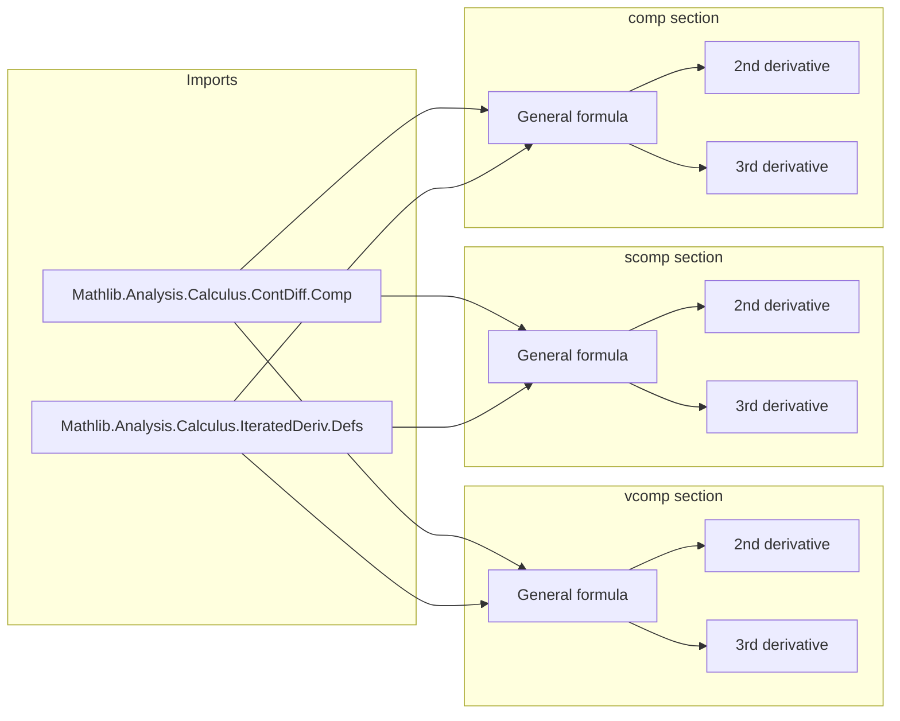

### Technical Brief: `FaaDiBruno.lean`

---

#### **1. Key Definitions & Theorems**

| Name | Type / Signature | Purpose |
|------|------------------|---------|
| `iteratedDerivWithin` | `iteratedDerivWithin i h s x` | $i$-th derivative of `h` *within* set `s` at `x` |
| `iteratedDeriv` | `iteratedDeriv i h x` | $i$-th derivative of `h` at `x` (global, i.e., within `univ`) |
| `iteratedFDerivWithin` | `iteratedFDerivWithin 𝕜 k g t y v` | $k$-th Fréchet derivative of `g` at `y`, applied to tuple `v`, within `t` |
| `OrderedFinpartition i` | Type | Finite partitions of `{0, ..., i-1}` into ordered, nonempty contiguous blocks; used to index Faà di Bruno terms |
| `partSize` | `OrderedFinpartition i → ℕ` | Size of each block in the partition |
| `length` | `OrderedFinpartition i → ℕ` | Number of blocks in the partition |
| `iteratedFDerivWithin_comp` | Lemma | Chain rule for iterated Fréchet derivatives of compositions |
| `iteratedFDerivWithin_apply_eq_iteratedDerivWithin_mul_prod` | Lemma | Relates iterated Fréchet derivative in 1D to iterated derivative and product of derivatives (key simplification in 1D) |
| `iteratedDerivWithin_vcomp_eq_sum_orderedFinpartition` | Theorem | General Faà di Bruno for `g ∘ f`, where `f : 𝕜 → E`, `g : E → F` |
| `iteratedDerivWithin_scomp_eq_sum_orderedFinpartition` | Theorem | Specialization to `g : 𝕜 → E`, `f : 𝕜 → 𝕜` (scalar-valued outer function) |
| `iteratedDerivWithin_comp_eq_sum_orderedFinpartition` | Theorem | Full scalar-to-scalar case (`g, f : 𝕜 → 𝕜`) |
| `iteratedDerivWithin_vcomp_two`, `iteratedDerivWithin_vcomp_three` | Theorems | Explicit formulas for 2nd and 3rd derivatives in vector-valued inner function case |
| `iteratedDerivWithin_scomp_two`, `iteratedDerivWithin_scomp_three` | Theorems | Explicit formulas for scalar outer, vector inner case |
| `iteratedDerivWithin_comp_two`, `iteratedDerivWithin_comp_three` | Theorems | Classical 1D Faà di Bruno up to order 3:   $$(g \circ f)'' = g''(f) (f')^2 + g'(f) f''$$   $$(g \circ f)''' = g'''(f) (f')^3 + 3 g''(f) f'' f' + g'(f) f'''$$ |

---

#### **2. Naming Conventions**

- **Prefixes**:
  - `vcomp_`: *vector*-valued inner function (`f : 𝕜 → E`)
  - `scomp_`: *scalar*-valued outer function (`g : 𝕜 → E`)
  - `comp_`: *scalar-to-scalar* case (`g, f : 𝕜 → 𝕜`)
- **Suffixes**:
  - `_eq_sum_orderedFinpartition`: General Faà di Bruno formula (sum over ordered partitions)
  - `_two`, `_three`: Specialized closed forms for low orders
- **Other**:
  - `iteratedFDerivWithin_apply_eq_iteratedDerivWithin_mul_prod`: Indicates conversion from multilinear to scalar derivative form in 1D

---

#### **3. Tactic Stack**

| Tactic | Usage Frequency | Purpose |
|--------|-----------------|---------|
| `simp` / `simp only` | Very High | Simplify using lemmas about `iteratedDerivWithin`, `OrderedFinpartition`, `Fintype.sum`, etc. |
| `rw` | High | Rewrite using previously proven theorems (e.g., `iteratedDerivWithin_vcomp_eq_sum_orderedFinpartition`) |
| `congr` / `ext` | Medium | Prove equality of functions/vectors by extensionality |
| `abel` | Medium | Simplify additive expressions (used in `scomp_three`) |
| `ring` | Medium | Simplify polynomial expressions (used in `comp_three`) |
| `fin_cases` | Medium | Handle finite types like `Fin 2`, `Fin 3` |
| `have` / `have h : ...` | Medium | Introduce intermediate equalities (e.g., constant function on `Fin n`) |
| `congr` + `ext` + `simp` | High | Prove equality of multilinear maps or functions by pointwise equality |

---

#### **4. Proof Logic**

- **General Strategy**:
  1. **Reduce to general case**: Prove the general Faà di Bruno formula (`_eq_sum_orderedFinpartition`) first.
  2. **Apply simplifications**: Use lemmas like `iteratedFDerivWithin_apply_eq_iteratedDerivWithin_mul_prod` to collapse multilinear derivatives to scalar ones in low dimensions.
  3. **Enumerate partitions**: For low orders (`i = 2, 3`), enumerate all `OrderedFinpartition i` (small finite sets), and simplify the sum using:
     - `OrderedFinpartition.extendEquiv`, `extend`, `atomic`, `default_eq`, etc.
     - `Fintype.sum_sigma`, `sum_unique`, `sum_option` to collapse sums over finite types.
  4. **Use symmetry**: In scalar cases, use `mul_comm`, `smul_eq_mul`, `nsmul_eq_mul` to reorder terms.
  5. **Leverage `UniqueDiffOn`**: Ensures uniqueness of derivatives within sets (needed for `iteratedDerivWithin` to coincide with `iteratedDeriv` on interiors).

- **Inductive flavor**: Not explicitly inductive; instead, case-based enumeration of partitions for fixed low orders.

---

#### **5. Imports & Dependencies**

| Module | Role |
|--------|------|
| `Mathlib.Analysis.Calculus.ContDiff.Comp` | Contains chain rule for `ContDiff` and related lemmas |
| `Mathlib.Analysis.Calculus.IteratedDeriv.Defs` | Definitions of `iteratedDeriv`, `iteratedDerivWithin`, `iteratedFDeriv`, etc. |
| `Mathlib.Data.Fintype.Sigma` | For summing over sigma types (used in partition enumeration) |
| `Mathlib.Data.Fintype.Option` | For simplifying sums over `option` types |
| `Mathlib.Data.Fintype.Unique` | For simplifying sums over singleton types |
| `Mathlib.Data.Fin.Basic` | For reasoning about `Fin n` types |
| `Mathlib.Data.Nat.WithTop` | For `WithTop ℕ∞`, used in differentiability order bounds |

---

#### **6. Mermaid Diagrams**

##### **Dependency Graph (High-Level)**

##### **Overview of File Structure**

---

#### **7. Theory Context**

- **Faà di Bruno’s formula** generalizes the chain rule to higher derivatives.
- This file provides:
  - A *structured* formalization using `OrderedFinpartition`, which encodes all set partitions of `{0, ..., i-1}` into ordered contiguous blocks — a combinatorial model for derivative chain terms.
  - Explicit low-order formulas (2nd and 3rd), which are often used in analysis and PDEs.
  - Three levels of generality: vector-valued inner (`vcomp`), scalar outer (`scomp`), scalar-to-scalar (`comp`).
- **Motivation for `OrderedFinpartition`**: In 1D, derivatives are symmetric, so many terms coincide. `OrderedFinpartition` avoids overcounting by enforcing order on blocks, while still allowing clean indexing.

---

#### **8. Future Work (from TODO)**

- **Weaken `UniqueDiffOn`**: Replace with weaker regularity assumptions (e.g., `HasFDerivWithinAt`, `DifferentiableWithinAt`).
- **Symmetry-aware formulas**: Exploit symmetry of iterated derivatives in 1D to reduce number of terms.
- **Generalize to algebras**: Extend `scomp`/`comp` to cases like `f : ℝ → ℂ`, using normed algebra structure.

--- 

Let me know if you'd like a **proof sketch** of `iteratedDerivWithin_comp_three`, or a **pretty-printed version** of the 3rd derivative formula in LaTeX.
