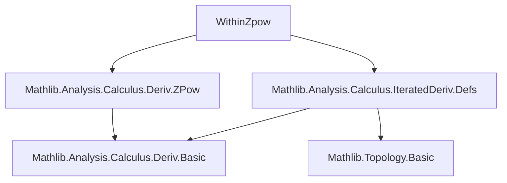

**Technical Brief: `WithinZpow.lean`**

---

### 1. **Key Definitions & Theorems**

| Name | Type | Purpose |
|------|------|---------|
| `iteratedDerivWithin` | `ℕ → (𝕜 → 𝕜) → Set 𝕜 → 𝕜 → 𝕜` | $k$-th iterated derivative of a function *within* a set (defined via restriction to the interior and iterated Fréchet derivatives). |
| `iteratedDerivWithin_zpow` | `∀ m : ℤ, k : ℕ, IsOpen s → s.EqOn (iteratedDerivWithin k (y ↦ y ^ m) s) (y ↦ (∏ i < k, (m - i)) * y ^ (m - k))` | Gives a closed-form expression for the $k$-th iterated derivative *within* an open set $s$ of the function $y \mapsto y^m$, for integer exponent $m$. |
| `iteratedDerivWithin_one_div` | `∀ k : ℕ, IsOpen s → s.EqOn (iteratedDerivWithin k (y ↦ 1 / y) s) (y ↦ (-1)^k * k! * y ^ (-1 - k))` | Special case of the above for $m = -1$, i.e., $y \mapsto y^{-1} = 1/y$. |

> Note: The product $\prod_{i \in \text{Finset.range } k} (m - i)$ is the falling factorial $(m)_k = m (m-1) \cdots (m-k+1)$, generalizing the usual derivative formula for $x^n$, $n \in \mathbb{Z}$.

---

### 2. **Naming Conventions**

- **Prefixes**:
  - `iteratedDerivWithin_`: for theorems about iterated derivatives *within* a set.
- **Suffixes**:
  - `_zpow`: for integer powers $x^m$, $m \in \mathbb{Z}$.
  - `_one_div`: for the reciprocal function $x \mapsto 1/x$.

---

### 3. **Tactic Stack**

- `apply Set.EqOn.trans (...)`: to chain equality-on-subsets.
- `iteratedDerivWithin_of_isOpen_eq_iterate hs`: a key lemma equating `iteratedDerivWithin` with `iteratedDeriv` on open sets (since interior = set itself when open).
- `intro t ht`: unpack membership in the open set.
- `simp`: simplifies using definitional equalities and algebraic simplifications (e.g., `Finset.prod_range_succ`, `zpow`, factorial, signs).

> The proofs are highly automated: once the open-set equivalence is applied, `simp` suffices due to definitional alignment of `zpow` and `one_div` with `pow`/`inv` on the domain where they’re defined.

---

### 4. **Proof Logic**

- **High-level strategy**:
  1. Use `iteratedDerivWithin_of_isOpen_eq_iterate` to reduce `iteratedDerivWithin` to `iteratedDeriv` on open sets (since $s$ is open, the derivative within $s$ coincides with the usual derivative on $s$).
  2. Reduce the goal to proving pointwise equality on $s$.
  3. Apply `simp` — the required identities are already available in `Mathlib.Analysis.Calculus.Deriv.ZPow` (e.g., derivative of $x^m$ for $m \in \mathbb{Z}$), and `iteratedDeriv` satisfies the standard falling-factorial rule.

- **No induction is explicit in this file**, because the main work is offloaded to prior lemmas about `iteratedDeriv` of `zpow` (in `Deriv.ZPow`), and `iteratedDerivWithin` on open sets.

---

### 5. **Imports**

| Module | Role |
|--------|------|
| `Mathlib.Analysis.Calculus.IteratedDeriv.Defs` | Defines `iteratedDerivWithin`, basic properties, and the key equivalence `iteratedDerivWithin_of_isOpen_eq_iterate`. |
| `Mathlib.Analysis.Calculus.Deriv.ZPow` | Contains derivative formulas for $x^m$, $m \in \mathbb{Z}$, including base case (`deriv_zpow`) and inductive step for integer powers. |

> These imports define both the *calculus infrastructure* (`iteratedDerivWithin`) and the *algebraic derivative rules* for integer powers needed to prove the iterated formulas.

---

### 6. **Mermaid Diagrams**

#### Dependency Graph (Module-Level)



#### Overview of File Content

```mermaid
flowchart LR
  A[Open set s] --> B[iteratedDerivWithin k (y ↦ y^m) s]
  A --> C[iteratedDerivWithin k (y ↦ 1/y) s]
  B --> D[∏_{i<k} (m - i) · y^{m - k}]
  C --> E[(-1)^k · k! · y^{-1 - k}]
  D & E --> F[Pointwise equality on s]
  A -->|IsOpen s| G[Use iteratedDerivWithin_of_isOpen_eq_iterate]
  G --> H[Reduce to iteratedDeriv]
  H --> I[Apply known zpow derivative rules]
```

---

### 7. **Domain-Specific AI Agent Notes**

- **Target domain**: Real/complex analysis on manifolds or normed fields, especially calculus of monomials with integer exponents.
- **Key reasoning pattern**: *Open-set reduction* + *algebraic simplification*.
- **Expected reuse**: These lemmas are stepping stones for:
  - Smoothness proofs of $x \mapsto x^m$ on $\mathbb{R} \setminus \{0\}$ for $m < 0$,
  - Local behavior of functions with poles,
  - Formalization of Laurent series or meromorphic functions.

Let me know if you'd like the next-level theory (e.g., how this fits into `Mathlib.Analysis.Normed.Field.ZPow` or `LaurentSeries.lean`).
