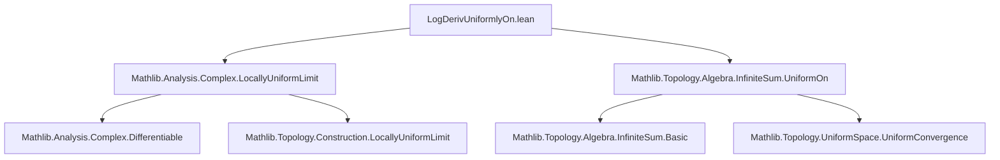

**Technical Brief: `LogDerivUniformlyOn.lean`**

---

### 1. **Key Definitions & Theorems**

| Name | Type / Signature | Purpose |
|------|------------------|---------|
| `logDeriv` | `f : ℂ → ℂ → ℂ` (typically `f : ℂ → ℂ`) → `logDeriv f = fun z ↦ deriv f z / f z` | Logarithmic derivative of a complex function (defined where `f ≠ 0`). |
| `tprod` / `∏' i, f i ·` | Infinite product of functions (pointwise product over index type `ι`) | Represents the pointwise infinite product of a family of functions. |
| `tsum` / `∑' i, g i` | Infinite sum of functions (pointwise sum) | Used for the sum of logarithmic derivatives. |
| `logDeriv_tprod_eq_tsum` | `logDeriv (∏' i, f i ·) x = ∑' i, logDeriv (f i) x` | Main theorem: under suitable convergence and non-vanishing conditions, the logarithmic derivative of an infinite product equals the sum of logarithmic derivatives. |
| `logDeriv_tendsto` | A convergence lemma for `logDeriv` under locally uniform convergence | Used to pass the limit through `logDeriv`. |
| `MultipliableLocallyUniformlyOn` | A convergence condition on infinite products (analogous to `Summable` for series) | Ensures the infinite product converges *locally uniformly* on a set. |
| `DifferentiableOn`, `IsOpen`, `Summable`, `hasProdLocallyUniformlyOn` | Standard analysis notions | Used to state hypotheses for analytic behavior and convergence. |

---

### 2. **Naming Conventions**

- **Prefixes**:
  - `logDeriv_`: for logarithmic derivative–related functions/lemmas.
  - `tprod_`, `tsum_`: for infinite product/sum operations (`t` for *topological*, as in `tprod` = topological product).
  - `hasProd_`, `hasSum_`: for convergence properties (e.g., `hasProdLocallyUniformlyOn`).
- **Suffixes**:
  - `_On`: for statements localized to a subset `s : Set ℂ`.
  - `_locallyUniformlyOn`: for locally uniform convergence on a set.
- **Predicates**:
  - `DifferentiableOn`, `IsOpen`, `Summable`, `MultipliableLocallyUniformlyOn`, `hf : ∀ i, f i x ≠ 0`, `hnez : ∏' i, f i x ≠ 0`: all express regularity/non-vanishing.

---

### 3. **Tactic Stack**

- `rw`: rewriting using equivalences and definitions (e.g., `Eq.comm`, `hasSum_iff`).
- `refine`: constructing proofs with holes (`?_`) to be filled later.
- `fun_prop`: a `simp`-like tactic for proving functional properties (e.g., differentiability, continuity).
- `simp_rw`: (implied via `rw` + `simp`-like behavior in modern Lean) for rewriting with simplification.
- `congr`: congruence rule to replace the goal’s RHS with a convertible term.
- `logDeriv_prod`: finite product rule for logarithmic derivative (used in the final `rw`).

> *Note*: No heavy automation like `aesop` or `ring` appears in this snippet — the proof is mostly structural and relies on analysis lemmas.

---

### 4. **Proof Logic**

The proof proceeds as follows:

1. **Rewrite target sum** using `hasSum_iff` to express the infinite sum as a limit.
2. **Apply `logDeriv_tendsto`**, a convergence lemma for logarithmic derivatives under locally uniform convergence of the product.
   - Inputs to `logDeriv_tendsto`:
     - `hs : IsOpen s`: open domain.
     - `hx : x ∈ s`: point in domain.
     - `htend.hasProdLocallyUniformlyOn`: product converges locally uniformly (from `htend`).
     - A proof that the limit function is non-vanishing at `x` (`hnez`).
     - A congruence condition (`congr`) to match the target sum.
3. **Simplify the resulting finite-case expression** using `logDeriv_prod`, which applies the finite product rule for logarithmic derivative.
   - Requires:
     - Non-vanishing of each `f i` at `x` (`hf`).
     - Differentiability of each `f i` at `x` (`hd` + `differentiableAt`).

> **Overall strategy**: Reduce the infinite-case identity to a finite one via convergence, then apply known finite product rule.

---

### 5. **Imports & Dependencies**

| Import | Role |
|--------|------|
| `Mathlib.Analysis.Complex.LocallyUniformLimit` | Provides tools for limits of complex functions under locally uniform convergence (e.g., `logDeriv_tendsto`, `hasProdLocallyUniformlyOn`). |
| `Mathlib.Topology.Algebra.InfiniteSum.UniformOn` | Supplies infrastructure for infinite sums and their uniform convergence on sets (e.g., `Summable`, `tsum`, convergence lemmas). |

> These imports indicate the file sits at the intersection of **complex analysis** and **topological algebra**, specifically dealing with infinite products/sums in the complex plane.

---

### 6. **Mermaid Diagrams**

#### **Dependency Graph (Module-Level)**



#### **Theoretical Overview (File Scope)**

```mermaid
flowchart LR
  subgraph Hypotheses
    H1[IsOpen s]
    H2[x ∈ s]
    H3[∀ i, f i x ≠ 0]
    H4[∀ i, DifferentiableOn (f i) s]
    H5[Summable (logDeriv (f i))]
    H6[MultipliableLocallyUniformlyOn f s]
    H7[∏' i, f i x ≠ 0]
  end

  subgraph Main Theorem
    T[logDeriv (∏' i, f i ·) x = ∑' i, logDeriv (f i) x]
  end

  H1 & H2 & H3 & H4 & H5 & H6 & H7 --> T

  T --> L[logDeriv_tendsto]
  L --> P[logDeriv_prod]
  P --> F[Finite product rule]
```

---

### 7. **Summary**

This file formalizes a **complex-analytic infinite product rule** for the logarithmic derivative: under locally uniform convergence and non-vanishing, differentiation commutes with infinite products *via* logarithmic derivative. It leverages deep results on locally uniform convergence (`logDeriv_tendsto`) and finite product calculus (`logDeriv_prod`). The proof is clean and modular, relying on high-level analysis infrastructure in Mathlib.

Let me know if you'd like a formalized dependency graph or a comparison with the real-analytic analog.
