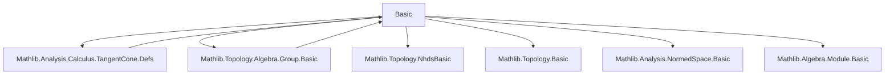
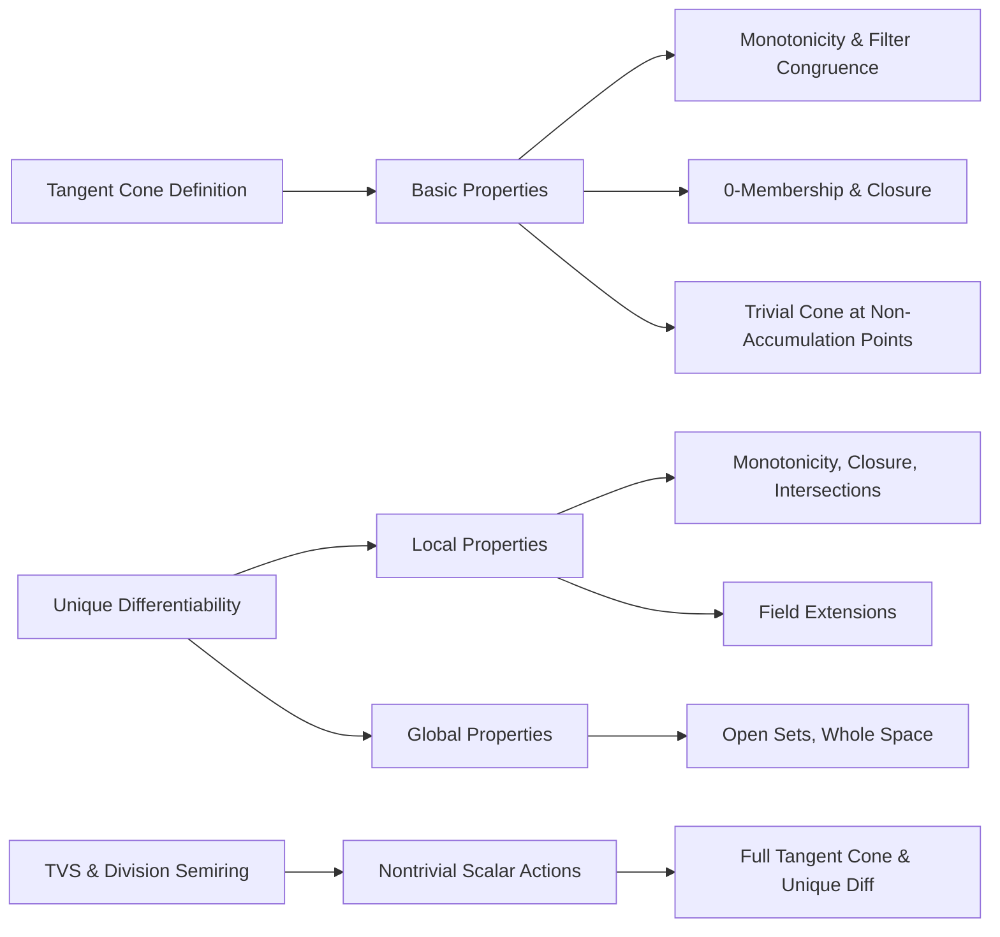

**Technical Brief: Basic Properties of Tangent Cones and Unique Differentiability**

---

### **1. Key Definitions & Theorems**

| Name | Type / Signature | Purpose |
|------|------------------|---------|
| `tangentConeAt` | `tangentConeAt 𝕜 s x : Set E` | Defines the tangent cone to a set `s` at a point `x`, with scalars from semiring `𝕜`. |
| `UniqueDiffWithinAt` | `UniqueDiffWithinAt 𝕜 s x : Prop` | States that `s` has a unique differentiable structure at `x` (i.e., the tangent cone spans the whole space and is dense in its linear span). |
| `UniqueDiffOn` | `UniqueDiffOn 𝕜 s : Prop` | Universal version: `UniqueDiffWithinAt 𝕜 s x` holds for all `x ∈ s`. |
| `tangentConeAt_mono` | `s ⊆ t → tangentConeAt 𝕜 s x ⊆ tangentConeAt 𝕜 t x` | Monotonicity of tangent cones w.r.t. inclusion of sets. |
| `tangentConeAt_mono_field` | `𝕜 ⊆ 𝕜' ⇒ tangentConeAt 𝕜 s x ⊆ tangentConeAt 𝕜' s x` | Extending scalars enlarges the tangent cone. |
| `tangentConeAt_congr` | `𝓝[s] x = 𝓝[t] x ⇒ tangentConeAt 𝕜 s x = tangentConeAt 𝕜 t x` | Tangent cone depends only on the relative neighborhood filter. |
| `tangentConeAt_inter_nhds` | `t ∈ 𝓝 x ⇒ tangentConeAt 𝕜 (s ∩ t) x = tangentConeAt 𝕜 s x` | Intersecting with a neighborhood doesn’t change the tangent cone. |
| `zero_mem_tangentConeAt_iff` | `0 ∈ tangentConeAt 𝕜 s x ↔ x ∈ closure s` | Characterizes membership of 0 in the tangent cone. |
| `tangentConeAt_subset_zero` | `¬AccPt x (𝓟 s) ⇒ tangentConeAt 𝕜 s x ⊆ {0}` | If `x` is not an accumulation point, the tangent cone is trivial. |
| `UniqueDiffWithinAt.mono` | `s ⊆ t ⇒ UniqueDiffWithinAt 𝕜 t x` | Monotonicity of unique differentiability w.r.t. set inclusion. |
| `UniqueDiffWithinAt.mono_field` | `𝕜 ⊆ 𝕜' ⇒ UniqueDiffWithinAt 𝕜 s x → UniqueDiffWithinAt 𝕜' s x` | Extending scalars preserves unique differentiability. |
| `uniqueDiffWithinAt_closure` | `UniqueDiffWithinAt 𝕜 (closure s) x ↔ UniqueDiffWithinAt 𝕜 s x` | Closure doesn’t affect unique differentiability. |
| `uniqueDiffWithinAt_univ` | `UniqueDiffWithinAt 𝕜 univ x` | Whole space has unique differentiability. |
| `uniqueDiffWithinAt_of_mem_nhds` | `s ∈ 𝓝 x ⇒ UniqueDiffWithinAt 𝕜 s x` | Sets containing a neighborhood have unique differentiability. |

---

### **2. Naming Conventions**

- **Prefixes**:
  - `tangentConeAt_`: properties of tangent cones.
  - `UniqueDiffWithinAt_`: properties of local unique differentiability.
  - `uniqueDiffOn_`: global unique differentiability.
- **Suffixes**:
  - `_mono`: monotonicity (set inclusion or filter refinement).
  - `_congr`: invariance under equality of filters.
  - `_inter`: behavior under intersection with neighborhoods.
  - `_closure`: behavior under topological closure.
  - `_field`: behavior under field/semiring extension.
  - `_nhds` / `_nhdsWithin`: behavior under neighborhood filters.
- **Special**:
  - `_of_`: construction from a condition (e.g., `mem_tangentConeAt_of_frequently`).
  - `__iff`: equivalence characterizations.

---

### **3. Tactic Stack**

Frequently used tactics in proofs:
- `simp` / `simp only`: simplification with definitional lemmas.
- `gcongr`: for monotonicity goals involving set inclusion and scalar multiplication.
- `rw` / `grw`: rewriting with equalities and filter lemmas.
- `refine` / `exact`: constructing proofs stepwise.
- `ext`: extensionality for set equality.
- `intro` / `intro h`: hypothesis introduction.
- `cases` / `rcases`: destructing existential hypotheses.
- `tendsto_*` lemmas: for convergence arguments (e.g., `tendsto_const_nhds`, `tendsto_nhdsWithin_iff`).
- `filter_basis_*`: for basis-based characterizations (e.g., `basis_sets`, `nhds_basis_opens`).
- `closure_*`: closure minimality, continuity, and image properties.
- `mem_closure_iff_*`: closure membership criteria.
- `accPt_iff_frequently`: accumulation point criteria.

---

### **4. Proof Logic**

- **Inductive/constructive style**: Most proofs proceed by:
  1. Unfolding definitions (`tangentConeAt_def`, `uniqueDiffWithinAt_iff`).
  2. Reducing to filter-theoretic statements (e.g., using `HasBasis`, `clusterPt_iff_forall_mem_closure`).
  3. Applying monotonicity or continuity lemmas (`tendsto_*`, `closure_minimal`, `isClosed_closure`).
  4. Using topological properties (e.g., `T2Space` for uniqueness of limits, `AccPt` for accumulation).
  5. Leveraging algebraic structure (e.g., `SMul`, `Module`, `ContinuousSMul`) to manipulate scalar actions.

- **Common proof patterns**:
  - *Filter-based tangent cone characterizations*: via neighborhoods or basis elements.
  - *Equivalence via antisymmetry*: for set equalities (`Subset.antisymm`).
  - *Reduction to known cases*: e.g., reducing to `univ` via intersection with neighborhoods.
  - *Contrapositive reasoning*: especially in accumulation point arguments (`AccPt.of_mem_tangentConeAt_ne_zero`).

---

### **5. Imports & Dependencies**

**Primary imports**:
- `Mathlib.Analysis.Calculus.TangentCone.Defs`: foundational definitions of tangent cones.
- `Mathlib.Topology.Algebra.Group.Basic`: basic topological group theory (needed for `ContinuousAdd`, `nhdsWithin`, etc.).

**Key underlying structures**:
- `AddCommGroup E`, `SMul 𝕜 E`, `TopologicalSpace E`: additive group + scalar action + topology.
- `ContinuousAdd`, `ContinuousConstSMul`, `ContinuousSMul`: continuity assumptions for algebraic operations.
- `Semiring 𝕜`, `DivisionSemiring 𝕜`: algebraic base for scalars.
- `T2Space E`: Hausdorff condition for uniqueness of limits.

---

### **6. Mermaid Diagrams**

#### **Dependency Graph (Module-Level)**

#### **Overview of Theory Flow**

---

### **7. Summary**

This file establishes foundational properties of tangent cones and unique differentiability in topological vector spaces over semirings. It emphasizes:
- **Filter-theoretic characterizations** of tangent cones.
- **Invariance under neighborhood refinement and closure**.
- **Monotonicity and extension of scalars**.
- **Characterizations of accumulation points via tangent cones**.
- **Sufficient conditions for unique differentiability**, especially in neighborhoods and open sets.

It serves as a technical backbone for more advanced calculus results (e.g., in `Manifold.lean`, `DifferentiableWithinAt.lean`, etc.), where tangent cones and unique differentiability are used to define manifolds and submanifolds.

--- 

Let me know if you'd like a formal dependency graph (e.g., `leanpkg tree`-style) or a proof outline for a specific theorem.
