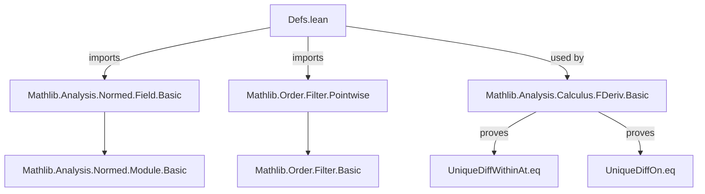
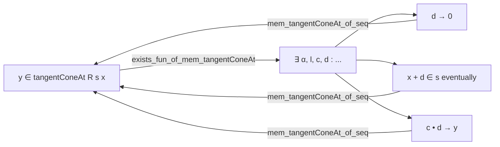

**Technical Brief: `Defs.lean` — Tangent Cone and Uniqueness of Derivatives**

---

### **1. Key Definitions & Theorems**

| Name | Type / Signature | Purpose |
|------|------------------|---------|
| `tangentConeAt` | `Set E → E → Set E` | Defines the *tangent cone* at `x ∈ E` relative to `s ⊆ E`: the set of cluster points of scaled neighborhoods `c • d` where `d → 0` and `x + d ∈ s`. |
| `posTangentConeAt` | `Set E → E → Set E` | *Positive* tangent cone: `tangentConeAt` over scalars `NNReal`. |
| `UniqueDiffWithinAt` | `Set E → E → Prop` | Predicate ensuring: (1) the *linear span* of the tangent cone at `x` is dense in `E`; (2) `x ∈ closure s`. Ensures uniqueness of the derivative *within* `s` at `x`. |
| `UniqueDiffOn` | `Set E → Prop` | Holds if `UniqueDiffWithinAt R s x` for all `x ∈ s`. Ensures uniqueness of the derivative *along* `s`. |
| `mem_tangentConeAt_of_frequently` | `… → y ∈ tangentConeAt R s x` | Sufficient condition: if `d n → 0`, `x + d n ∈ s` *frequently*, and `c n • d n → y`, then `y` lies in the tangent cone. |
| `mem_tangentConeAt_of_seq` | `… → y ∈ tangentConeAt R s x` | Variant of above with *eventual* membership `x + d n ∈ s` (stronger hypothesis, simpler to use in practice). |
| `exists_fun_of_mem_tangentConeAt` | `y ∈ tangentConeAt R s x → ∃ …` | Unfolding lemma: characterizes membership in the tangent cone via existence of sequences/filters satisfying the scaling/tendsto conditions. |
| `UniqueDiffOn.uniqueDiffWithinAt` | `UniqueDiffOn R s → x ∈ s → UniqueDiffWithinAt R s x` | Immediate projection from global to pointwise condition. |

> **Note**: Uniqueness of the derivative (e.g., `UniqueDiffWithinAt.eq`) is *not* proved here, but *used* in `FDeriv.Basic.lean`. This file provides the *geometric* foundation (`tangentConeAt`) to support that later proof.

---

### **2. Naming Conventions**

| Pattern | Examples | Meaning |
|--------|----------|---------|
| `tangentConeAt` | `tangentConeAt`, `posTangentConeAt` | Geometric object associated to a set and point. |
| `UniqueDiffWithinAt` / `UniqueDiffOn` | `UniqueDiffWithinAt`, `UniqueDiffOn` | *Use-driven* naming: reflects *purpose* (ensuring uniqueness of derivative), not construction. |
| `mem_…_of_…` | `mem_tangentConeAt_of_frequently`, `mem_tangentConeAt_of_seq` | Membership criteria built from filter/sequence data. |
| `exists_…_of_mem_…` | `exists_fun_of_mem_tangentConeAt` | Existential unpacking of abstract membership. |
| `…_uniqueDiffWithinAt` | `UniqueDiffOn.uniqueDiffWithinAt` | Projection from global to local property. |

---

### **3. Tactic Stack**

Frequently used tactics in this file:

| Tactic | Role |
|--------|------|
| `rw` | Rewriting definitions (`tangentConeAt_def`, `mem_setOf`, `frequently_iff_neBot`, etc.) |
| `simp` / `simp_rw` | Simplifying `eventually`, `inf`, `comap`, `map`, `tendsto` goals |
| `filter_upwards` | Handling filter-based implications (`∀ᶠ` goals) |
| `gcongr` | Congruence for filter inequalities (e.g., `nhdsWithin_le_nhds`) |
| `exact`, `refine`, `intro` | Standard proof construction |
| `tendsto_*` lemmas (`tendsto_map`, `tendsto_comp`, `tendsto_top.prodMk`, etc.) | Building tendsto proofs from components |
| `inf_le_*` | Reasoning about infima of filters (`inf_le_left`, `inf_le_right`) |

> **No `induction`, `cases`, or `ring`** — this file is *definitionally* and *topologically* driven, not algebraic or inductive.

---

### **4. Proof Logic**

The logical flow is **filter-theoretic and constructive-unfolding**:

1. **Define** `tangentConeAt` abstractly via *cluster points* of a scaled neighborhood filter.
2. **Provide two directions**:
   - *Sufficient condition* (`mem_tangentConeAt_of_frequently`, `mem_tangentConeAt_of_seq`): build elements of the cone from sequences/filters.
   - *Necessary condition* (`exists_fun_of_mem_tangentConeAt`): unpack any element into such a sequence.
3. **Lift to uniqueness** via:
   - `UniqueDiffWithinAt`: density of the *span* of the cone + closure condition.
   - `UniqueDiffOn`: uniform version over a set.

> **Key insight**: The definition avoids universe quantification by encoding derivative uniqueness *geometrically* (via tangent cone density), rather than quantifying over all possible target spaces and functions.

---

### **5. Imports & Dependencies**

| Import | Role |
|--------|------|
| `Mathlib.Analysis.Normed.Field.Basic` | Provides basic analysis over normed fields (scalars `R`, topological vector space structure). |
| `Mathlib.Order.Filter.Pointwise` | Supplies filter arithmetic: `•` (scalar multiplication of sets), `𝓝[(x + ·) ⁻¹' s] 0`, `inf`, `comap`, `map`, etc. |

> **No calculus yet**: Derivatives (`FDeriv`, `HasFDerivWithinAt`, etc.) are *not* defined here — this file is a *prerequisite* for `FDeriv.Basic.lean`.

---

### **6. Theory Overview & Dependency Diagram**

#### **Module Scope**
- **Goal**: Provide a *universe-polymorphic*, *filter-based* definition of tangent cone to support *uniqueness of derivatives*.
- **Design choice**: Avoid direct derivative-based uniqueness (universe-dependent) in favor of geometric density condition.

#### **Mermaid Diagrams**

##### **Dependency Graph (File-Level)**

##### **Conceptual Flow (This File)**

##### **Unfolding Logic (Tangent Cone Membership)**

---

### **7. Summary**

This file establishes a *filter-theoretic* foundation for geometric analysis in Lean:
- Introduces `tangentConeAt` as a *cluster-point* construction.
- Provides *bidirectional* characterizations (sufficient/necessary conditions).
- Defines `UniqueDiffWithinAt` and `UniqueDiffOn` as *uniqueness-enforcing* predicates.
- Designed to be *low-level* and *universe-safe*, serving as a *prerequisite* for calculus developments.

The naming reflects *intention* (uniqueness of derivative), not *construction* — a deliberate Lean design choice to decouple *definition* from *use*.
