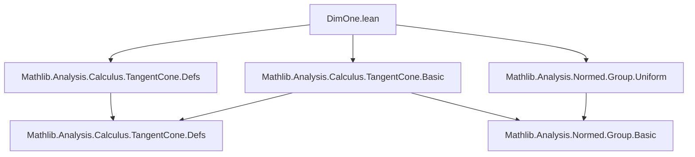

**Technical Brief: `DimOne.lean`**

---

### 1. KEY DEFINITIONS & THEOREMS

| Name | Type | Purpose |
|------|------|---------|
| `tangentConeAt_eq_univ` | `∀ {s : Set 𝕜} {x : 𝕜}, AccPt x (𝓟 s) → tangentConeAt 𝕜 s x = univ` | Shows that in 1D (over a normed division ring), the tangent cone at an accumulation point of a set is the entire space. |
| `uniqueDiffWithinAt_iff_accPt` | `∀ {s : Set 𝕜} {x : 𝕜}, UniqueDiffWithinAt 𝕜 s x ↔ AccPt x (𝓟 s)` | Characterizes points of unique differentiability within a set in 1D as precisely the accumulation points of the set. |
| `AccPt.uniqueDiffWithinAt` | `AccPt x (𝓟 s) → UniqueDiffWithinAt 𝕜 s x` | Right-to-left direction of the equivalence (constructive part). |
| `UniqueDiffWithinAt.accPt` | `UniqueDiffWithinAt 𝕜 s x → AccPt x (𝓟 s)` | Left-to-right direction (necessary condition). |

*Notation*:  
- `AccPt x (𝓟 s)` means *x is an accumulation point of s*, i.e., every punctured neighborhood of *x* meets *s*.  
- `UniqueDiffWithinAt 𝕜 s x` means *s has unique differentiability at x within itself*, i.e., the only continuous linear map *f* satisfying the differentiability condition is the zero map — equivalent to the tangent cone being the whole space in 1D.

---

### 2. NAMING CONVENTIONS

- **Prefixes**:
  - `tangentConeAt_`: for theorems about tangent cones at a point.
  - `uniqueDiffWithinAt_`: for results about unique differentiability within a set.
- **Suffixes**:
  - `_eq_univ`: for theorems proving equality with the universal set (`univ`).
  - `_iff_`: for biconditional characterizations.

No special infixes or custom operators beyond standard `𝕜`, `Set`, `Filter`, and `Metric` notation.

---

### 3. TACTIC STACK

- `refine`: to construct proofs by filling in holes.
- `fun_prop`: for proving continuity/ measurability of simple functions (e.g., `by fun_prop`).
- `simp_rw` / `simp`: for simplification using definitions and lemmas (e.g., `simp [div_mul_cancel₀]`, `simp [accPt_iff_frequently_nhdsNE]`).
- `exact`: implicit via `exact hx` or `exact this`.
- `mono_left`: for monotonicity of filters (used with `tendsto`).
- `eventually_mem_nhdsWithin.mono`: for restricting neighborhoods.
- `eq_univ_of_forall`: to prove a set equals `univ` by showing all elements belong to it.
- `mem_tangentConeAt_of_frequently`: key lemma for tangent cone membership via frequent points.
- `tendsto_nhds_of_eventually_eq`: for proving convergence via eventual equality.

---

### 4. PROOF LOGIC

The proofs follow a **filter-theoretic and geometric** approach:

1. **For `tangentConeAt_eq_univ`**:
   - Reduce to showing *every* `y ∈ 𝕜` lies in the tangent cone.
   - Use `mem_tangentConeAt_of_frequently` with:
     - Filter: `𝓝[≠] x` (punctured neighborhood filter),
     - Function: `z ↦ y / (z - x)`,
     - Target map: `z ↦ z - x`.
   - Verify:
     - Continuity of the function (via `fun_prop`),
     - Frequent application using the accumulation point assumption (`hx`),
     - Convergence via eventual equality and algebraic simplifications (`div_mul_cancel₀`).

2. **For `uniqueDiffWithinAt_iff_accPt`**:
   - **→**: Use `UniqueDiffWithinAt.accPt`, a known lemma.
   - **←**: Use `tangentConeAt_eq_univ h` to get `tangentConeAt 𝕜 s x = univ`, and apply the definition of unique differentiability:  
     `UniqueDiffWithinAt` holds iff the tangent cone is the whole space *and* `x` is in the closure (i.e., cluster point).  
     The latter follows from `AccPt x (𝓟 s) → x ∈ closure s` (via `mem_closure_iff_clusterPt.mpr h.clusterPt`).

---

### 5. IMPORTS

| Module | Role |
|--------|------|
| `Mathlib.Analysis.Calculus.TangentCone.Defs` | Definitions of tangent cones, unique differentiability. |
| `Mathlib.Analysis.Calculus.TangentCone.Basic` | Basic lemmas about tangent cones (e.g., `mem_tangentConeAt_of_frequently`, `tangentConeAt_eq_univ`-related tools). |
| `Mathlib.Analysis.Normed.Group.Uniform` | Uniform structure on normed groups, needed for filter-based arguments (e.g., `clusterPt`, `closure`). |

*No topology beyond metric/normed structure is required.*

---

### 6. DEPENDENCY & THEORY OVERVIEW (Mermaid Diagrams)

#### Dependency Graph (Module-Level)

#### Theoretical Flow (Conceptual)

- **Core equivalence**:  
  $$
  \text{AccPt}(x, \mathcal{P}(s)) \iff \text{UniqueDiffWithinAt}(\mathbb{k}, s, x)
  $$
  holds *because* in dimension 1, the tangent cone at an accumulation point is the full space.

---

### 7. REMARKS

- The proof leverages the **algebraic simplicity** of 1D: division by $z - x$ is well-defined away from $x$, enabling explicit construction of the required function for tangent cone membership.
- The result is **specific to 1D**; in higher dimensions, accumulation points need not satisfy unique differentiability (e.g., corners, cusps).
- The file is part of a larger effort to formalize geometric measure theory and calculus on manifolds over general normed division rings (e.g., $\mathbb{R}, \mathbb{C}, \mathbb{H}$).

--- 

*End of Technical Brief.*
