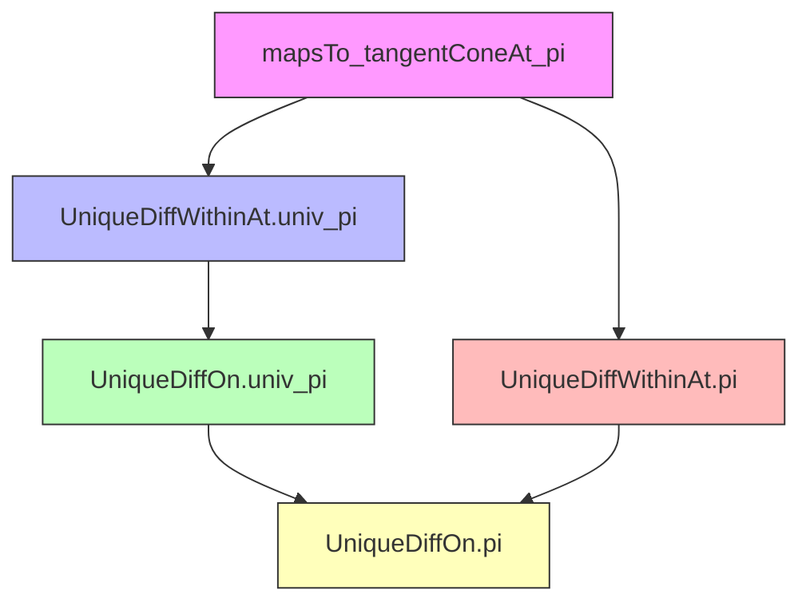
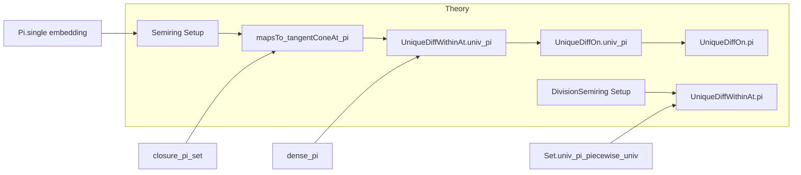

**Technical Brief: `Pi.lean` — Indexed Product of Sets with Unique Differentiability Property**

---

### 1. **Key Definitions & Theorems**

| Name | Type / Signature | Purpose |
|------|------------------|---------|
| `tangentConeAt` | `tangentConeAt 𝕜 s x` | Tangent cone to set `s` at point `x` over semiring `𝕜`. |
| `UniqueDiffWithinAt` | `UniqueDiffWithinAt 𝕜 s x` | Property that the tangent cone at `x` within `s` is the whole space (i.e., unique differentiability within `s` at `x`). |
| `UniqueDiffOn` | `UniqueDiffOn 𝕜 s` | Universal property: `UniqueDiffWithinAt 𝕜 s x` holds for all `x ∈ s`. |
| `Set.pi` | `Set.pi I s` | Cartesian product of sets `s i` over index set `I`. |
| `Set.univ_pi` | `Set.pi univ s` | Full product over all indices. |
| `Pi.single` | `Pi.single i y` | Function that is `y` at index `i` and `0` elsewhere. |
| `mapsTo_tangentConeAt_pi` | `MapsTo (Pi.single i) (tangentConeAt 𝕜 (s i) (x i)) (tangentConeAt 𝕜 (Set.pi univ s) x)` | Shows that embedding the tangent cone of a factor into the product via `Pi.single i` lands in the tangent cone of the product. |
| `UniqueDiffWithinAt.univ_pi` | `(∀ i, UniqueDiffWithinAt 𝕜 (s i) (x i)) → UniqueDiffWithinAt 𝕜 (Set.pi univ s) x` | Proves unique differentiability of full product at a point from pointwise unique differentiability. |
| `UniqueDiffOn.univ_pi` | `(∀ i, UniqueDiffOn 𝕜 (s i)) → UniqueDiffOn 𝕜 (Set.pi univ s)` | Global version: product of sets with unique differentiability has unique differentiability. |
| `UniqueDiffWithinAt.pi` | `(∀ i ∈ I, UniqueDiffWithinAt 𝕜 (s i) (x i)) → UniqueDiffWithinAt 𝕜 (Set.pi I s) x` | Generalization to arbitrary index set `I`, using `piecewise` trick. |
| `UniqueDiffOn.pi` | `(∀ i ∈ I, UniqueDiffOn 𝕜 (s i)) → UniqueDiffOn 𝕜 (Set.pi I s)` | Global version for arbitrary `I`. |

---

### 2. **Naming Conventions**

- **Prefixes**:
  - `UniqueDiffWithinAt` / `UniqueDiffOn`: core properties.
  - `mapsTo_`: indicates a `MapsTo` statement (function preserves membership).
  - `tangentConeAt_`: tangent cone–related lemmas.
- **Suffixes**:
  - `_pi`: product-related results.
  - `_univ_pi`: full product over `univ`.
- **Quantifier style**:
  - `fun i ↦ ...` used for dependent families.
  - `hi : i ∈ I` or `hi : i ≠ j` used for case analysis.

---

### 3. **Tactic Stack**

Frequently used tactics in this file:

| Tactic | Role |
|--------|------|
| `rw` | Rewriting using lemmas like `closure_pi_set`, `tangentConeAt_closure`, `Set.univ_pi_piecewise_univ`. |
| `simp only [...] at h ⊢` | Simplifying goals and hypotheses using `uniqueDiffWithinAt_iff`, `closure_pi_set`, etc. |
| `refine` | Building proofs stepwise, especially with existential quantifiers. |
| `rcases` / `cases` | Decomposing existential or conjunction hypotheses. |
| `gcongr` | Used with `iSup_le`, `subset`, `image_subset` to lift inequalities. |
| `intro` / `intro h` | Introducing hypotheses/variables. |
| `by_cases` | Splitting on membership (`i ∈ I`) for piecewise arguments. |
| `simp [*, ...]` | Simplification with local context and explicit lemmas. |
| `exact` / `apply` | Finishing subgoals via known lemmas. |

---

### 4. **Proof Logic**

- **Structure of main proofs**:
  - **Step 1**: Reduce to closure or use `uniqueDiffWithinAt_iff`, which characterizes `UniqueDiffWithinAt` via:
    $$
    \text{Tangent cone} = \text{whole space} \quad \text{and} \quad \text{closure has dense tangent cone}.
    $$
  - **Step 2**: Use `closure_pi_set` to rewrite closures of products.
  - **Step 3**: For tangent cone inclusion, apply `mapsTo_tangentConeAt_pi`, which shows that `Pi.single i` embeds factor tangent cones into the product tangent cone.
  - **Step 4**: Use `dense_pi` to show density of the product of dense subsets.
  - **Step 5**: For arbitrary `I`, reduce to full product via `Set.univ_pi_piecewise_univ`, i.e., extend `s` to all `ι` by `univ` on complement of `I`.

- **Induction / recursion**: Not used — proofs are direct and rely on set-theoretic and topological properties of products.

- **Case analysis**: On `i = j` or `i ∈ I`, using `eq_or_ne` and `by_cases`.

---

### 5. **Imports & Dependencies**

| Import | Purpose |
|--------|---------|
| `Mathlib.Analysis.Calculus.TangentCone.Basic` | Defines `tangentConeAt`, `UniqueDiffWithinAt`, `UniqueDiffOn`, and basic lemmas. |
| `Mathlib.Topology.Algebra.Module.Basic` | Provides module and topological vector space background (e.g., continuity of addition/scalar mult). |
| `Filter`, `Set` | Standard libraries for filters, sets, products, closures. |
| `Topology` scope | For `nhds`, `tendsto`, etc. |

---

### 6. **Mermaid Diagrams**

#### **Dependency Graph (Theorems & Lemmas)**

#### **Overview of File Structure**

---

### 7. **Mathematical Summary**

This file establishes that **unique differentiability is preserved under arbitrary indexed products**, both locally (`UniqueDiffWithinAt`) and globally (`UniqueDiffOn`). The key insight is that the tangent cone of a product decomposes as the product of tangent cones (up to closure), and the embedding of each factor’s tangent cone via `Pi.single` respects this structure. The proofs rely heavily on:

- Closure and density properties of product sets (`closure_pi_set`, `dense_pi`).
- The characterization of `UniqueDiffWithinAt` via tangent cones.
- Technical lemmas about `Pi.single` and `piecewise` functions to reduce arbitrary products to full products.

The results are foundational for extending calculus on manifolds or Banach spaces to infinite-dimensional product spaces (e.g., sequence spaces), where coordinate-wise differentiability implies global differentiability.

--- 

Let me know if you'd like a formalized dependency graph for the entire `Mathlib` or a visualization of how this file fits into the `Analysis.Manifold` hierarchy.
