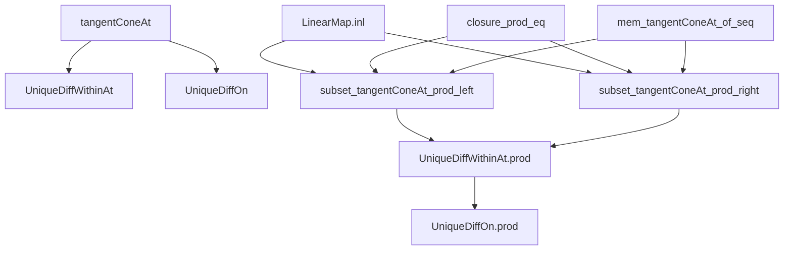
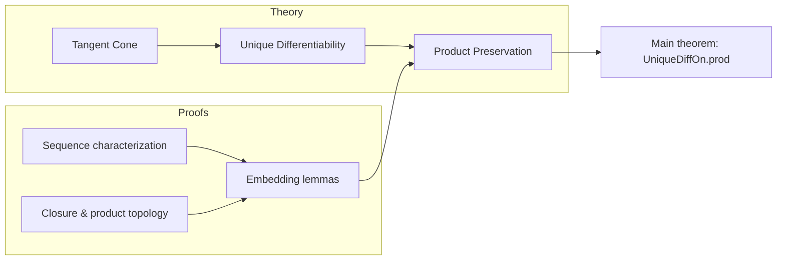

### Technical Brief: `Prod.lean` — Product of Sets with Unique Differentiability Property

---

#### **1. Key Definitions & Theorems**

| Name | Type / Signature | Purpose |
|------|------------------|---------|
| `tangentConeAt 𝕜 s x` | `Set E` | Tangent cone to set `s` at point `x`, generalizing tangent spaces in non-smooth settings. |
| `UniqueDiffWithinAt 𝕜 s x` | `Prop` | `s` has *unique differentiability* at `x` within itself: the tangent cone generates the whole space and is a submodule. |
| `UniqueDiffOn 𝕜 s` | `Prop` | `s` has unique differentiability at *every* point of `s`. |
| `subset_tangentConeAt_prod_left` | `y ∈ closure t → LinearMap.inl '' tangentConeAt 𝕜 s x ⊆ tangentConeAt 𝕜 (s ×ˢ t) (x, y)` | Left factor’s tangent cone embeds into product tangent cone. |
| `subset_tangentConeAt_prod_right` | `x ∈ closure s → LinearMap.inr '' tangentConeAt 𝕜 t y ⊆ tangentConeAt 𝕜 (s ×ˢ t) (x, y)` | Right factor’s tangent cone embeds into product tangent cone. |
| `UniqueDiffWithinAt.prod` | `UniqueDiffWithinAt 𝕜 s x → UniqueDiffWithinAt 𝕜 t y → UniqueDiffWithinAt 𝕜 (s ×ˢ t) (x, y)` | Pointwise product preserves unique differentiability. |
| `UniqueDiffOn.prod` | `UniqueDiffOn 𝕜 s → UniqueDiffOn 𝕜 t → UniqueDiffOn 𝕜 (s ×ˢ t)` | Global product preserves unique differentiability. |

---

#### **2. Naming Conventions**

- **Prefixes**:
  - `subset_..._prod_left/right`: Embedding lemmas for tangent cones in product.
  - `UniqueDiffWithinAt.prod`, `UniqueDiffOn.prod`: Product lemmas for unique differentiability.
- **Suffixes**:
  - `_at`: Pointwise (local) properties (`UniqueDiffWithinAt`, `tangentConeAt`).
  - `_on`: Global (set-wide) properties (`UniqueDiffOn`).
- **Module/Map naming**:
  - `inl`, `inr`: Canonical injections `E → E × F`, `F → E × F`.
  - `prodMk_nhds`, `prod`: Product-related constructions (e.g., product of filters, sets).

---

#### **3. Tactic Stack**

Frequently used tactics in proofs:
- `rw [...] at ... ⊢`: Rewriting using equivalences/definitions (e.g., `uniqueDiffWithinAt_iff`, `closure_prod_eq`).
- `intro / rintro`: Introducing hypotheses/exists-quantified elements.
- `rcases`: Destructuring existential statements (e.g., `exists_fun_of_mem_tangentConeAt`).
- `refine`: Constructing proofs with holes to be filled later.
- `simp [...]`: Simplification using lemmas like `subset_closure`, `closure_prod_eq`.
- `simpa`: Simplify and discharge goal using assumptions.
- `mono`: Apply monotonicity of `Submodule.span` or set inclusion.
- `exact`: Final step to close goal.

No heavy automation (e.g., `linarith`, `ring`, `aesop`) — proofs are mostly structural and rely on known lemmas about tangent cones and closures.

---

#### **4. Proof Logic**

- **Structure of `UniqueDiffWithinAt.prod`**:
  1. Unfold definition: `uniqueDiffWithinAt_iff` gives:
     - `closure (s ×ˢ t) = univ` (handled via `closure_prod_eq` and assumptions),
     - `tangentConeAt ≤ ⊤`,
     - and that the tangent cone is a submodule.
  2. Show `tangentConeAt 𝕜 (s ×ˢ t) (x, y)` contains images of both factors’ tangent cones via `inl` and `inr`.
  3. Use `subset_tangentConeAt_prod_left/right` (which require membership in closures).
  4. Conclude via `Submodule.span_mono` and `LinearMap.span_inl_union_inr` to get full space.
  5. Use `hs.1.prod ht.1` (product of full-rank submodules is full-rank) to get equality.

- **Structure of `UniqueDiffOn.prod`**:
  - Immediate from `UniqueDiffWithinAt.prod` by pointwise application.

- **Tangent cone embedding proofs** (`subset_tangentConeAt_prod_left/right`):
  - Use characterization of tangent cone via sequences (`mem_tangentConeAt_of_seq`).
  - Lift paths from factor to product (e.g., `n ↦ (d n, 0)`).
  - Use closure assumptions to ensure product stays in `s ×ˢ t`.

---

#### **5. Imports & Dependencies**

| Import | Role |
|--------|------|
| `Mathlib.Analysis.Calculus.TangentCone.Defs` | Definitions of tangent cones, unique differentiability. |
| `Mathlib.LinearAlgebra.Prod` | Product modules, `inl`, `inr`, `span_inl_union_inr`. |
| `Mathlib.Topology.Algebra.Monoid` | Topological monoid/semiring facts (e.g., continuity of addition/scalar mult). |
| `Mathlib.Analysis.Calculus.TangentCone.Basic` | Basic lemmas: `tangentConeAt_closure`, `exists_fun_of_mem_tangentConeAt`, `mem_tangentConeAt_of_seq`. |

**Key underlying theory**:
- Tangent cones generalize differentiable structure to arbitrary sets.
- Unique differentiability ensures the tangent cone is the whole space and a submodule (i.e., a linear subspace).
- Product topology and module structure interact nicely (continuous addition, scalar mult).

---

#### **6. Mermaid Diagrams**

##### **Dependency Graph (Theorems & Lemmas)**

##### **Overview of File Structure**

---

#### **7. Summary**

This file establishes that the class of sets with *unique differentiability* is closed under Cartesian products — a foundational result for building higher-dimensional or product-type differentiable structures in analysis on sets (e.g., manifolds with corners, stratified spaces). The proofs rely on careful manipulation of tangent cones via sequence-based characterizations and module-theoretic properties of embeddings `inl`, `inr`.
