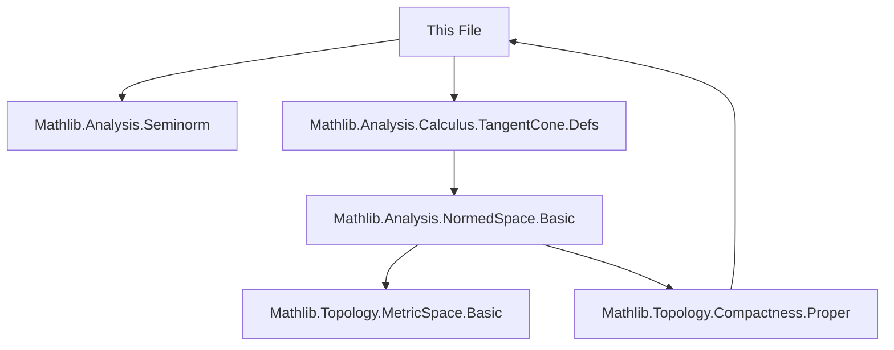

**Technical Brief: `ProperSpace.lean`**

---

### 1. **Key Definitions & Theorems**

| Name | Type / Signature | Purpose |
|------|------------------|---------|
| `tangentConeAt_nonempty_of_properSpace` | `∀ [ProperSpace E] {s : Set E} {x : E}, AccPt x (𝓟 s) → (tangentConeAt 𝕜 s x ∩ {0}ᶜ).Nonempty` | Main theorem: In a proper normed space, the tangent cone at a non-isolated point of a set contains a nonzero vector. |
| `tangentConeAt` | (imported from `Mathlib.Analysis.Calculus.TangentCone.Defs`) | Standard definition of the tangent cone of a set `s` at a point `x`, as the set of limits of rescaled sequences `c n • (xₙ - x)` with `xₙ ∈ s`, `c n → ∞`. |
| `AccPt` | `AccPt x (𝓟 s)` | `x` is an accumulation point of `s` (i.e., every neighborhood of `x` meets `s \ {x}`). |
| `rescale_to_shell` | (imported, used implicitly) | For any nonzero vector `v`, and constants `0 < a < b`, there exists `c > 0` such that `c • v` lies in the annulus `{y : a ≤ ‖y‖ ≤ b}`. |
| `isCompact_closedBall` | (from `Mathlib.Analysis.NormedSpace.Basic`) | Closed unit ball in a proper space is compact. |

---

### 2. **Naming Conventions**

- **Prefixes**:
  - `tangentConeAt_`: for lemmas about tangent cones.
  - `isCompact_`: for compactness results (e.g., `isCompact_closedBall`).
  - `accPt_`: for accumulation point lemmas (e.g., `accPt_iff_nhds`).
- **Suffixes**:
  - `_of_properSpace`: indicates reliance on properness of the space.
  - `_seq`: for sequential characterizations (e.g., `mem_tangentConeAt_of_seq`).
- **Variables**:
  - `d`, `v`, `u`, `c`, `φ`: standard notation for sequences and scaling factors.
  - `r`: a scalar with `‖r‖ > 1`, used to define the annulus.

---

### 3. **Tactic Stack**

| Tactic | Usage |
|--------|-------|
| `obtain` / `choose` | Construct sequences (`u`, `v`, `c`) via choice principles. |
| `simp` / `simp only` | Simplify set membership, norms, filters (e.g., `closedBall_mem_nhds`, `dist_eq_norm`). |
| `push _ ∈ _` | Move membership goals into context. |
| `contrapose!` | Flip implications with negated goals. |
| `refine` | Partial proof construction (e.g., `refine ⟨l, ?_, ?_⟩`). |
| `exact` / `apply` | Apply known lemmas (e.g., `mem_tangentConeAt_of_seq`, `squeeze_zero_norm`). |
| `swap` | Reorder goals. |
| `simp_rw` (implicit via `simp only`) | Rewriting with definitional equalities. |
| `aesop` (not used here) | Not present — proof is highly constructive and sequential. |

---

### 4. **Proof Logic**

The proof follows a **constructive sequential compactness argument**:

1. **Sequence to zero**: Use `exists_seq_strictAnti_tendsto` to get a positive sequence `u n ↘ 0`.
2. **Points near `x`**: From accumulation, pick `v n ∈ s ∩ closedBall x (u n)`, `v n ≠ x`.
3. **Difference vectors**: Define `d n := v n - x`, so `x + d n ∈ s \ {x}` and `d n → 0`.
4. **Rescaling to a fixed shell**: Use `rescale_to_shell` to find scalars `c n` such that `c n • d n` lies in a fixed annulus `{y : 1 ≤ ‖y‖ ≤ ‖r‖}` (via `hr : ∃ r, 1 < ‖r‖`).
5. **Compactness extraction**: Since the closed unit ball is compact (proper space), extract a convergent subsequence `c (φ n) • d (φ n) → l` with `l ≠ 0`.
6. **Verify membership in tangent cone**: Show `l ∈ tangentConeAt 𝕜 s x` using `mem_tangentConeAt_of_seq`, checking:
   - `c (φ n) • d (φ n) = c (φ n) • (v (φ n) - x)`,
   - `v (φ n) ∈ s`,
   - `c (φ n) • d (φ n) → l`.

---

### 5. **Imports**

| Module | Role |
|--------|------|
| `Mathlib.Analysis.Seminorm` | Normed space basics, seminorms, norms. |
| `Mathlib.Analysis.Calculus.TangentCone.Defs` | Definition of `tangentConeAt`, sequential characterizations (`mem_tangentConeAt_of_seq`), basic properties. |
| `Mathlib.Analysis.NormedSpace.Basic` (via above) | Compactness of closed balls in proper spaces (`isCompact_closedBall`), norm properties. |
| `Mathlib.Filter.Basic`, `Mathlib.Topology.Basic` | Accumulation points (`AccPt`), neighborhoods (`𝓟 s`, `𝓝`), filters. |
| `Mathlib.Topology.MetricSpace.Basic` | Metric/distance definitions, balls, `dist_eq_norm`. |

---

### 6. **Mermaid Diagrams**

#### **Dependency Graph (Module-Level)**



#### **Proof Overview Flowchart**

```mermaid
flowchart LR
  A[AccPt x (𝓟 s)] --> B[Pick u n ↘ 0]
  B --> C[Pick v n ∈ s ∩ clBall(x, u n), v n ≠ x]
  C --> D[Define d n = v n - x]
  D --> E[Rescale: c n • d n ∈ annulus]
  E --> F[Compactness ⇒ subseq c(φ n)•d(φ n) → l]
  F --> G[l ≠ 0]
  G --> H[l ∈ tangentConeAt s x]
  H --> I[(tangentConeAt s x ∩ {0}ᶜ).Nonempty]
```

---

### 7. **Key Lemmas Used (Implicitly)**

- `accPt_iff_nhds`: Characterization of accumulation points via neighborhoods.
- `closedBall_mem_nhds`: Closed balls form a neighborhood base at their center.
- `rescale_to_shell`: Existence of scaling to hit a prescribed norm interval.
- `isCompact_closedBall`: Closed balls are compact in proper spaces.
- `mem_tangentConeAt_of_seq`: Sequential criterion for tangent cone membership.
- `squeeze_zero_norm`: If `‖d n‖ → 0` and `c n → ∞` appropriately, then `c n • d n` can be controlled.

---

### 8. **Theoretical Context**

This file sits at the intersection of:
- **Geometric analysis** (tangent cones),
- **Metric geometry** (proper spaces = complete + totally bounded closed balls),
- **Nonlinear functional analysis** (rescaling arguments, sequential compactness).

It is foundational for further development of **tangent cone calculus**, especially in contexts where smoothness is absent (e.g., metric measure spaces, subanalytic sets). The nontriviality of the tangent cone at accumulation points is a key step toward proving existence of directions, differentiability a.e., or rectifiability results.

--- 

*End of Technical Brief.*
