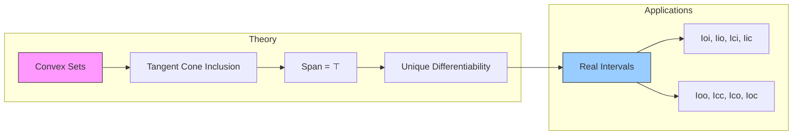

**Technical Brief: `Real.lean` — Unique Differentiability in Real Normed Spaces**

---

### **1. Key Definitions & Theorems**

| Name | Type / Signature | Purpose |
|------|------------------|---------|
| `tangentConeAt` | `Set E → E → Set E` (implicit field `ℝ` or `ℝ≥0`) | Generalized notion of tangent directions at a point to a set. |
| `openSegment ℝ x y` | `Set E` | Open line segment between `x` and `y`. |
| `segment ℝ x y` | `Set E` | Closed line segment between `x` and `y`. |
| `Submodule.span ℝ s` | `Submodule ℝ E` | Linear span of a set `s` over `ℝ`. |
| `uniqueDiffWithinAt ℝ s x` | `Prop` | `s` has unique differentiability at `x` *within* itself (i.e., the tangent cone spans the whole space). |
| `uniqueDiffOn ℝ s` | `Prop` | `s` has unique differentiability at every point of `s`. |
| `uniqueDiffWithinAt_convex` | `Convex ℝ s → (interior s).Nonempty → x ∈ closure s → UniqueDiffWithinAt ℝ s x` | Convex sets with nonempty interior are uniquely differentiable *within* at all closure points. |
| `uniqueDiffOn_convex` | `Convex ℝ s → (interior s).Nonempty → UniqueDiffOn ℝ s` | Convex sets with nonempty interior are globally uniquely differentiable. |
| `sub_mem_posTangentConeAt_of_openSegment_subset` | `openSegment ℝ x y ⊆ s → y - x ∈ tangentConeAt ℝ≥0 s x` | Direction of an open segment in `s` lies in the *positive* tangent cone. |
| `mem_tangentConeAt_of_openSegment_subset` | `openSegment ℝ x y ⊆ s → y - x ∈ tangentConeAt ℝ s x` | Same as above, but for the (full) tangent cone over `ℝ`. |
| `mem_tangentConeAt_of_segment_subset` | `segment ℝ x y ⊆ s → y - x ∈ tangentConeAt ℝ s x` | Extends the previous result to closed segments. |
| `Convex.span_tangentConeAt` | `Convex ℝ s → (interior s).Nonempty → x ∈ closure s → Submodule.span ℝ (tangentConeAt ℝ s x) = ⊤` | For convex `s` with nonempty interior, the tangent cone at any closure point spans the whole space. |
| `uniqueDiffOn_Ici`, `uniqueDiffOn_Iic`, `uniqueDiffOn_Ioi`, `uniqueDiffOn_Iio`, `uniqueDiffOn_Icc`, `uniqueDiffOn_Ico`, `uniqueDiffOn_Ioc`, `uniqueDiffOn_Ioo` | `UniqueDiffOn ℝ (interval)` | Intervals on `ℝ` are uniquely differentiable sets. |
| `uniqueDiffWithinAt_Ioo`, `uniqueDiffWithinAt_Ioi`, etc. | `UniqueDiffWithinAt ℝ (interval) point` | Points inside intervals inherit unique differentiability *within* the interval. |

---

### **2. Naming Conventions**

- **Prefixes**:
  - `mem_`, `sub_mem_`: membership statements (often for tangent cones).
  - `uniqueDiffWithinAt_`, `uniqueDiffOn_`: unique differentiability properties.
  - `Convex.`: lemmas about convex sets.
- **Suffixes**:
  - `_At`: pointwise property (`x` is a parameter).
  - `_On`: global property over a set.
  - `_of_`: implication from a hypothesis (e.g., `of_openSegment_subset`, `of_segment_subset`).
- **Interval notation**:
  - `Ici`, `Iic`, `Ioi`, `Iio`, `Icc`, `Ico`, `Ioc`, `Ioo`: standard interval types (`[a,∞)`, `(-∞,a]`, etc.).
- **Field annotations**:
  - `tangentConeAt ℝ≥0` vs `tangentConeAt ℝ`: positive vs full tangent cone.

---

### **3. Tactic Stack**

- `simp` / `simp only`: simplification using definitional equalities and lemmas (e.g., `interior_Icc`, `nonempty_Ioo`).
- `rw`: rewriting using equalities (e.g., `openSegment_eq_image_lineMap`).
- `apply`: applying lemmas or implications.
- `refine`: constructing proofs with holes (e.g., `refine mem_tangentConeAt_of_add_smul_mem ... ?_`).
- `filter_upwards`: for filter-based arguments (used in `sub_mem_posTangentConeAt_of_openSegment_subset`).
- `intro` / `rintro`: introducing hypotheses.
- `cases`: destructing existential or conjunction hypotheses.
- `subset_closure`, `subset.trans`: set-theoretic reasoning.
- `mono`: monotonicity for subsets (e.g., `interior_mono`, `Submodule.subset_span`).
- `eq_top_of_nonempty_interior'`: used to show a submodule is the whole space.
- `aesop` / `ring`: not explicitly used here, but `ring` may be implicit in `NNReal.smul_def` simplifications.

---

### **4. Proof Logic**

- **Core logical flow**:
  1. **Segment inclusion ⇒ direction in tangent cone**  
     Prove that if an open/closed segment lies in `s`, then its direction vector lies in the tangent cone at endpoints.
     - Uses filter convergence (`tendsto_id'`, `nhdsGT_le_nhdsNE`) and explicit parametrization via `lineMap`.
  2. **Convexity + nonempty interior ⇒ tangent cone spans space**  
     For `x ∈ closure s`, pick `y ∈ interior s`. Show `y - x ∈ interior(tangentConeAt ℝ s x)`, using:
     - Convexity: `openSegment y z ⊆ interior s` for `z ∈ s`.
     - Closure: `x ∈ closure s` ⇒ `y - x` approximable by directions from `x`.
     - Open mapping (`isOpenMap_sub_right`) to push interior neighborhoods.
  3. **Span = whole space ⇒ unique differentiability**  
     By definition: `uniqueDiffWithinAt` ⇔ `Submodule.span (tangentConeAt ℝ s x) = ⊤`.

- **Induction / recursion**: Not used.
- **Case analysis**: Used in interval lemmas (`if hab : a < b then ... else ...`).
- **Monotonicity & inclusion chaining**: Heavy use of `subset.trans`, `mono`, `subset_closure`.

---

### **5. Imports & Dependencies**

- **Core imports**:
  ```lean
  Mathlib.Analysis.Calculus.TangentCone.Basic
  Mathlib.Analysis.Convex.Topology
  ```
- **Implicit dependencies**:
  - `Mathlib.MeasureTheory.MeasurableSpace.Basic` (via `Filter`, `nhds`, `tendsto`)
  - `Mathlib.Topology.Basic`, `Mathlib.Topology.Structure` (for `TopologicalSpace`, `IsTopologicalAddGroup`)
  - `Mathlib.Algebra.Module.Basic`, `Mathlib.Algebra.Module.Submodule.Basic`
  - `Mathlib.Analysis.NormedSpace.Basic` (via `AddCommGroup`, `Module ℝ`, `TopologicalSpace`, `ContinuousSMul`)
  - `Mathlib.Topology.Separation`, `Mathlib.Topology.ContinuousMap` (for `isOpenMap_sub_right`)

---

### **6. Mermaid Diagrams**

#### **Dependency Graph (High-Level)**

```mermaid
graph TD
  A[Real.lean] --> B[Mathlib.Analysis.Calculus.TangentCone.Basic]
  A --> C[Mathlib.Analysis.Convex.Topology]

  B --> D[TangentConeAt]
  B --> E[OpenSegment / Segment]
  B --> F[Filter Theory]

  C --> G[Convex Set Properties]
  C --> H[Interior & Closure]
  C --> I[Linearity & Submodule Span]

  G --> J[Convex.span_tangentConeAt]
  E --> J
  H --> J
  I --> J

  J --> K[uniqueDiffWithinAt_convex]
  K --> L[uniqueDiffOn_convex]

  L --> M[Interval Lemmas (Ioi, Icc, etc.)]
```

#### **Overview of File Structure**



---

### **7. Summary**

This file establishes foundational results on *unique differentiability*—a key property in geometric measure theory and calculus on manifolds—in the context of real normed spaces. It shows:

- Convex sets with nonempty interior are uniquely differentiable (via tangent cone spanning).
- All standard intervals on `ℝ` inherit this property, either as open sets (trivially) or via convexity + interior nonemptiness.

The proofs rely on:
- Geometric intuition (segments ⇒ directions),
- Topological properties (interior, closure, openness),
- Linear algebra (submodule span = whole space).

This forms the backbone for more advanced results (e.g., area/coarea formulas, implicit function theorems in nonsmooth settings).
