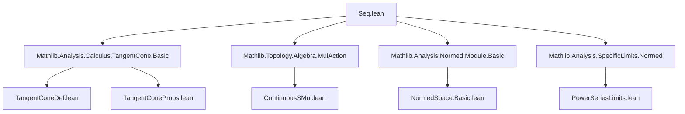
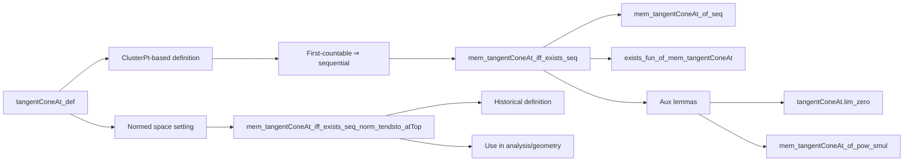

**Technical Brief: `Seq.lean` — Tangent Cone Characterization via Sequences**

---

### 1. **Key Definitions & Theorems**

| Name | Type / Signature | Purpose |
|------|------------------|---------|
| `tangentConeAt` | `tangentConeAt R s x` | The tangent cone of a set `s` at a point `x`, defined as the set of limits of scaled differences `c • d` where `d → 0` and `x + d ∈ s` eventually. |
| `mem_tangentConeAt_iff_exists_seq` | `y ∈ tangentConeAt R s x ↔ ∃ c d, …` | Equivalence (in first-countable spaces) between membership in the tangent cone and existence of sequences `(c n)`, `(d n)` with `d n → 0`, `x + d n ∈ s` eventually, and `c n • d n → y`. |
| `mem_tangentConeAt_of_seq` | `… → y ∈ tangentConeAt R s x` | One direction of the above equivalence: constructing a tangent cone vector from sequences satisfying the conditions. |
| `exists_fun_of_mem_tangentConeAt` | `y ∈ tangentConeAt R s x → ∃ f, …` | Generalization of the above to arbitrary filters (not just `atTop`), used to lift sequence-based arguments to net-based ones. |
| `tangentConeAt.lim_zero` | `Tendsto (‖c ·‖) l atTop → Tendsto (c · • d ·) l (𝓝 y) → Tendsto d l (𝓝 0)` | Auxiliary lemma: if `c n • d n → y` and `‖c n‖ → ∞`, then `d n → 0`. |
| `mem_tangentConeAt_of_pow_smul` | `r ≠ 0 ∧ ‖r‖ < 1 ∧ x + r^n • y ∈ s eventually ⇒ y ∈ tangentConeAt` | A concrete sufficient condition using geometric decay (`r^n`) to generate tangent vectors. |
| `mem_tangentConeAt_iff_exists_seq_norm_tendsto_atTop` | `y ∈ tangentConeAt 𝕜 s x ↔ ∃ c d, ‖c n‖ → ∞ ∧ x + d n ∈ s eventually ∧ c n • d n → y` | Characterization in *normed* spaces over a *nontrivially normed field*, where the scaling factors diverge in norm. Historically, this was the *definition* of the tangent cone (pre-#34127). |

---

### 2. **Naming Conventions**

- **Prefixes**:
  - `mem_…`: membership lemmas (`mem_tangentConeAt_of_seq`, `mem_tangentConeAt_iff_exists_seq`).
  - `tangentConeAt.`: namespace for auxiliary lemmas (`tangentConeAt.lim_zero`).
- **Suffixes**:
  - `_of_…`: implication from a constructive condition to membership (`of_seq`, `of_pow_smul`).
  - `_iff_…`: full equivalence (`iff_exists_seq`, `iff_exists_seq_norm_tendsto_atTop`).
- **Functional patterns**:
  - `c n`, `d n`: generic scalar and vector sequences.
  - `•`: scalar multiplication operator.
  - `Tendsto … atTop (𝓝 …)`: convergence to a point or zero along `atTop`.

---

### 3. **Tactic Stack**

- **Core tactics**:
  - `constructor` (for ↔ proofs)
  - `rcases`, `rintro`, `obtain`, `choose`
  - `rw`, `simp`, `simp only`, `grw`
  - `exact`, `refine`, `simpa`
- **Analysis-specific**:
  - `tendsto_nhdsWithin_iff`, `tendsto_inf`, `tendsto_comap_iff`, `tendsto_prod_iff'`
  - `tendsto_norm_atTop_iff_cobounded`, `eventually_ne_of_tendsto_norm_atTop`
  - `norm_smul`, `norm_pow`, `inv_smul_smul₀`
  - `atTop_basis.tendsto_iff`, `Metric.nhds_basis_ball_pow`
- **Algebraic simplification**:
  - `ring`, `norm_num1`, `div_eq_inv_mul`, `mul_pow`, `div_inv_eq_mul`

---

### 4. **Proof Logic**

- **Structure of main equivalences**:
  1. **Forward direction** (`→`):
     - Use `tangentConeAt_def` to unpack as cluster points of a filter.
     - Apply `exists_seq_tendsto` (first-countability → sequential characterization).
     - Extract sequences via `Prod.fst ∘ cd`, `Prod.snd ∘ cd`.
  2. **Reverse direction** (`←`):
     - Construct sequences satisfying the required convergence properties.
     - Apply `mem_tangentConeAt_of_seq` (or its variant with `atTop`).
- **Normed-space refinement**:
  - Split on `y = 0` vs `y ≠ 0`.
  - For `y = 0`, construct sequences using closure characterization (`Metric.mem_closure_iff`).
  - For `y ≠ 0`, reduce to the general `mem_tangentConeAt_iff_exists_seq` using `tangentConeAt.lim_zero` to ensure `d n → 0`.
- **Auxiliary lemmas**:
  - Use `Tendsto.congr'`, `Tendsto.smul`, `eventually_ne_of_tendsto` to manipulate convergence.
  - Leverage `NormedField.exists_lt_norm` to get a scalar with large norm.

---

### 5. **Imports & Dependencies**

| Module | Role |
|--------|------|
| `Mathlib.Analysis.Calculus.TangentCone.Basic` | Core definition and basic properties of `tangentConeAt`. |
| `Mathlib.Topology.Algebra.MulAction` | For `SMul`, `•`, and continuity of scalar multiplication. |
| `Mathlib.Analysis.Normed.Module.Basic` | Normed vector spaces, continuity of scalar mult, `NormedSpace`. |
| `Mathlib.Analysis.SpecificLimits.Normed` | Tools for limits in normed spaces (e.g., `tendsto_pow_atTop_nhds_zero`). |

---

### 6. **Mermaid Diagrams**

#### **Dependency Graph (Module-Level)**

#### **Overview of Theory Flow**

---

### 7. **Notes**

- This file bridges *topological* and *metric/normed* characterizations of tangent cones.
- The equivalence `mem_tangentConeAt_iff_exists_seq_norm_tendsto_atTop` is especially useful in calculus of variations and geometric analysis, where sequences like `n • (x_n - x)` arise naturally.
- The `tangentConeAt.lim_zero` lemma is critical for ensuring that the “step size” `d n` vanishes when the scaling factor diverges — a key intuition behind tangent cones.

--- 

Let me know if you'd like a formalized summary in Lean syntax or a diagram for the proof of `mem_tangentConeAt_iff_exists_seq_norm_tendsto_atTop`.
