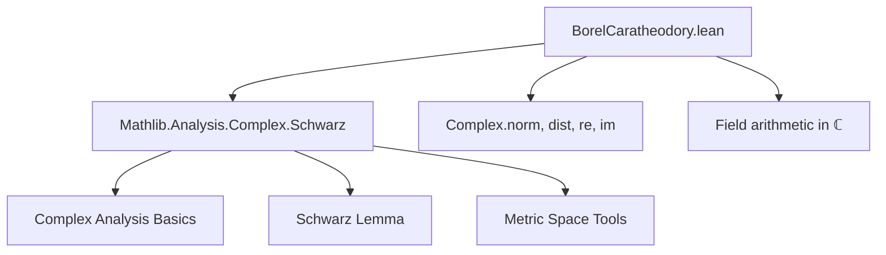

### Technical Brief: `BorelCaratheodory.lean`

---

#### **1. Key Definitions & Theorems**

| Name | Type / Signature | Purpose |
|------|------------------|---------|
| `eq_mul_div_one_add_of_eq_div_sub` | `M ≠ 0 → 2 * M - z ≠ 0 → w = z / (2 * M - z) → z = 2 * M * w / (1 + w)` | Inverse of the Schwarz transform used in the proof. |
| `norm_two_mul_div_one_add_le` | `0 < M → ‖w‖ < 1 → ‖2 * M * w / (1 + w)‖ ≤ 2 * M * ‖w‖ / (1 - ‖w‖)` | Norm bound for the inverse transform; used to convert bounds on `w` back to bounds on `f`. |
| `norm_lt_norm_two_mul_sub` | `0 < M → z.re < M → ‖z‖ < ‖2 * M - z‖` | Shows the Schwarz transform maps points with `Re(z) < M` into the unit disk. |
| `schwarz_applied` | `0 < M → DifferentiableOn ℂ f (ball 0 R) → MapsTo f (ball 0 R) {z | z.re < M} → z ∈ ball 0 R → f 0 = 0 → ‖f z / (2 * M - f z)‖ ≤ (1 / R) * ‖z‖` | Applies Schwarz lemma to the transformed function `z ↦ f z / (2 * M - f z)`. |
| `borelCaratheodory_zero` | `0 < M → DifferentiableOn ℂ f (ball 0 R) → MapsTo f (ball 0 R) {z | z.re < M} → 0 < R → z ∈ ball 0 R → f 0 = 0 → ‖f z‖ ≤ 2 * M * ‖z‖ / (R - ‖z‖)` | Special case of Borel–Carathéodory when `f(0) = 0`. |
| `borelCaratheodory` | `0 < M → DifferentiableOn ℂ f (ball 0 R) → MapsTo f (ball 0 R) {z | z.re < M} → 0 < R → z ∈ ball 0 R → ‖f z‖ ≤ 2 * M * ‖z‖ / (R - ‖z‖) + ‖f 0‖ * (R + ‖z‖) / (R - ‖z‖)` | General form of the Borel–Carathéodory theorem. |

---

#### **2. Naming Conventions**

- **Prefixes**:
  - `norm_`: for norm inequalities (e.g., `norm_lt_norm_two_mul_sub`, `norm_two_mul_div_one_add_le`)
  - `eq_`: for algebraic identities (e.g., `eq_mul_div_one_add_of_eq_div_sub`)
  - `schwarz_`: for lemmas related to the application of Schwarz lemma
  - `borelCaratheodory[_zero]`: main theorems

- **Suffixes**:
  - `_le`: indicates an inequality (`≤`)
  - `_ne`: indicates a nonzero condition (e.g., `h_denom_ne`)
  - `_zero`: indicates the special case `f(0) = 0`

- **Variables**:
  - `f : ℂ → ℂ`, `M R : ℝ`, `z w : ℂ`, `s : Set ℂ` — standard for complex analysis context.

---

#### **3. Tactic Stack**

Frequently used tactics in this file:

| Tactic | Role |
|--------|------|
| `field_simp` | Simplify division expressions, especially with nonzero denominators. |
| `ring` / `ring_nf` | Normalize polynomial/rational expressions. |
| `gcongr` | Prove inequalities by congruence (e.g., bounding numerators/denominators). |
| `linarith` | Solve linear inequalities involving real numbers. |
| `simp` / `simp only` | Simplify goals using known equalities or definitions. |
| `aesop` | Automated reasoning for simple logical steps (e.g., verifying maps-to conditions). |
| `norm_cast` | Handle coercion between `ℝ` and `ℂ`. |
| `rw` | Rewrite using hypotheses or lemmas. |
| `nth_rw` | Rewrite at a specific position in the expression. |

---

#### **4. Proof Logic**

The proof proceeds in two stages:

1. **Reduction to `f(0) = 0` via transformation**:
   - Define `w = f(z) / (2M - f(z))`, which maps `Re(f(z)) < M` into the unit disk.
   - Apply **Schwarz lemma** to `w`, yielding `‖w‖ ≤ ‖z‖ / R`.
   - Invert the transformation using `z = 2M * w / (1 + w)` and apply norm bounds to get `‖f(z)‖ ≤ 2M * ‖z‖ / (R - ‖z‖)`.

2. **General case via translation**:
   - Define `g(z) = f(z) - f(0)`, so `g(0) = 0`.
   - Show `Re(g(z)) < M + ‖f(0)‖`, then apply `borelCaratheodory_zero` to `g`.
   - Use triangle inequality: `‖f(z)‖ ≤ ‖f(z) - f(0)‖ + ‖f(0)‖`.
   - Algebraic simplification yields the final bound.

Induction is not used; the proof is direct and relies on:
- Schwarz lemma (via `schwarz_applied`)
- Algebraic inversion of the transform
- Norm inequalities (e.g., `norm_sub_le_norm_add`, `norm_two_mul_div_one_add_le`)

---

#### **5. Imports**

- `Mathlib.Analysis.Complex.Schwarz`: Provides the Schwarz lemma and related tools (`dist_le_div_mul_dist_of_mapsTo_ball`, etc.)

No other imports are needed — the file is self-contained modulo standard complex analysis infrastructure.

---

#### **6. Mermaid Diagrams**

##### **Dependency Graph**



##### **Overview of File Structure**

```mermaid
flowchart LR
  subgraph Theory
    A[Schwarz Transform] --> B[Inverse Transform]
    A --> C[Norm Bounds]
    C --> D[Schwarz Applied]
    D --> E[Borel-Caratheodory Zero]
    E --> F[Borel-Caratheodory General]
  end

  subgraph Proof Strategy
    D -->|Apply Schwarz lemma| G[Bound on w = f/(2M - f)]
    G -->|Invert transform| H[Bound on f]
    H -->|Subtract f(0)| I[General case]
  end
```

---

#### **7. Tags**

- `complex analysis`
- `Borel`
- `Carathéodory`
- `analytic function`
- `growth bound`
- `Schwarz lemma`
- `transform method`

---

This file formalizes a classical result in complex analysis using a clever transformation and the Schwarz lemma, with a clean separation between the `f(0) = 0` and general cases. The naming and structure follow Lean’s `Mathlib` conventions precisely.
