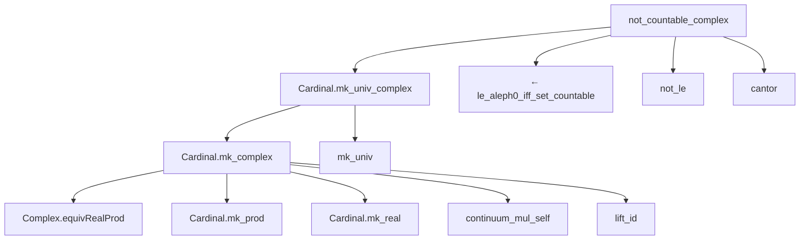

**Technical Brief: `Cardinality.lean`**

---

### 1. **Key Definitions & Theorems**

| Name | Type | Purpose |
|------|------|---------|
| `Cardinal.mk_complex` | `#ℂ = 𝔠` | Shows the cardinality of the type `ℂ` equals the continuum. |
| `Cardinal.mk_univ_complex` | `#(Set.univ : Set ℂ) = 𝔠` | Shows the cardinality of the *set* of all complex numbers (i.e., the universal set) is also continuum. |
| `not_countable_complex` | `¬(Set.univ : Set ℂ).Countable` | Proves the complex numbers are uncountable, using Cantor’s theorem. |

---

### 2. **Naming Conventions**

- **Prefixes**:
  - `mk_`: for theorems about cardinality of types/sets (`mk_complex`, `mk_univ_complex`).
  - `not_`: for negated properties (`not_countable_complex`).
- **Suffixes**:
  - `_complex`: disambiguates results specific to `ℂ`.
  - `_univ`: for universal sets over a type.

---

### 3. **Tactic Stack**

- `rw`: rewriting using equalities (e.g., `mk_congr`, `mk_prod`, `continuum_mul_self`).
- `apply`: applying lemmas (e.g., `apply cantor`).
- `←` and `not_le`: for logical manipulations in negated inequalities.
- Implicit use of:
  - `mk_congr`: via `equiv` (e.g., `Complex.equivRealProd`).
  - `lift_id`, `mk_real`, `continuum_mul_self`: from `Mathlib.Data.Cardinal` and `Mathlib.Analysis.Real.Cardinality`.

No heavy automation (e.g., `aesop`, `ring`, `simp`) is used—proofs are mostly direct rewriting.

---

### 4. **Proof Logic**

- **`mk_complex`**:  
  1. Use `Complex.equivRealProd` to show `ℂ ≃ ℝ × ℝ`.  
  2. Apply `mk_congr` to get `#ℂ = #(ℝ × ℝ)`.  
  3. Rewrite using `mk_prod`, `mk_real`, `lift_id`, and `continuum_mul_self` (`𝔠 * 𝔠 = 𝔠`).

- **`mk_univ_complex`**:  
  1. Use `mk_univ` to reduce to `#ℂ`.  
  2. Apply `mk_complex`.

- **`not_countable_complex`**:  
  1. Rewrite `Set.univ.Countable` using `← le_aleph0_iff_set_countable`.  
  2. Use `not_le` to get `𝔠 ≤ ℵ₀` is false.  
  3. Apply `cantor` (Cantor’s theorem: `𝔠 > ℵ₀`).

---

### 5. **Imports**

- `Mathlib.Analysis.Real.Cardinality`: provides `continuum_mul_self`, `mk_real`, `𝔠` definitions.
- `Mathlib.Data.Complex.Basic`: provides `Complex.equivRealProd`, `ℂ` type.

These imports define the foundational facts about real/complex cardinalities used.

---

### 6. **Mermaid Diagrams**

#### **Dependency Graph (Theorems → Lemmas)**



#### **Overview of File & Theory Context**

```mermaid
graph LR
  subgraph "This File"
    A[Cardinal.mk_complex]
    B[Cardinal.mk_univ_complex]
    C[not_countable_complex]
  end

  subgraph "Imports"
    D[Mathlib.Analysis.Real.Cardinality]
    E[Mathlib.Data.Complex.Basic]
  end

  D -->|provides| F[𝔠 = #ℝ, #ℝ × #ℝ = #ℝ]
  E -->|provides| G[ℂ ≃ ℝ × ℝ]

  A -->|uses| D & E
  B -->|uses| A
  C -->|uses| A & D & Cantor's Thm
```

---

### 7. **Theory Context Summary**

- This file sits in the *cardinality* hierarchy of standard mathematical structures.
- It leverages:
  - `ℂ ≃ ℝ²` (as a type equivalence),
  - `#ℝ = 𝔠`,
  - `𝔠 × 𝔠 = 𝔠` (continuum is idempotent under multiplication),
  - Cantor’s theorem (`#ℝ > ℵ₀`) to conclude uncountability.

It is a standard result in set-theoretic foundations of analysis, confirming that `ℂ` has the size of the continuum—same as `ℝ`, and strictly larger than countable sets like `ℚ` or `ℕ`.
