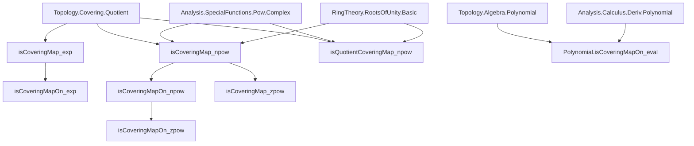
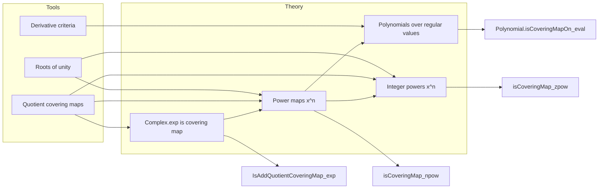

**Technical Brief: CoveringMap.lean (Lean 4)**  
*Domain: Topology & Complex Analysis — Covering Maps in the Context of Complex Exponential and Power Maps*

---

### 1. **Key Definitions & Theorems**

| Name | Type / Signature | Purpose |
|------|------------------|---------|
| `isAddQuotientCoveringMap_exp` | `IsAddQuotientCoveringMap (exp : ℂ → {z : ℂ // z ≠ 0}) (2πiℤ)` | Shows `exp` is an *additive quotient covering map* by the subgroup $2\pi i \mathbb{Z}$. |
| `isCoveringMap_exp` | `IsCoveringMap (exp : ℂ → {z : ℂ // z ≠ 0})` | Concludes `exp` is a covering map (global). |
| `isCoveringMapOn_exp` | `IsCoveringMapOn Complex.exp {0}ᶜ` | Restricts `exp` to a covering map on the punctured plane. |
| `Polynomial.isCoveringMapOn_eval` | `IsCoveringMapOn (p.eval) (p.eval '' {k | p.derivative.eval k = 0})ᶜ` | Any polynomial is a covering map over its *regular values* (complement of critical values). |
| `isCoveringMapOn_npow` | `IsCoveringMapOn (· ^ n) {0}ᶜ` (for `n ≠ 0`) | Power map $x \mapsto x^n$ is a covering map on $\mathbb{K} \setminus \{0\}$. |
| `isCoveringMap_npow` | `IsCoveringMap (· ^ n : 𝕜ˣ → 𝕜ˣ)` | Global covering map version on units. |
| `isCoveringMap_zpow` | `IsCoveringMap (· ^ n : 𝕜ˣ → 𝕜ˣ)` for `n ∈ ℤ`, `n ≠ 0` | Extends to integer powers (including inverses). |
| `isCoveringMapOn_zpow` | `IsCoveringMapOn (· ^ n) {0}ᶜ` | Local version for integer powers. |
| `isQuotientCoveringMap_npow` | `IsQuotientCoveringMap (· ^ n : 𝕜ˣ → 𝕜ˣ) (ker(powMonoidHom n))` | Identifies the covering as a *quotient by roots of unity* under surjectivity. |
| `Complex.isQuotientCoveringMap_npow` | Specialization to `𝕜 = ℂ`, using surjectivity of $z \mapsto z^n$ on ℂˣ. |
| `isQuotientCoveringMap_zpow` | Integer-power version of the above. |

---

### 2. **Naming Conventions**

- **Prefixes**:
  - `isCoveringMapOn_`: local covering map on a subset.
  - `isCoveringMap_`: global covering map (on whole space, often with codomain restricted).
  - `isQuotientCoveringMap_`: covering map arising as a quotient by a group action (often by roots of unity).
  - `isAddQuotientCoveringMap_`: additive group quotient version (used for `exp`).

- **Suffixes**:
  - `_exp`, `_npow`, `_zpow`: indicate the specific map involved.
  - `_eval`: for polynomial evaluation maps.

- **Other patterns**:
  - `mem_toOpenPartialHomeomorph_source`: technical helper for constructing local trivializations.
  - `hasStrictDerivAt`, `hasStrictFDerivAt_equiv`: used in differential criteria for covering maps.

---

### 3. **Tactic Stack**

Frequently used tactics in proofs:

| Tactic | Role |
|--------|------|
| `convert` | To reuse existing theorems with minor adjustments (e.g., `isCoveringMapOn_npow` from `isCoveringMapOn_eval`). |
| `simp` / `simp_rw` | Simplification using definitional equalities, especially for `zpow`, `pow`, `exp`, and set complements. |
| `aesop` | Solves arithmetic goals (e.g., `n ≠ 0`, `hn ≠ 0`, `NeZero n`). |
| `exact`, `refine`, `obtain` | Proof construction and case analysis. |
| `ext` | Extensionality for functions/sets (e.g., proving equality of homeomorphisms or sets). |
| `fun_prop` | Propagation of functorial properties (e.g., openness, continuity). |
| `rw [← ...]` | Rewriting using reverse definitions (e.g., `rootsOfUnity_eq_ker`). |
| `convert ... using n` | Control over which argument to apply conversion on. |

---

### 4. **Proof Logic**

The logical flow across most proofs follows this pattern:

1. **Reduction to known results**:
   - Use `isCoveringMapOn_of_openPartialHomeomorph` or `isAddQuotientCoveringMap.isCoveringMap`.
   - For polynomials: apply `isClosedMap_eval` + strict derivative condition.

2. **Local trivialization via derivative invertibility**:
   - Use `hasStrictDerivAt` + `hasStrictFDerivAt_equiv` to get local homeomorphisms away from critical points.

3. **Group-theoretic identification**:
   - For power maps: identify kernel of $x \mapsto x^n$ with `rootsOfUnity n`, and use finiteness ⇒ discreteness.

4. **Surjectivity + quotient argument**:
   - For `isQuotientCoveringMap_*`, verify surjectivity (e.g., via complex polar coordinates or `cpow_nat_inv_pow`), then apply `isQuotientCoveringMap_of_subgroup`.

5. **Extension to ℤ-powers**:
   - Split into `n ≥ 0` and `n < 0`, use `zpow_eq_zero_iff`, `inv₀`, or `comp_homeomorph`.

---

### 5. **Imports & Dependencies**

| Module | Purpose |
|--------|---------|
| `Mathlib.Analysis.Calculus.Deriv.Polynomial` | Derivatives of polynomials, chain rule, etc. |
| `Mathlib.Analysis.SpecialFunctions.Complex.LogDeriv` | Logarithmic derivative, local inverses of `exp`. |
| `Mathlib.Analysis.SpecialFunctions.Pow.Complex` | Complex power functions, continuity, differentiability. |
| `Mathlib.RingTheory.RootsOfUnity.Basic` | Structure of roots of unity, kernels of power maps. |
| `Mathlib.Topology.Algebra.Polynomial` | Continuity, closedness of polynomial maps. |
| `Mathlib.Topology.Covering.Quotient` | General theory of quotient covering maps (core of this file). |
| `Mathlib.Topology.LocalAtTarget` | Local behavior, neighborhoods, etc. |

---

### 6. **Mermaid Diagrams**

#### **Dependency Graph (High-Level)**

#### **Overview of File Structure**

---

### 7. **Summary**

This file formalizes foundational results in covering space theory over the complex numbers and general nontrivially normed fields:

- `exp` is a covering map via its periodicity and local biholomorphy.
- Power maps $x \mapsto x^n$ (for $n \ne 0$) are covering maps on the punctured space, with covering group $\mu_n$ (roots of unity).
- Polynomials are covering maps over their regular values, using the inverse function theorem.
- All results are expressed both globally (on units) and locally (on subsets), and some are phrased as *quotient covering maps*.

The proofs rely heavily on:
- The inverse function theorem (`hasStrictDerivAt` → local homeomorphism),
- Group-theoretic descriptions of kernels (roots of unity),
- Topological properties (closedness, openness, properness),
- And the general theory of covering maps from `Topology.Covering.Quotient`.

--- 

Let me know if you'd like a formalized dependency graph (e.g., `.lean`-level imports) or a tactic-level proof trace for a specific theorem.
