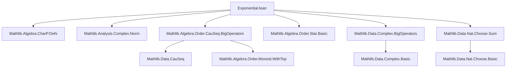
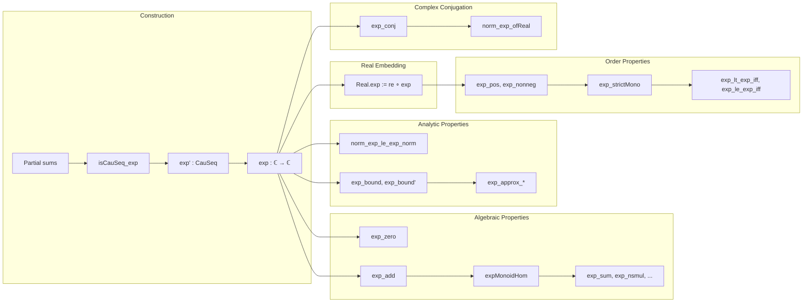

Here's a structured technical brief based on the `Exponential.lean` file:

---

### **1. Key Definitions & Theorems**

| Name | Type / Signature | Purpose |
|------|------------------|---------|
| `Complex.exp'` | `ℂ → CauSeq ℂ norm` | Cauchy sequence of partial Taylor sums for complex exponential |
| `Complex.exp` | `ℂ → ℂ` | Complex exponential, defined as limit of `exp'` |
| `Real.exp` | `ℝ → ℝ` | Real exponential, defined as real part of complex exponential |
| `exp_zero` | `exp 0 = 1` | Base case of exponential at 0 |
| `exp_add` | `exp (x + y) = exp x * exp y` | Functional equation (exponential of sum = product) |
| `expMonoidHom` | `Multiplicative ℂ →ₙ* ℂ` | Exponential as a monoid homomorphism |
| `exp_list_sum`, `exp_sum`, `exp_nsmul`, etc. | Various | Generalizations of `exp_add` to sums over lists, multisets, finite sums, natural scalar multiples |
| `exp_ne_zero` | `exp x ≠ 0` | Non-vanishing of exponential |
| `exp_neg`, `exp_sub` | `exp (-x) = (exp x)⁻¹`, `exp (x - y) = exp x / exp y` | Behavior under negation and subtraction |
| `exp_conj` | `exp (conj x) = conj (exp x)` | Commutes with complex conjugation |
| `exp_bound`, `exp_bound'` | Bounds on tail of Taylor series | Quantitative approximation lemmas |
| `norm_exp_sub_one_le`, `norm_exp_sub_one_sub_id_le` | `‖exp x - 1‖ ≤ 2‖x‖`, `‖exp x - 1 - x‖ ≤ ‖x‖²` | Local Lipschitz / differentiability estimates |
| `exp_strictMono` | `StrictMono exp` | Strict monotonicity of real exponential |
| `exp_pos`, `exp_nonneg` | `0 < exp x`, `0 ≤ exp x` | Positivity properties of real exponential |
| `expNear` | `ℕ → ℝ → ℝ → ℝ` | Approximation scheme for `exp` using truncated series + tail parameter |
| `exp_approx_*` | Various | Lemmas for iterative approximation of `exp` via `expNear` |

---

### **2. Naming Conventions**

- **Prefixes**:
  - `exp_`: Core exponential properties (`exp_zero`, `exp_add`, `exp_neg`, etc.)
  - `norm_exp_*`: Norm estimates for complex exponential (`norm_exp_sub_one_le`, `norm_exp_le_exp_norm`)
  - `expNear_*`: Approximation scheme (`expNear`, `exp_approx_*`, `exp_bound_*`)
  - `ofReal_*`: Embedding real exponential into complex (`ofReal_exp`, `ofReal_exp_ofReal_re`)
  - `expMonoidHom_*`: Homomorphism-related lemmas (`map_list_sum`, `map_multiset_sum`, etc.)

- **Suffixes**:
  - `_le`, `_lt`: Inequality direction (`exp_le_exp`, `exp_lt_exp`)
  - `_iff`: Equivalence (`exp_lt_exp_iff`, `exp_eq_one_iff`)
  - `_nonneg`, `_pos`: Positivity variants (`exp_nonneg`, `exp_pos`)
  - `_of_*`: Conditions on inputs (`exp_bound_of_interval`, `exp_nsmul'`)

---

### **3. Tactic Stack**

Frequently used tactics in proofs:
- `simp`, `simp_rw`, `congr`, `congr_arg`
- `gcongr`, `linarith`, `nlinarith`
- `ring`, `field_simp`, `norm_num`
- `rw`, `apply`, `exact`, `refine`
- `induction`, `cases`
- `convert`, `trans`, `calc`
- ` positivity`, `aesop` (via ` positivity` extension)
- `lim_*` lemmas: `lim_eq_of_equiv_const`, `lim_mul_lim`, `lim_add`, `lim_neg`, `lim_le`, `lim_conj`

---

### **4. Proof Logic**

- **Construction**: Define `exp` as limit of Cauchy sequence of partial sums (via `isCauSeq_exp`).
- **Functional equation (`exp_add`)**:
  - Prove finite version using binomial theorem (`hj` lemma).
  - Pass to limit using continuity of multiplication (`lim_mul_lim`).
- **Monoid homomorphism structure**:
  - Define `expMonoidHom` using `exp_add`.
  - Derive all sum/product lemmas via `MonoidHom.map_*`.
- **Positivity & monotonicity**:
  - Use Taylor truncation + positivity of tail (`sum_le_exp_of_nonneg`).
  - Derive strict monotonicity via `lt_mul_iff_one_lt_left`.
- **Approximation lemmas**:
  - Use `expNear` to encode truncated series + tail parameter.
  - Prove approximation lemmas via induction on `n` using `exp_approx_succ`.
- **Complex estimates**:
  - Reduce to real case via `norm_exp_le_exp_norm`, `norm_exp_sub_sum_le_exp_norm_sub_sum`.
  - Use geometric series bounds (`sum_div_factorial_le`) for tail control.

---

### **5. Imports & Dependencies**

Primary imports defining scope:
- `Mathlib.Algebra.CharP.Defs`: For characteristic-zero reasoning (e.g., `Nat.cast_ne_zero`)
- `Mathlib.Analysis.Complex.Norm`: Norm on ℂ, `norm_natCast`, etc.
- `Mathlib.Algebra.Order.CauSeq.BigOperators`: Cauchy sequences, `lim_*`, `CauSeq.le_of_exists`
- `Mathlib.Algebra.Order.Star.Basic`: `conj`, `starRingEnd`, `ofReal`
- `Mathlib.Data.Complex.BigOperators`: Complex arithmetic, `norm_mul`, `norm_div`, `norm_pow`
- `Mathlib.Data.Nat.Choose.Sum`: Binomial coefficients, `add_pow`, `Nat.choose_mul_factorial_mul_factorial`

---

### **6. Mermaid Diagrams**

#### **Dependency Graph (Module-Level)**

#### **Overview of Theory Flow**

--- 

Let me know if you'd like a formalized dependency graph for Lean’s `init`/`mathlib` module system or a proof dependency DAG for a specific theorem (e.g., `exp_add`).
