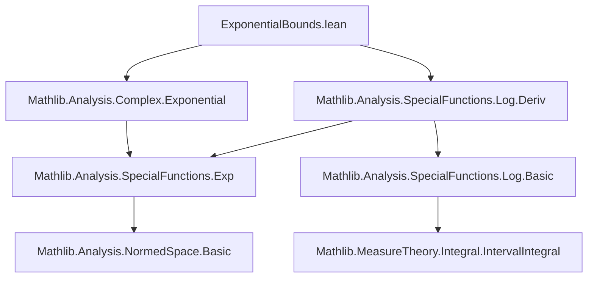

### Technical Brief: `ExponentialBounds.lean`

---

#### **1. Key Definitions & Theorems**

| Name | Type / Purpose |
|------|----------------|
| `exp_one_near_10` | `|exp 1 - 2244083 / 825552| ≤ 1 / 10 ^ 10` — Provides a high-precision rational approximation of $ e = \exp(1) $ accurate to 10 decimal places. |
| `exp_one_near_20` | `|exp 1 - 363916618873 / 133877442384| ≤ 1 / 10 ^ 20` — Same as above but accurate to 20 decimal places. |
| `exp_one_gt_d9`, `exp_one_lt_d9` | Bounds on $ e $: $ 2.7182818283 < e < 2.7182818286 $. Used to derive integer floor/ceil/round values. |
| `exp_one_gt_two`, `exp_one_lt_three` | Cruder but useful bounds: $ 2 < e < 3 $. |
| `floor_exp_one_eq_two` | `⌊exp 1⌋ = 2` — Formalizes that the greatest integer ≤ $ e $ is 2. |
| `ceil_exp_one_eq_three` | `⌈exp 1⌉ = 3` — Formalizes that the least integer ≥ $ e $ is 3. |
| `round_exp_one_eq_three` | `round (exp 1) = 3` — Confirms rounding $ e $ gives 3. |
| `exp_neg_one_gt_d9`, `exp_neg_one_lt_d9` | Tight rational bounds for $ e^{-1} $: $ 0.36787944116 < e^{-1} < 0.3678794412 $. |
| `exp_neg_one_lt_half` | `exp (-1) < 1 / 2` — Simple but useful inequality. |
| `log_two_near_10` | `|log 2 - 287209 / 414355| ≤ 1 / 10 ^ 10` — High-precision rational approximation of $ \log 2 $. |
| `log_two_gt_d9`, `log_two_lt_d9` | Bounds: $ 0.6931471803 < \log 2 < 0.6931471808 $. |

**Auxiliary lemmas used internally**:
- `exp_approx_start`, `exp_1_approx_succ_eq`, `exp_approx_end'`: Part of a Taylor-series-based approximation scheme for $ \exp(1) $.
- `Real.abs_log_sub_add_sum_range_le`: Used in bounding the remainder of the alternating series for $ \log(1+x) $ at $ x = 1 $ (i.e., $ \log 2 $).

---

#### **2. Naming Conventions**

- **Prefixes**:
  - `exp_one_*`: Properties of $ \exp(1) $.
  - `exp_neg_one_*`: Properties of $ \exp(-1) $.
  - `log_two_*`: Properties of $ \log 2 $.
  - `_*_near_*`: Approximation theorems with specified decimal precision.
  - `_*_gt_d9`, `_*_lt_d9`: Lower/upper bounds with 10-digit decimal precision.

- **Suffixes**:
  - `_eq_*`: Equalities involving `floor`, `ceil`, `round`.
  - `_gt_*`, `_lt_*`: Strict inequalities.

- **Pattern**: `verb_subject_precision` or `verb_subject_property`, e.g., `floor_exp_one_eq_two`.

---

#### **3. Tactic Stack**

Frequently used tactics:
- `norm_num`, `norm_num1`: Numerical simplification and rational arithmetic.
- `refine`: To construct proofs stepwise, especially in iterative approximations.
- `rw`, `simp_rw`: Rewriting using definitions and lemmas (e.g., `exp_neg`, `log_inv`, `abs_sub_le_iff`).
- `lt_of_lt_of_le`, `lt_of_le_of_lt`, `lt_trans`: Chain inequalities.
- `apply`, `assumption`, `exact`, `grw`, `grind`: Goal-directed proof construction.
- `have`, `suffices`: Introduce intermediate claims.
- `iterate n`: Repeats a tactic `n` times (used in `exp_one_near_10`, `exp_one_near_20`).

---

#### **4. Proof Logic**

- **Structure**:
  - **Approximation phase**: Use iterative Taylor expansion (`exp_1_approx_succ_eq`) to build rational approximations of $ \exp(1) $, then close with `exp_approx_end'`.
  - **Bounding phase**: Convert approximation error bounds into strict inequalities via `abs_sub_le_iff` and `sub_le_comm`.
  - **Integer operations**: Derive `floor`, `ceil`, `round` using `Int.floor_eq_iff`, `Int.ceil_eq_iff`, and `round_eq`.
  - **Logarithm**: Use alternating series remainder bound (`abs_log_sub_add_sum_range_le`) for $ \log(1+x) $ at $ x = 1 $, then simplify.

- **Induction/Recursion**: Not used directly; proofs rely on *iterative refinement* of Taylor polynomials (via `iterate` and `refine`), not structural induction.

- **Case analysis**: Minimal; mostly arithmetic reasoning and inequality chaining.

---

#### **5. Imports**

- `Mathlib.Analysis.Complex.Exponential`: Provides `exp`, `exp_neg`, `exp_pos`, etc., and foundational properties.
- `Mathlib.Analysis.SpecialFunctions.Log.Deriv`: Supplies `log`, `log_inv`, `Real.log_sub_add_sum_range_le`, and derivative-based analysis tools.

These imports define the analytic context: real/complex exponential, logarithm, and their series expansions.

---

#### **8. Mermaid Diagrams**

##### **Dependency Graph (File-Level)**



##### **Overview of Theoretical Flow**

```mermaid
flowchart LR
  subgraph Theory
    A[Series Expansions] --> B[exp Taylor Approximation]
    A --> C[log Alternating Series]
    B --> D[Rational Bounds on exp(1)]
    C --> E[Rational Bounds on log(2)]
    D --> F[Integer Properties ⌊e⌋, ⌈e⌉, round(e)]
    D --> G[Bounds on exp(-1)]
    E --> H[Bounds on log(2)]
  end

  subgraph Proofs
    D -->|norm_num, refine| I[exp_one_near_10/20]
    G -->|rw, inv_lt_comm₀| J[exp_neg_one_*]
    H -->|abs_log_sub_add_sum_range_le| K[log_two_near_10]
  end
```

---

### Summary

This module formalizes **high-precision rational bounds** for $ e = \exp(1) $, $ e^{-1} $, and $ \log 2 $, leveraging Taylor and alternating series expansions. It bridges analytic approximations with discrete arithmetic (`floor`, `ceil`, `round`) and demonstrates Lean’s capacity for *verified numerical analysis*. The naming and structure follow Lean’s `Mathlib` conventions, emphasizing clarity and reuse.
