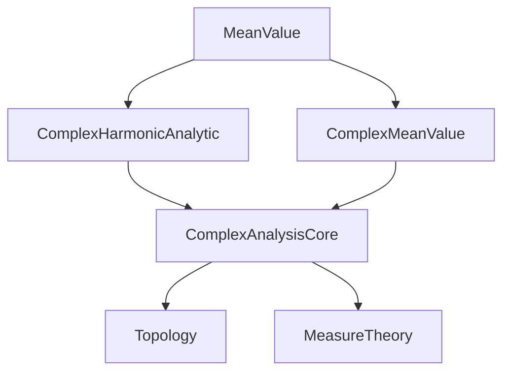

**Technical Brief: `MeanValue.lean`**

---

### 1. **Key Definitions & Theorems**

| Name | Type / Signature | Purpose |
|------|------------------|---------|
| `HarmonicOnNhd` | `f : ℂ → ℝ → Prop` | Predicate stating that `f` is harmonic in a neighborhood of a set (here, a closed disc). |
| `circleAverage` | `f : ℂ → ℝ → c : ℂ → R : ℝ → ℝ` | Computes the average of `f` over the circle centered at `c` with radius `R`. |
| `HarmonicOnNhd.circleAverage_eq` | `hf : HarmonicOnNhd f (closedBall c |R|) → circleAverage f c R = f c` | **Main theorem**: Harmonic functions satisfy the mean value property — the average over a circle equals the value at the center. |

---

### 2. **Naming Conventions**

- **Prefixes**:
  - `is_` (implicit in `harmonicAt`, `harmonicOnNhd`) — property predicates.
  - `circle_` — operations related to circular averages.
  - `closedBall`, `sphere` — geometric sets.
- **Suffixes**:
  - `_eq` — equality theorems (e.g., `circleAverage_eq`).
  - `_comm` — commutativity lemmas (e.g., `reCLM.circleAverage_comp_comm`).
- **Module-level**:
  - `public import` — indicates this module re-exports core analysis/complex results.

---

### 3. **Tactic Stack**

The proof uses a layered tactic pipeline:

- `obtain ⟨e, h₁e, h₂e⟩` — existential elimination via `exists_thickening_subset_open`.
- `rw [...] at h₂e` — rewriting using topological facts (`thickening_closedBall`).
- `obtain ⟨F, h₁F, h₂F⟩` — extraction of holomorphic primitive via `harmonic_is_realOfHolomorphic`.
- `fun x hx ↦ ...` — lambda abstraction for pointwise reasoning.
- `simp_all`, `simp [mem_ball, ...]` — simplification with membership and metric facts.
- `apply`, `exact`, `rw [...]` — standard proof scripting.
- `circleIntegrable'` — specialized integrability tactic for circle integrals.
- `continuousOn_of_forall_continuousAt` — continuity lifting lemma.

**Dominant tactics**: `obtain`, `rw`, `simp`, `apply`, `exact`.

---

### 4. **Proof Logic**

The proof follows a standard complex-analytic strategy:

1. **Local extension to a holomorphic function**:
   - Use compactness of the closed disc to find a thickening (open neighborhood) where `f` is harmonic.
   - Lift `f` to the real part of a holomorphic function `F` on that neighborhood.

2. **Relate circle averages**:
   - Show `f` and `Re ∘ F` agree on the *sphere* (boundary), using `circleAverage_congr_sphere`.
   - Use `reCLM.circleAverage_comp_comm` to commute real part with averaging.

3. **Apply holomorphic mean value property**:
   - Use `circleAverage_of_differentiable_on`, valid for holomorphic (hence harmonic) functions.
   - Verify differentiability on the closed disc via `DifferentiableAt` and continuity for integrability.

4. **Conclude equality**:
   - Reduce to verifying that `F`’s real part matches `f` on the sphere — done via `h₂F`.

**Structure**:  
`HarmonicOnNhd` → local holomorphic lift → boundary agreement → holomorphic MVT → conclusion.

---

### 5. **Imports**

| Import | Role |
|--------|------|
| `Mathlib.Analysis.Complex.Harmonic.Analytic` | Analyticity of harmonic functions, local holomorphic representatives. |
| `Mathlib.Analysis.Complex.MeanValue` | Preliminary mean value results, definitions of `circleAverage`, integrability lemmas. |

These imports sit in the *complex analysis* and *potential theory* stack of Mathlib, indicating this module is part of a larger development on harmonic and holomorphic functions on ℂ.

---

### 6. **Mermaid Diagrams**

#### **Dependency Graph (Module-Level)**



#### **Theoretical Overview (Proof Flow)**

```mermaid
flowchart LR
  A[HarmonicOnNhd f (closedBall c |R|)] --> B[Thickening ⊆ open U where f harmonic]
  B --> C[∃ holomorphic F: Re(F) = f on U]
  C --> D[Re(F) = f on sphere c |R|]
  D --> E[circleAverage f c R = circleAverage (Re ∘ F)]
  E --> F[= Re(circleAverage F)]
  F --> G[= Re(F c) = f c]
  style A fill:#f9f,stroke:#333
  style G fill:#9f9,stroke:#333
```

---

### 7. **Summary**

This module formalizes the **mean value property** for real-valued harmonic functions on the complex plane. It leverages the deep link between harmonic and holomorphic functions: every real harmonic function is locally the real part of a holomorphic function. The proof is a careful chain of local analysis, geometric set manipulation, and application of known mean value results for holomorphic functions. The formalization is precise, modular, and aligns with standard complex analysis textbooks (e.g., Ahlfors, Stein–Shakarchi).
