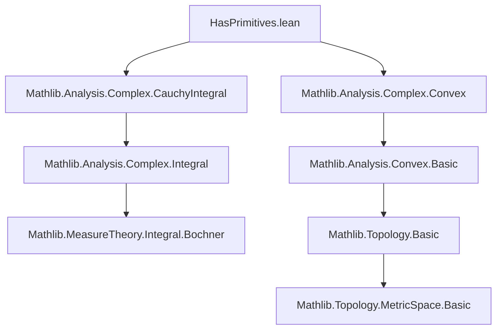

### Technical Brief: `HasPrimitives.lean`

---

#### **1. Key Definitions & Theorems**

| Name | Type / Signature | Purpose |
|------|------------------|---------|
| `wedgeIntegral` | `wedgeIntegral (z w : ℂ) (f : ℂ → E) : E` | Defines the integral of `f` over the “L-shaped” path from `z` to `w`: horizontal segment then vertical segment. |
| `IsConservativeOn` | `IsConservativeOn (f : ℂ → E) (U : Set ℂ) : Prop` | `f` is conservative on `U` if integrals over all rectangles in `U` vanish (i.e., `wedgeIntegral z w f = -wedgeIntegral w z f`). |
| `IsExactOn` | `IsExactOn (f : ℂ → E) (U : Set ℂ) : Prop` | `f` is exact on `U` if it has a complex primitive (i.e., ∃ `g` s.t. `g' = f` on `U`). |
| `IsConservativeOn.isExactOn_ball` | `IsConservativeOn f (ball c r) → ContinuousOn f (ball c r) → IsExactOn f (ball c r)` | **Morera’s Theorem for disks**: A continuous conservative function on a disk has a primitive. |
| `DifferentiableOn.isExactOn_ball` | `DifferentiableOn ℂ f (ball c r) → IsExactOn f (ball c r)` | Holomorphic functions on disks have primitives (corollary of above + `DifferentiableOn ⇒ IsConservativeOn`). |
| `isConservativeOn_and_continuousOn_iff_isDifferentiableOn` | `IsOpen U → (IsConservativeOn f U ∧ ContinuousOn f U) ↔ DifferentiableOn ℂ f U` | Equivalence between conservative + continuous and holomorphic on open sets. |

---

#### **2. Naming Conventions**

- **Prefixes**:
  - `is_`: Property definitions (`IsConservativeOn`, `IsExactOn`)
  - `has_`: Derivative/existence properties (`hasDerivAt`, `hasFDerivAt`)
  - `mem_`, `re_`, `im_`: Geometric membership lemmas (`mem_ball_re_aux`, `re_add_im_mul_mem_ball`)
  - `eventually_`: Filter-based asymptotic behavior (`eventually_nhds_...`)
- **Suffixes**:
  - `_aux`: Technical auxiliary lemmas (`mem_ball_of_map_re_aux`, `hasDerivAt_wedgeIntegral_re_aux`)
  - `_sub_`, `_add_`, `_eq_`: Structural equalities (`wedgeIntegral_add_wedgeIntegral_eq`, `integral_boundary_rect_eq_zero_of_differentiableOn`)
- **Constants**:
  - `c`, `r`: Center and radius of a disk
  - `z`, `w`: Points in ℂ
  - `f`: Function under study
  - `E`: Target normed space over ℂ

---

#### **3. Tactic Stack**

| Tactic | Usage Frequency | Purpose |
|--------|-----------------|---------|
| `grind` | High | Automated simplification + linear arithmetic (custom tactic in Mathlib) |
| `simp` / `simp_rw` | Very High | Simplification with rewrite rules (e.g., `re_add_im`, `intervalIntegral.integral_add_adjacent_intervals`) |
| `exact`, `refine`, `convert` | High | Goal-directed proof construction |
| `abel` | Medium | Abelian group reasoning (e.g., simplifying sums of integrals) |
| `filter_upwards` | Medium | Handling filter-based little-o arguments |
| `rw` | High | Rewriting using lemmas/definitions |
| `cases` | Medium | Case analysis on interval membership (`mem_uIoc`) |
| `nlinarith` | Medium | Nonlinear arithmetic (e.g., bounding squares) |
| `grind [wedgeIntegral]` | Low | Custom tactic for final simplification steps |

---

#### **4. Proof Logic**

The logical flow follows a **constructive Morera-style argument**:

1. **Setup**:
   - Work on a disk `ball c r`.
   - Assume `f` is continuous and conservative (`IsConservativeOn f (ball c r)`).

2. **Define candidate primitive**:
   - `g(z) := wedgeIntegral c z f`.

3. **Show `g' = f`**:
   - Use `hasDerivAt_iff_isLittleO`.
   - Decompose `wedgeIntegral z w f - (w - z) • f z` into horizontal + vertical parts.
   - Prove each part is `o(‖w - z‖)` using:
     - `hasDerivAt_wedgeIntegral_re_aux`: Horizontal integral approximates `(w - z).re • f z`.
     - `hasDerivAt_wedgeIntegral_im_aux`: Vertical integral approximates `(w - z).im • f z`.
   - Key tools: continuity of `f`, interval integral differentiability lemmas, and `eventually_nhds_wedgeIntegral_sub_wedgeIntegral` to relate `wedgeIntegral c w f - wedgeIntegral c z f` to `wedgeIntegral z w f`.

4. **Conclude**:
   - `IsConservativeOn.isExactOn_ball`: `g` is a primitive.
   - `DifferentiableOn.isExactOn_ball`: Since holomorphic ⇒ conservative (via `integral_boundary_rect_eq_zero_of_differentiableOn`), the result follows.

5. **Equivalence on open sets**:
   - Use local disk covering (`Metric.isOpen_iff`) to lift from disks to arbitrary open sets.

---

#### **5. Imports & Dependencies**

| Module | Role |
|--------|------|
| `Mathlib.Analysis.Complex.CauchyIntegral` | Provides Cauchy integral machinery, rectangle boundary integrals, and `integral_boundary_rect_eq_zero_of_differentiableOn`. |
| `Mathlib.Analysis.Complex.Convex` | Used for convexity of balls (`convex_ball`), rectangle inclusion (`rectangle_subset`). |
| `MeasureTheory`, `Metric`, `Topological`, `Set`, `Interval` | Integration theory, topology of ℂ, interval integrals, set operations. |
| `NormedAddCommGroup`, `NormedSpace ℂ` | Functional-analytic setup for target space `E`. |
| `CompleteSpace E` | Required for interval integrals to exist (via Bochner integral completeness). |

---

#### **6. Mermaid Diagrams**

##### **Dependency Graph (File-Level)**



##### **Theoretical Flow (Conceptual)**

```mermaid
flowchart LR
  subgraph Setup
    A[Continuous f on ball c r] --> B[IsConservativeOn f (ball c r)]
  end

  subgraph Construction
    B --> C[Define g(z) = wedgeIntegral c z f]
  end

  subgraph Analysis
    C --> D[Show g' = f]
    D --> E[Use wedgeIntegral decomposition]
    E --> F[Horizontal + Vertical o(‖w-z‖) estimates]
  end

  subgraph Conclusion
    D --> G[IsExactOn f (ball c r)]
    G --> H[Holomorphic ⇒ IsExactOn]
  end

  A -->|Morera| G
  H -->|Local-to-global| I[DifferentiableOn ⇔ Conservative + Continuous on open U]
```

---

#### **7. Summary**

This file formalizes a foundational result in complex analysis: **holomorphic functions on disks have primitives**, via Morera’s theorem. It introduces the `wedgeIntegral` to construct primitives explicitly and proves key lemmas about its differentiability using interval integral estimates and filter-based asymptotics. The approach is constructive and avoids power series, relying instead on real analysis and measure-theoretic integration. The main theorem `IsConservativeOn.isExactOn_ball` is a stepping stone toward the full Morera theorem on simply connected domains (marked as future work).
