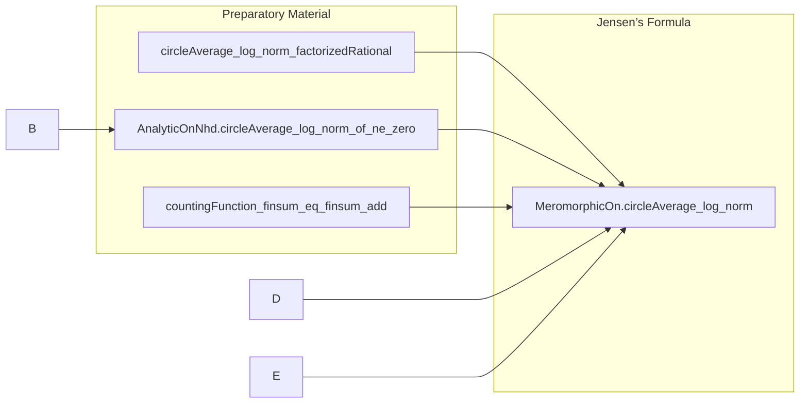

**Technical Brief: JensenFormula.lean**

---

### 1. KEY DEFINITIONS & THEOREMS

| Name | Type / Signature | Purpose |
|------|------------------|---------|
| `circleAverage_log_norm_factorizedRational` | `∀ {R c D}, D ∈ Function.locallyFinsuppWithin (closedBall c |R|) ℤ → circleAverage (∑ᶠ u, D u * log ‖· - u‖) c R = ∑ᶠ u, D u * log R` | Computes the circle average of a finitely supported logarithmic potential; key technical lemma for handling zero/pole contributions. |
| `AnalyticOnNhd.circleAverage_log_norm_of_ne_zero` | `∀ {R c g}, AnalyticOnNhd g (closedBall c |R|) → (∀ u ∈ closedBall c |R|, g u ≠ 0) → circleAverage (log ‖g ·‖) c R = log ‖g c‖` | Mean value property for harmonic functions: log norm of non-vanishing analytic function is harmonic, so its circle average equals its value at the center. |
| `countingFunction_finsum_eq_finsum_add` | `∀ {c R D}, R ≠ 0 → D.support.Finite → ∑ᶠ u, D u * (log R - log ‖c - u‖) = ∑ᶠ u, D u * log (R * ‖c - u‖⁻¹) + D c * log R` | Algebraic reformulation of a key sum appearing in Jensen’s formula; isolates the contribution at the center point `c`. |
| `MeromorphicOn.circleAverage_log_norm` *(Jensen’s Formula)* | `∀ {c R f}, R ≠ 0 → MeromorphicOn f (closedBall c |R|) → circleAverage (log ‖f ·‖) c R = ∑ᶠ u, divisor f CB u * log (R * ‖c - u‖⁻¹) + divisor f CB c * log R + log ‖meromorphicTrailingCoeffAt f c‖` | Main theorem: relates circle average of log norm of a meromorphic function to its divisor (zeros/poles) and the meromorphic trailing coefficient at the center. |

---

### 2. NAMING CONVENTIONS

- **Prefixes**:
  - `circleAverage_`: for lemmas about circle averages.
  - `log_norm_`: for results involving `log ‖·‖`.
  - `divisor_`: for divisor-related constructions (e.g., `divisor f CB`).
  - `meromorphicTrailingCoeffAt_`: for trailing coefficient at a point.
  - `analyticOnNhd_`, `meromorphicOn_`, `meromorphicAt_`: for properties of analytic/meromorphic functions.

- **Suffixes**:
  - `_of_ne_zero`: when non-vanishing is assumed.
  - `_finsum_eq_finsum_add`: for algebraic rewrites of finsum expressions.
  - `_factorizedRational`: for factorized rational-type expressions (sums of logs of distances).

- **Abbreviations**:
  - `CB := closedBall c |R|` used locally in proofs.

---

### 3. TACTIC STACK

Frequently used tactics in this file:

| Tactic | Role |
|--------|------|
| `simp_rw` | Rewriting with simplification, especially for `finsum`, `log`, `norm`, and arithmetic. |
| `aesop` | Automated reasoning for set-theoretic and filter-level goals (e.g., support containment, codiscrete filters). |
| `rw` | Standard rewriting, often after `have` or `obtain`. |
| `apply`, `intro`, `intro h`, `by_cases`, `push_neg` | Standard natural-deduction style proof structuring. |
| `ring` | For algebraic simplifications of real/complex expressions involving `log`, `inv`, `norm`. |
| `congr`, `congr'`, `congr 1` | Congruence reasoning, especially for equality of sums/integrals. |
| `filter_upwards` | For filter-based arguments (e.g., codiscreteWithin, equality almost everywhere). |
| `ext` | Extensionality for functions/divisors. |
| `simp only [...]` | Fine-grained simplification with explicit control over what to simplify. |

---

### 4. PROOF LOGIC

The proof of **Jensen’s Formula** proceeds as follows:

1. **Case split on whether `f` has a pole of infinite order anywhere in the closed ball**:
   - If **no poles of infinite order** (`∀ u ∈ CB, meromorphicOrderAt f u ≠ ⊤`):
     - Use `extract_zeros_poles` to factor `f = g * ∏ (· - u)^{D(u)}`.
     - Apply additivity of circle average.
     - Compute each part:
       - The product part via `circleAverage_log_norm_factorizedRational`.
       - The non-vanishing analytic part `g` via `circleAverage_log_norm_of_ne_zero`.
     - Use `MeromorphicOn.log_norm_meromorphicTrailingCoeffAt_extract_zeros_poles` to relate `g(c)` to `meromorphicTrailingCoeffAt f c`.
     - Algebraically rearrange using `countingFunction_finsum_eq_finsum_add`.
   - If **some pole of infinite order exists**:
     - Show the divisor is identically zero (since poles of infinite order dominate).
     - Show `f = 0` almost everywhere w.r.t. codiscreteWithin filter.
     - Use `circleAverage_congr_codiscreteWithin` to reduce to the zero function.
     - Verify both sides vanish (using `log_zero`, `meromorphicTrailingCoeffAt_of_order_eq_top`).

The structure is highly modular: preparatory lemmas isolate computational pieces, and the main theorem combines them via case analysis and filter-based congruences.

---

### 5. IMPORTS

- `Mathlib.Analysis.SpecialFunctions.Integrals.PosLogEqCircleAverage`: Provides foundational results on circle averages and integrals of `log ‖·‖`, especially the equality `PosLogEqCircleAverage` used implicitly in harmonic function theory.

This import anchors the file in real/complex analysis and potential theory.

---

### 6. DEPENDENCY & THEORY OVERVIEW (Mermaid Diagram)

#### Dependency Graph (Top-Level)

```mermaid
graph TD
  A[JensenFormula.lean] --> B[Mathlib.Analysis.SpecialFunctions.Integrals.PosLogEqCircleAverage]
  A --> C[Mathlib.Analysis.Complex.ValueDistribution.CountingFunction] % indirect (mentioned in docstring)
  A --> D[Mathlib.Analysis.Complex.Meromorphic]
  A --> E[Mathlib.Topology.Filter.Codiscrete]
  A --> F[Mathlib.MeasureTheory.Integral.IntervalIntegral]
```

#### Overview of File Structure



#### Theory Context

- **Domain**: Complex analysis, specifically *value distribution theory*.
- **Core objects**: Meromorphic functions on ℂ, divisors, meromorphic order, trailing coefficients.
- **Tools used**:
  - Harmonic function theory (`log ‖f‖` harmonic when `f` analytic & non-vanishing).
  - Filter theory (`codiscreteWithin`, `frequently`, `a.e.` arguments).
  - Integration on circles (`circleAverage`, `intervalIntegral`).
- **Related files**:
  - `Mathlib/Analysis/Complex/ValueDistribution/CountingFunction.lean`: defines the counting function `N_f(r)` used in Nevanlinna theory.
  - `Mathlib/Analysis/Complex/Meromorphic.lean`: foundational meromorphic function theory.
  - `Mathlib/Analysis/SpecialFunctions/Integrals/PosLogEqCircleAverage.lean`: technical bridge between harmonic averages and logarithmic potentials.

---

Let me know if you'd like a formalized dependency graph (e.g., in `.lean` format) or a visualization of the proof tree for `MeromorphicOn.circleAverage_log_norm`.
