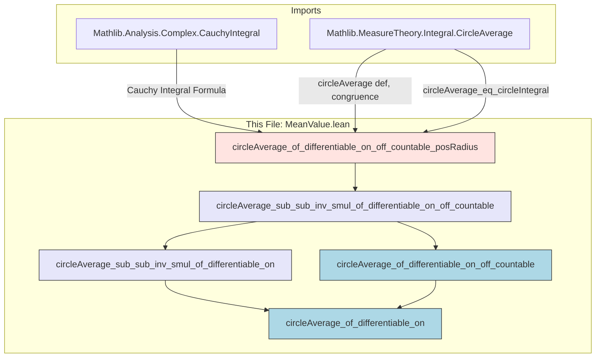

**Technical Brief: `MeanValue.lean` — Mean Value Properties for Complex-Differentiable Functions**

---

### 1. KEY DEFINITIONS & THEOREMS

| Name | Type / Signature | Purpose |
|------|------------------|---------|
| `circleAverage` | `ℂ → E → ℝ → ℂ → E` (via `CircleAverage`) | Computes the average of a function over a circle centered at `c` with radius `R`. Defined via normalized circle integral. |
| `circleAverage_eq_circleIntegral` | `hR : 0 < R → circleAverage f c R = (2 * π * I)⁻¹ • ∮ z in C(c, R), f z` | Relates `circleAverage` to the contour integral over the circle `C(c, R)`. |
| `circleAverage_of_differentiable_on_off_countable_posRadius` | `0 < R → s.Countable → ContinuousOn f (closedBall c R) → (∀ z ∈ ball c R \ s, DifferentiableAt ℂ f z) → w ∈ ball c R → circleAverage (fun z ↦ ((z - c) * (z - w)⁻¹) • f z) c R = f w` | Core lemma for generalized mean value property in the case of positive radius. Uses Cauchy integral formula for weighted integrand. |
| `circleAverage_sub_sub_inv_smul_of_differentiable_on_off_countable` | `s.Countable → ContinuousOn f (closedBall c |R|) → (∀ z ∈ ball c |R| \ s, DifferentiableAt ℂ f z) → w ∈ ball c |R| → R ≠ 0 → circleAverage (fun z ↦ ((z - c) / (z - w)) • f z) c R = f w` | **Generalized Mean Value Property**: expresses `f(w)` as a circle average of a weighted version of `f`. |
| `circleAverage_sub_sub_inv_smul_of_differentiable_on` | `(∀ z ∈ closedBall c |R|, DifferentiableAt ℂ f z) → w ∈ ball c |R| → R ≠ 0 → circleAverage (fun z ↦ ((z - c) / (z - w)) • f z) c R = f w` | Special case of the above where differentiability holds *everywhere* on the closed disk. |
| `circleAverage_of_differentiable_on_off_countable` | `s.Countable → ContinuousOn f (closedBall c |R|) → (∀ z ∈ ball c |R| \ s, DifferentiableAt ℂ f z) → circleAverage f c R = f c` | **Classic Mean Value Property**: `f(c)` equals the average of `f` over the circle `C(c, R)`. |
| `circleAverage_of_differentiable_on` | `(∀ z ∈ closedBall c |R|, DifferentiableAt ℂ f z) → circleAverage f c R = f c` | Classic mean value property under full differentiability on the closed disk. |

> Note: In all theorems, `|R|` is used to ensure nonnegative radius; `R ≠ 0` avoids degenerate circles.

---

### 2. NAMING CONVENTIONS

- **Prefixes**:
  - `circleAverage_`: for theorems/lemmas about circle averages.
  - `sub_sub_inv_smul`: for the weighted integrand `((z - c) / (z - w)) • f z`, where `sub` refers to `z - c`, `sub_inv` to `(z - w)⁻¹`, and `smul` to scalar multiplication.
- **Suffixes**:
  - `_of_differentiable_on`: assumes differentiability on the *closed* disk.
  - `_of_differentiable_on_off_countable`: assumes differentiability *almost everywhere* (except a countable set).
  - `_posRadius`: used for auxiliary lemmas assuming `0 < R`.
- **Pattern**: `circleAverage_[structure]_[hypothesis]` — e.g., `circleAverage_sub_sub_inv_smul_of_differentiable_on_off_countable`.

---

### 3. TACTIC STACK

Frequently used tactics in proofs:

| Tactic | Role |
|--------|------|
| `simp only [...]` | Simplify using algebraic identities (e.g., `inv_I`, `neg_mul`, `smul_right_inj`). |
| `match_scalars` | Normalize scalar multiples in vector-valued integrals (e.g., pull out constants from `•`). |
| `aesop` | Solve simple goals involving inequalities, membership, and basic topology (e.g., `w ∈ ball c |R|`, `z - c ≠ 0`). |
| `grind` | Custom tactic (likely from `Mathlib.Tactic`) for grinding through algebraic simplifications, especially for field operations and nonzero conditions. |
| `rw [...]` | Rewrite using previously proven equalities (e.g., `← circleAverage_sub_sub_inv_smul_of_differentiable_on_off_countable`). |
| `apply circleAverage_congr_sphere` | Prove equality of circle averages by showing integrands agree almost everywhere on the sphere. |
| `simp_all` | Simplify all goals and assumptions, often after `grind`. |
| `by_cases hR : R = 0` | Handle degenerate radius case separately. |

---

### 4. PROOF LOGIC

**General proof strategy**:

1. **Handle degenerate radius** (`R = 0`) separately via `by_cases`, reducing to `simp`.
2. **Reduce to positive radius** using `← circleAverage_abs_radius` or `circleAverage_of_differentiable_on_off_countable_posRadius`.
3. **Rewrite circle average as contour integral** using `circleAverage_eq_circleIntegral`.
4. **Simplify integrand** (e.g., `((z - c) / (z - w)) • f z`) via `match_scalars`, algebraic simplifications, and `grind`.
5. **Apply Cauchy integral formula** (via `circleIntegral_sub_inv_smul_of_differentiable_on_off_countable`), which requires:
   - Countable exceptional set (`s.Countable`)
   - Continuity on closed disk
   - Differentiability almost everywhere on open disk
   - Point `w` strictly inside the disk
6. **Conclude equality** `= f w`, possibly using `simp [field]` to simplify scalar actions.

**Classic mean value property** is derived by setting `w = c`, where the weight simplifies to `1`, and using `circleAverage_congr_sphere` to show integrand equality on the sphere (since `z ≠ c` on `sphere c R`).

---

### 5. IMPORTS

| Module | Purpose |
|--------|---------|
| `Mathlib.Analysis.Complex.CauchyIntegral` | Provides Cauchy integral formula, contour integrals over circles, and tools like `circleIntegral_sub_inv_smul_of_differentiable_on_off_countable`. |
| `Mathlib.MeasureTheory.Integral.CircleAverage` | Defines `circleAverage`, its relation to integrals, and basic properties (e.g., `circleAverage_eq_circleIntegral`, `circleAverage_congr_sphere`). |

> These imports define the analytic and measure-theoretic foundation for complex contour integration and averaging over circles.

---

### 6. DEPENDENCY & OVERVIEW DIAGRAM

**Overview**:

- The file builds from a **core auxiliary lemma** (`posRadius`) to two **generalized mean value properties** (weighted averages), and finally to the **classic mean value properties** (unweighted, at the center).
- All proofs rely on the **Cauchy integral formula** for functions differentiable off a countable set.
- The structure mirrors standard complex analysis development: first handle nonzero radius, then reduce degenerate case.

---

### 7. DOMAIN & APPLICATIONS

- **Domain**: Complex analysis, functional analysis (Banach-space-valued functions), measure theory.
- **Applications**:
  - Proving analyticity of complex-differentiable functions.
  - Deriving Poisson integral formulas.
  - Supporting potential theory and harmonic analysis in the complex plane.
  - Formalizing properties of holomorphic functions in Banach spaces.

---

### 8. NOTES ON FORMALIZATION QUALITY

- Uses `|R|` to avoid sign issues with radius.
- Handles countable exceptional sets (e.g., isolated singularities).
- Fully vector-valued (`E : NormedSpace ℂ E`), making results applicable to Banach-space-valued holomorphic functions.
- Leverages `match_scalars` and `grind` for automated scalar manipulation — essential for clean vector-valued integral proofs.

--- 

Let me know if you'd like a dependency graph of the broader `Mathlib` theory (e.g., how this connects to `Analytic`, `Harmonic`, or `CauchyFormula`).
