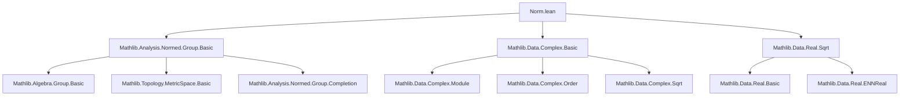

### Technical Brief: `Norm.lean` — Norm on the Complex Numbers in Lean 4

---

#### **1. Key Definitions & Theorems**

| Name | Type / Signature | Purpose |
|------|------------------|---------|
| `instNorm` | `Norm ℂ` | Defines the standard Euclidean norm on ℂ via `√(normSq z)` |
| `norm_def` | `‖z‖ = √(normSq z)` | Definition of the norm |
| `norm_mul_self_eq_normSq` | `‖z‖ * ‖z‖ = normSq z` | Relates norm squared to `normSq` |
| `norm_nonneg` | `0 ≤ ‖z‖` | Positivity of norm |
| `abs_re_le_norm`, `re_le_norm` | `|z.re| ≤ ‖z‖`, `z.re ≤ ‖z‖` | Real part bounded by norm |
| `norm_add_le'` | `‖z + w‖ ≤ ‖z‖ + ‖w‖` | Triangle inequality (proof uses `gcongr` + `re_le_norm`) |
| `norm_eq_zero_iff` | `‖z‖ = 0 ↔ z = 0` | Definiteness of norm |
| `norm_neg'` | `‖-z‖ = ‖z‖` | Evenness of norm |
| `instNormedAddCommGroup` | `NormedAddCommGroup ℂ` | Constructs the normed additive commutative group structure |
| `norm_mul`, `norm_div` | `‖z * w‖ = ‖z‖ * ‖w‖`, `‖z / w‖ = ‖z‖ / ‖w‖` | Multiplicativity (and division) of norm |
| `isAbsoluteValueNorm` | `IsAbsoluteValue (‖·‖)` | Norm satisfies absolute value axioms |
| `norm_pow`, `norm_zpow`, `norm_prod` | `‖z^n‖ = ‖z‖^n`, etc. | Homomorphism properties over powers/products |
| `norm_conj` | `‖conj z‖ = ‖z‖` | Conjugation-invariance |
| `norm_I` | `‖I‖ = 1` | Norm of imaginary unit |
| `norm_real`, `norm_natCast`, `norm_intCast`, `norm_ratCast` | Compatibility with embeddings | Norm of real/natural/int/rational numbers embedded in ℂ |
| `normSq_eq_norm_sq` | `normSq z = ‖z‖^2` | Equivalence of `normSq` and square of norm |
| `norm_eq_sqrt_sq_add_sq` | `‖z‖ = √(z.re² + z.im²)` | Explicit formula for norm |
| `range_norm`, `range_normSq` | `range ‖·‖ = [0, ∞)`, `range normSq = [0, ∞)` | Surjectivity onto nonnegative reals |
| `norm_le_sqrt_two_mul_max` | `‖z‖ ≤ √2 * max(|z.re|, |z.im|)` | Upper bound in terms of max coordinate |
| `abs_re_div_norm_le_one`, `abs_im_div_norm_le_one` | Normalized coordinates bounded by 1 | Used in projective or spherical arguments |
| `dist_eq`, `dist_eq_re_im`, `dist_mk` | Metric induced by norm | Standard Euclidean metric on ℂ |
| `dist_conj_self`, `dist_self_conj` | Distance between a point and its conjugate | `2 * |z.im|` |
| `isCauSeq_re`, `isCauSeq_im`, `isCauSeq_norm`, `isCauSeq_conj` | Cauchy sequence stability under operations | Key for completeness |
| `cauSeqRe`, `cauSeqIm`, `cauSeqConj`, `cauSeqNorm` | Real/imaginary/conjugate/norm projections of Cauchy sequences | Constructive components |
| `limAux`, `equiv_limAux`, `lim_eq_lim_im_add_lim_re` | Limit of complex Cauchy seq = real + imag parts | Completeness proof |
| `lim_re`, `lim_im`, `lim_conj`, `lim_norm` | Limits commute with operations | Continuity of operations |
| `norm_sub_one_sq_eq_of_norm_eq_one` | On unit circle: `‖z - 1‖² = 2(1 - Re(z))` | Geometry of unit circle |
| `normSq_ofReal_add_I_mul_sqrt_one_sub`, `normSq_ofReal_sub_I_mul_sqrt_one_sub` | Points on unit circle parametrized by real part | Used in spherical constructions |

---

#### **2. Naming Conventions**

- **Prefixes**:
  - `norm_`: Basic norm properties (`norm_def`, `norm_mul`, `norm_add_le'`, `norm_eq_zero_iff`)
  - `abs_`: Absolute value bounds (`abs_re_le_norm`, `abs_im_le_norm`, `abs_re_lt_norm`)
  - `normSq_`: Properties of `normSq` (`normSq_eq_norm_sq`, `normSq_mul`, `normSq_div`, `normSq_add_mul_I`)
  - `dist_`: Metric properties (`dist_eq`, `dist_mk`, `dist_conj_self`)
  - `cauSeq_`: Cauchy sequence operations (`cauSeqRe`, `cauSeqConj`, `cauSeqNorm`)
  - `lim_`: Limit operations (`lim_re`, `lim_im`, `lim_conj`, `lim_norm`)
  - `nnnorm_`: Nonnegative norm variant (`nnnorm_I`, `nnnorm_natCast`)
  - `norm_cast`: Cast lemmas (`norm_natCast`, `norm_intCast`, `norm_ratCast`, `norm_real`)

- **Suffixes**:
  - `_le`, `_lt`, `_eq`: Inequality/equality lemmas (`norm_add_le`, `abs_re_lt_norm`, `abs_re_eq_norm`)
  - `_iff`: Biconditional lemmas (`norm_eq_zero_iff`, `abs_re_lt_norm`, `abs_re_eq_norm`)
  - `_self`: Self-application (`norm_mul_self_eq_normSq`, `normSq_eq_norm_sq`)
  - `_of_`: Conditional versions (`norm_of_nonneg`, `norm_int_of_nonneg`, `norm_sub_one_sq_eq_of_norm_eq_one`)

- **Special**:
  - `isCauSeq_`: Predicate for Cauchy sequences (`isCauSeq_re`, `isCauSeq_norm`)
  - `equiv_`: Approximation/equivalence lemmas (`equiv_limAux`)
  - `range_`: Image/range lemmas (`range_norm`, `range_normSq`)

---

#### **3. Tactic Stack**

| Tactic | Frequency | Role |
|--------|-----------|------|
| `rw` | Very High | Rewriting definitions (`norm_def`, `normSq_apply`, `sq`, etc.) |
| `simp` / `simp_rw` | Very High | Simplification using lemmas, especially `norm_*`, `abs_*`, `dist_*` |
| `gcongr` | Medium-High | Proving inequalities with monotone functions (e.g., `√`, `max`) |
| `linarith` | Medium | Linear arithmetic over reals (e.g., in `norm_sub_one_sq_eq_of_norm_eq_one`) |
| `apply`, `exact`, `intro`, `cases` | Medium | Basic proof structure |
| `ring` | Medium | Algebraic simplification (e.g., in `norm_sub_one_sq_eq_of_norm_eq_one`) |
| `nlinarith` | Low-Medium | Nonlinear arithmetic (e.g., in `normSq_ofReal_add_I_mul_sqrt_one_sub`) |
| `set_option backward.privateInPublic true` | Local | Allows private lemmas to be used in public instances (e.g., `instNormedAddCommGroup`) |
| `calc` | Medium | Chain of equalities/inequalities (e.g., `norm_le_sqrt_two_mul_max`) |
| `dsimp`, `rwa` | Medium | Simplification + rewriting in hypotheses/goal |
| `obtain ⟨x, y⟩ := z` | Low | Pattern matching on complex numbers |

---

#### **4. Proof Logic**

- **Structure**: Most proofs follow a **definition → algebraic manipulation → inequality bounding** pattern.
- **Triangle inequality (`norm_add_le'`)**:
  - Reduce to `‖z + w‖² ≤ (‖z‖ + ‖w‖)²` via `mul_self_le_mul_self_iff`.
  - Expand both sides using `norm_mul_self_eq_normSq`, `normSq_add`, and `normSq_conj`.
  - Reduce to `2 * Re(z * conj w) ≤ 2 * ‖z‖ * ‖w‖`, i.e., `re_le_norm (z * conj w)`.
- **Multiplicativity (`norm_mul`)**:
  - Directly from `normSq_mul` and `Real.sqrt_mul`.
- **Completeness (`instIsComplete`)**:
  - Define limit as pair of real limits (`limAux`).
  - Prove equivalence (`equiv_limAux`) using triangle inequality and `norm_le_abs_re_add_abs_im`.
- **Cauchy stability**:
  - Use `abs_re_le_norm`, `abs_im_le_norm`, `abs_norm_sub_norm_le` to lift Cauchy property.
- **Geometric lemmas** (e.g., on unit circle):
  - Use `sq_norm`, `normSq_apply`, and algebraic simplification (`ring`, `linarith`).

---

#### **5. Imports**

| Module | Purpose |
|--------|---------|
| `Mathlib.Analysis.Normed.Group.Basic` | General normed group theory (`NormedAddCommGroup`, `IsAbsoluteValue`, `dist`, `CauSeq`) |
| `Mathlib.Data.Complex.Basic` | Complex numbers, `conj`, `normSq`, `I`, `mk`, `re`, `im`, `ofReal` |
| `Mathlib.Data.Real.Sqrt` | Square root properties (`Real.sqrt_mul`, `Real.sqrt_sq`, `Real.sqrt_eq_zero`) |

---

#### **6. Mermaid Diagrams**

##### **Dependency Graph (Top-Level)**



##### **Overview of Theory Flow**

```mermaid
flowchart LR
  subgraph Foundations
    A[Complex Numbers] --> B[normSq]
    B --> C[√(normSq)]
    C --> D[Norm]
  end

  subgraph Structure
    D --> E[instNorm]
    E --> F[instNormedAddCommGroup]
    D --> G[isAbsoluteValueNorm]
  end

  subgraph Metric
    D --> H[dist]
    H --> I[metric space]
  end

  subgraph Analysis
    D --> J[Cauchy sequences]
    J --> K[Completeness]
    K --> L[lim = lim_re + lim_im * I]
  end

  subgraph Geometry
    D --> M[Unit circle]
    M --> N[norm_sub_one_sq_eq]
    M --> O[Parametrization]
  end
```

---

#### **7. Summary**

This file formalizes the **Euclidean norm** on ℂ, establishes it as a **multiplicative absolute value**, constructs the **normed additive group** and **complete metric space** structure, and proves key geometric and analytic properties (triangle inequality, conjugation invariance, behavior under arithmetic operations, Cauchy sequence stability, and unit-circle geometry). It serves as a foundational module for complex analysis in Mathlib.

The formalization is **highly structured**, with careful use of `simp`-friendly lemmas, `gcongr` for monotonicity, and `calc` for chain reasoning. It leverages existing infrastructure (`IsAbsoluteValue`, `CauSeq`, `NormedAddCommGroup`) to minimize redundancy and maximize reuse.

--- 

Let me know if you'd like a dependency graph for specific sub-theories (e.g., `dist_*` lemmas or Cauchy sequence machinery).
