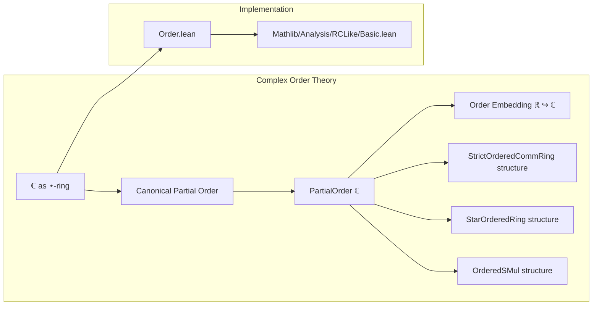
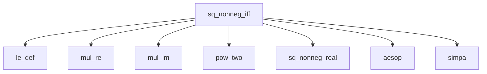

### Technical Brief: `Order.lean` — Partial Order on ℂ

---

#### **1. Key Definitions & Theorems**

| Name | Type / Signature | Purpose |
|------|------------------|---------|
| `Complex.partialOrder` | `PartialOrder ℂ` | Defines the canonical partial order on ℂ: $ z \le w \iff z.\text{re} \le w.\text{re} \land z.\text{im} = w.\text{im} $. |
| `le_def` | $ z \le w \leftrightarrow z.\text{re} \le w.\text{re} \land z.\text{im} = w.\text{im} $ | Characterizes the order relation. |
| `lt_def` | $ z < w \leftrightarrow z.\text{re} < w.\text{re} \land z.\text{im} = w.\text{im} $ | Characterizes strict order. |
| `nonneg_iff`, `pos_iff`, `nonpos_iff`, `neg_iff` | $ 0 \le z \leftrightarrow 0 \le z.\text{re} \land z.\text{im} = 0 $, etc. | Relate order-theoretic properties of $ z $ to its real/imaginary parts. |
| `sq_nonneg_iff` | $ 0 \le z^2 \leftrightarrow z.\text{im} = 0 $ | Characterizes when a square is nonnegative. |
| `sq_nonpos_iff` | $ z^2 \le 0 \leftrightarrow z.\text{re} = 0 $ | Characterizes when a square is nonpositive. |
| `real_le_real`, `real_lt_real` | $ (x : ℂ) \le (y : ℂ) \leftrightarrow x \le y $, etc. | Embedding $ \mathbb{R} \hookrightarrow \mathbb{C} $ is an order embedding. |
| `not_le_iff`, `not_lt_iff`, `not_le_zero_iff`, `not_lt_zero_iff` | Logical negations of order relations. | Useful for contradiction-based reasoning. |
| `eq_re_of_ofReal_le` | $ (r : ℂ) \le z \Rightarrow z = z.\text{re} $ | If a real number is ≤ $ z $, then $ z $ must be real. |
| `re_eq_norm`, `neg_re_eq_norm`, `re_eq_neg_norm` | $ z.\text{re} = \|z\| \leftrightarrow 0 \le z $, etc. | Connects order with norm geometry. |
| `monotone_ofReal` | $ \text{Monotone } \text{ofReal} $ | $ \mathbb{R} \to \mathbb{C} $ preserves order. |
| `evalComplexOfReal` | `PositivityExt` instance | Enables `positivity` tactic to reason about positivity of `Complex.ofReal`. |

---

#### **2. Naming Conventions**

- **Prefixes**:
  - `le_`, `lt_`, `nonneg_`, `pos_`, `nonpos_`, `neg_`, `sq_`, `real_`, `not_`, `re_`, `neg_re_`, `norm_`
- **Suffixes**:
  - `_iff`, `_def`, `_iff`, `_le`, `_lt`, `_iff`
- **Pattern**:
  - `X_iff` for characterizations of $ X $ in terms of real/imaginary parts.
  - `real_X_real` for embedding lemmas.
  - `not_X_iff` for negations.

---

#### **3. Tactic Stack**

- `tauto` — for logical reasoning in `lt_iff_le_not_ge`.
- `aesop` — in `sq_nonneg_iff`, `sq_nonpos_iff`.
- `simp` + `rw` — pervasive for rewriting definitions (`le_def`, `lt_def`, etc.).
- `simpa` — to simplify using hypotheses.
- `ext` — for proving equality of complex numbers via real/imag parts.
- `ofReal`, `conj_eq_iff_re`, `conj_eq_iff_im` — used in geometric reasoning.
- `positivity` tactic (via `evalComplexOfReal`) — for automated positivity proofs.

---

#### **4. Proof Logic**

- **Structure**: Most proofs follow a pattern:
  1. Unfold definitions (`le_def`, `lt_def`, etc.).
  2. Reduce to real-number inequalities and equalities.
  3. Use `aesop`, `simp`, or `tauto` to finish.
- **Typical Flow**:
  - For `le_trans`, `le_antisymm`: decompose into real and imag parts, apply real-order properties.
  - For `sq_nonneg_iff`, `sq_nonpos_iff`: expand multiplication (`mul_re`, `mul_im`), reduce to real algebra, use `sq_nonneg`.
  - For `eq_re_of_ofReal_le`: use conjugate characterizations (`conj_eq_iff_im`) to force imaginary part zero.

---

#### **5. Imports**

- `Mathlib.Analysis.Complex.Norm` — provides `norm`, `norm_nonneg`, `norm_neg`, `abs_re_eq_norm`, etc.
- Implicit reliance on:
  - `Mathlib.Data.Complex.Basic` (for `re`, `im`, `conj`, `ofReal`, `pow_two`, etc.)
  - `Mathlib.Order.PartialOrder`, `Mathlib.Order.Basic`
  - `Mathlib.Data.Real.Basic` (for real order properties)

---

#### **6. Mermaid Diagrams**

##### **Dependency Graph (File-Level)**

```mermaid
graph TD
  A[Order.lean] --> B[Mathlib.Analysis.Complex.Norm]
  A --> C[Mathlib.Data.Complex.Basic]
  A --> D[Mathlib.Order.PartialOrder]
  A --> E[Mathlib.Data.Real.Basic]
  A --> F[Mathlib.Meta.Positivity]
  A --> G[Mathlib.Analysis.RCLike.Basic]  %% indirectly via RCLike.* instances
```

##### **Conceptual Overview (Theory Scope)**



##### **Proof Dependency (Example: `sq_nonneg_iff`)**



---

#### **7. Summary**

This file introduces the **canonical partial order** on ℂ, where two complex numbers are comparable only if they lie on the same horizontal line (equal imaginary part), and ordering is inherited from ℝ on the real part. It establishes foundational lemmas for reasoning about this order, especially how it interacts with algebraic operations (squaring, negation), norm, and the embedding of ℝ. The order is *not* linear (as expected), but suffices to make ℂ a `StrictOrderedCommRing` and `StarOrderedRing` — though those structures are deferred to `RCLike.Basic`.

The `positivity` tactic extension (`evalComplexOfReal`) enables automation for positivity goals involving `Complex.ofReal`, leveraging the order embedding.

--- 

Let me know if you'd like a formalized dependency graph (e.g., Lean module graph) or a deeper dive into any specific lemma.
