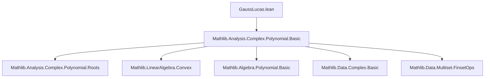

**Technical Brief: `GaussLucas.lean`**

---

### 1. **Key Definitions & Theorems**

| Name | Type / Signature | Purpose |
|------|------------------|---------|
| `derivRootWeight` | `ℂ → ℂ → ℝ` | Assigns a real weight to each root `w` of `P` relative to a point `z`, used to express `z` as a convex combination when `P'(z) = 0`. |
| `derivRootWeight_nonneg` | `∀ P z w, 0 ≤ derivRootWeight P z w` | Ensures weights are nonnegative — essential for convex combinations. |
| `sum_derivRootWeight_pos` | `∀ hP : 0 < degree P, ∀ z, 0 < ∑ w ∈ P.roots, derivRootWeight P z w` | Shows total weight is positive (hence normalization possible). |
| `eq_centerMass_of_eval_derivative_eq_zero` | `∀ hP : 0 < degree P, P.derivative.eval z = 0 → z = centerMass ...` | Main constructive Gauss–Lucas: expresses any critical point `z` as a convex combination of roots of `P`, with explicit weights. |
| `rootSet_derivative_subset_convexHull_rootSet` | `0 < degree P → rootSet P' ⊆ convexHull (rootSet P)` | Set-theoretic Gauss–Lucas: all critical points lie in the convex hull of roots. |

---

### 2. **Naming Conventions**

- **Prefixes**:
  - `derivRootWeight`: combines `deriv` (derivative), `root`, and `weight`.
  - `rootSet_...`: for root-set–related operations (`rootSet`, `mem_rootSet`, `coe_aeval_eq_eval`).
- **Suffixes**:
  - `_nonneg`, `_pos`: indicate sign/positivity properties.
  - `_subset_...`, `_mem_...`: standard subset/membership lemmas.
- **Structure**:
  - `eq_centerMass_of_eval_derivative_eq_zero`: describes *when* and *what* — equality of `z` to a center of mass *given* derivative vanishes.

---

### 3. **Tactic Stack**

Frequent tactics used:

- `simp` / `simp only` — simplification with definitional lemmas.
- `split_ifs` — handles `if ... then ... else ...` definitions.
- `rw` / `rwa` — rewriting using equalities, often with `at` or assumptions.
- `apply`, `intro`, `intro z hz`, etc. — standard natural-deduction style.
- `calc` — chaining equational reasoning.
- `Finset.sum_congr`, `Finset.sum_eq_single`, `Finset.centerMass_mem_convexHull` — combinatorial/finite-set lemmas.
- ` positivity`, `simp_all` — for positivity goals and simplification with assumptions.
- `field`, `ring` — algebraic simplifications in ℂ.
- `exact`, `refine`, `first | ...` — control flow in proofs.

---

### 4. **Proof Logic**

The logical flow follows a *constructive* strategy:

1. **Assumptions**: `P` nonconstant (`0 < degree P`), `z` a root of `P'`.
2. **Goal**: Show `z` lies in convex hull of `P`’s roots.
3. **Strategy**:
   - Define weights `derivRootWeight P z w`.
   - Prove weights are nonnegative and sum to a positive real.
   - Prove weighted sum of `(z - w)` over roots `w` is zero.
   - Conclude `z` equals the weighted average (center of mass) of roots.
4. **Case split** on whether `P(z) = 0`:
   - If yes: trivial (single-term convex combo).
   - If no: use complex-analytic identity:
     $$
     \sum_{w \in \text{roots}(P)} \frac{m_w}{z - w} = \frac{P'(z)}{P(z)} = 0
     $$
     where `m_w` is root multiplicity. Take conjugate and relate to `derivRootWeight`.

The final theorem `rootSet_derivative_subset_convexHull_rootSet` follows directly from the explicit formula.

---

### 5. **Imports & Dependencies**

- **Core import**: `Mathlib.Analysis.Complex.Polynomial.Basic`
- **Key underlying theories**:
  - Complex numbers (`ℂ`)
  - Polynomials over ℂ (`Polynomial`)
  - Multisets of roots (`roots`, `count_roots`, `rootMultiplicity`)
  - Convex hulls (`convexHull`, `centerMass`)
  - Finite sets and sums (`Finset`, `BigOperators`)
  - Complex conjugation (`ComplexConjugate`)
  - IsAlgClosed (used for polynomial splitting over ℂ)

---

### 6. **Mermaid Diagrams**

#### **Dependency Graph (Module-Level)**



#### **Overview of Theoretical Flow**

```mermaid
flowchart LR
  P[Polynomial P : ℂ[X]] -->|nonconstant| H[0 < degree P]
  H --> D[P'.eval z = 0]
  D --> W[Define derivRootWeight P z w]
  W --> N[derivRootWeight_nonneg]
  W --> S[sum_derivRootWeight_pos]
  N & S --> C[∑ weight x • (z - x) = 0]
  C --> E[eq_centerMass_of_eval_derivative_eq_zero]
  E --> R[rootSet_derivative_subset_convexHull_rootSet]
```

---

### 7. **Mathematical Formulae (Embedded)**

- **Weight definition**:
  $$
  \text{derivRootWeight}_P(z, w) =
  \begin{cases}
    1 & \text{if } P(z) = 0 \text{ and } w = z \\
    \dfrac{m_w}{\|z - w\|^2} & \text{otherwise}
  \end{cases}
  $$
  where $m_w$ is the root multiplicity of $w$ in $P$.

- **Gauss–Lucas identity** (key step):
  $$
  \sum_{w \in \text{roots}(P)} \frac{m_w}{z - w} = \frac{P'(z)}{P(z)}.
  $$

- **Convex combination**:
  $$
  z = \frac{\sum_{w \in \text{roots}(P)} \text{derivRootWeight}_P(z, w) \cdot w}{\sum_{w \in \text{roots}(P)} \text{derivRootWeight}_P(z, w)}.
  $$

---

### 8. **Domain-Specific AI Agent Notes**

- **Focus area**: Complex analysis, algebraic geometry, formal proof verification.
- **Key lemmas to surface**: `eq_centerMass_of_eval_derivative_eq_zero`, `rootSet_derivative_subset_convexHull_rootSet`.
- **Common proof patterns**:
  - Case analysis on evaluation at `z`.
  - Use of `Finset.sum_congr` and `Finset.sum_eq_single`.
  - Leveraging `IsAlgClosed.splits` for polynomial factorization.
- **Suggested tactic automation**: `simp_all`, ` positivity`, `field_simp` + `ring`.

--- 

Let me know if you'd like a visualization of the `derivRootWeight` function or a tactic trace for `eq_centerMass_of_eval_derivative_eq_zero`.
