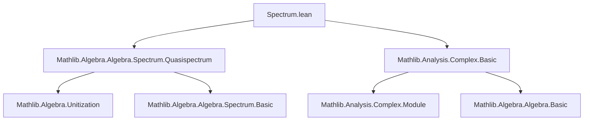
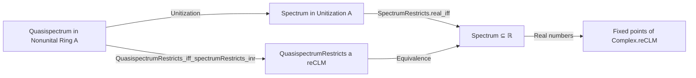

**Technical Brief: `Spectrum.lean`**

---

### 1. KEY DEFINITIONS & THEOREMS

| Name | Type / Signature | Purpose |
|------|------------------|---------|
| `SpectrumRestricts` | `SpectrumRestricts : A → (ℂ →ₐ[ℝ] ℂ) → Prop` | Predicate stating that the spectrum of an element `a : A` is preserved under restriction of scalars along a real algebra map (here `Complex.reCLM : ℂ →ₐ[ℝ] ℂ`). |
| `QuasispectrumRestricts` | `QuasispectrumRestricts : A → (ℂ →ₐ[ℝ] ℂ) → Prop` | Analogous to `SpectrumRestricts`, but for the *quasispectrum* in a non-unital ring setting (via unitization). |
| `real_iff` (in `SpectrumRestricts`) | `SpectrumRestricts a Complex.reCLM ↔ ∀ x ∈ spectrum ℂ a, x = x.re` | Characterizes when the spectrum lies entirely in `ℝ`: the spectrum is fixed under complex conjugation (i.e., real-valued) iff the element’s spectrum is real. |
| `real_iff` (in `QuasispectrumRestricts`) | `QuasispectrumRestricts a Complex.reCLM ↔ ∀ x ∈ σₙ ℂ a, x = x.re` | Same characterization for the quasispectrum, using reduction to the spectrum case via unitization. |

> **Note**: `Complex.reCLM` is the real-linear (but not complex-linear) algebra map `ℂ →ₐ[ℝ] ℂ`, `z ↦ z.re`. It is used to test whether the spectrum is *real*, i.e., invariant under this map.

---

### 2. NAMING CONVENTIONS

- **Predicate prefix**: `SpectrumRestricts`, `QuasispectrumRestricts` — indicates a restriction property of spectra/quasispectra under a map.
- **Suffix `_iff`**: Used for equivalences (`↔`) that relate structural properties (e.g., restriction) to pointwise conditions on spectrum elements.
- **Notation**: `σₙ` is locally defined as shorthand for `quasispectrum`.
- **Typeclass parameters**: `[Ring A]`, `[NonUnitalRing A]`, `[Algebra ℂ A]`, `[Module ℂ A]`, etc., follow standard Mathlib conventions.

---

### 3. TACTIC STACK

- `refine ⟨fun h x hx ↦ ?_, fun h ↦ ?_⟩`: Standard tactic for proving biconditionals by splitting into two implications.
- `obtain ⟨x, -, rfl⟩ := ...`: Destructuring existential quantifiers and using definitional equality (`rfl`) after rewriting.
- `simp`: Simplification using definitional equalities and known lemmas (e.g., `algebraMap_image`, `Complex.ofReal_re`).
- `rw [...]`: Rewriting using previously established equivalences (e.g., `quasispectrumRestricts_iff_spectrumRestricts_inr`, `Unitization.quasispectrum_eq_spectrum_inr'`).
- `exact .of_subset_range_algebraMap ...`: Application of a lemma from `SpectrumRestricts` theory.

No heavy automation (e.g., `aesop`, `ring`, `linarith`) is used—proofs are mostly structural and rely on algebraic properties of spectrum/unitization.

---

### 4. PROOF LOGIC

- **Structure**: Proofs proceed by unfolding definitions and reducing to known equivalences.
- **For `SpectrumRestricts.real_iff`**:
  1. Unfold `SpectrumRestricts` → use its definition in terms of `algebraMap_image`.
  2. One direction: assume restriction holds, then any spectrum point must be real (via `h.algebraMap_image` and `simp`).
  3. Other direction: assume all spectrum points are real, then construct preimages under `algebraMap` using `Complex.ofReal_re`, showing inclusion in the image.
- **For `QuasispectrumRestricts.real_iff`**:
  1. Reduce to the spectrum case via:
     - `quasispectrumRestricts_iff_spectrumRestricts_inr`: connects quasispectrum restriction to spectrum restriction on the unitization.
     - `Unitization.quasispectrum_eq_spectrum_inr'`: identifies quasispectrum in `A` with spectrum of `inr a` in `Unitization A`.
  2. Apply the already-proven `SpectrumRestricts.real_iff`.

Induction or case analysis is *not* used—proofs are purely algebraic and rely on categorical/structural lemmas.

---

### 5. IMPORTS & DEPENDENCIES

| Import | Role |
|--------|------|
| `Mathlib.Algebra.Algebra.Spectrum.Quasispectrum` | Core definitions: `spectrum`, `quasispectrum`, `SpectrumRestricts`, `QuasispectrumRestricts`, and key lemmas (e.g., `quasispectrumRestricts_iff_spectrumRestricts_inr`, `Unitization.quasispectrum_eq_spectrum_inr'`). |
| `Mathlib.Analysis.Complex.Basic` | Provides `Complex.reCLM`, `Complex.ofReal`, `Complex.ofReal_re`, and basic facts about complex conjugation/restriction of scalars. |

> These imports indicate the module sits at the intersection of **algebraic spectral theory** and **complex analysis**, specifically in the context of *-algebras or real forms of complex algebras.

---

### 6. MERMAID DIAGRAMS

#### Dependency Graph (Module-Level)

#### Overview of Theoretical Flow

---

### 7. SUMMARY

This file establishes a foundational equivalence:  
> *An element has spectrum (or quasispectrum) contained in `ℝ` iff it is fixed under restriction of scalars along `Complex.reCLM`.*

It leverages the unitization trick to reduce quasispectrum statements to spectrum statements, and uses only basic complex analysis and algebraic properties—no heavy analysis or topology. The lemmas are designed to support further work on real forms, *-algebras, or positivity theory in complex algebras.

--- 

Let me know if you'd like the corresponding `spectrum.lean` or `quasispectrum.lean` files formalized similarly.
