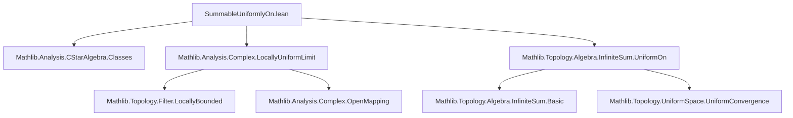

**Technical Brief: `SummableUniformlyOn.lean`**

---

### 1. **Key Definitions & Theorems**

| Name | Type / Signature | Purpose |
|------|------------------|---------|
| `SummableLocallyUniformlyOn` | `SummableLocallyUniformlyOn f s` | A predicate stating that the series $\sum_n f_n(z)$ converges *locally uniformly* on a set $s \subseteq \mathbb{C}$. (Defined in `Mathlib.Topology.Algebra.InfiniteSum.UniformOn`) |
| `differentiableOn` | `DifferentiableOn ℂ g s` | $g$ is complex-differentiable at every point of $s$ (within $s$, with respect to the subspace topology). |
| **Main Theorem** `SummableLocallyUniformlyOn.differentiableOn` | `∀ n r, r ∈ s → DifferentiableAt ℂ (f n) r` + `SummableLocallyUniformlyOn f s` ⇒ `DifferentiableOn ℂ (z ↦ ∑' n, f n z) s` | If each term $f_n$ is complex-differentiable at points of an open set $s$, and the series converges locally uniformly on $s$, then the sum function is differentiable on $s$. |

> Note: This is a *local* version of the classical theorem: uniform convergence of a series of holomorphic functions on open sets preserves holomorphy (and differentiability) of the limit.

---

### 2. **Naming Conventions**

- **Prefixes**:
  - `SummableLocallyUniformlyOn`: compound predicate naming — `Summable` + `LocallyUniformlyOn`.
  - `hasSumLocallyUniformlyOn`: variant for existence of a limit function.
- **Suffixes**:
  - `On`: indicates restriction to a subset (e.g., `uniformlyOn`, `differentiableOn`).
  - `At`: pointwise version (e.g., `DifferentiableAt`, `tendstoLocallyUniformlyOn`).
- **Quantifier style**: `∀ n r, r ∈ s → ...` — standard for pointwise conditions over index and point.

---

### 3. **Tactic Stack**

| Tactic | Usage |
|--------|-------|
| `obtain ⟨g, hg⟩` | Extract witness for locally uniform convergence. |
| `tendstoLocallyUniformlyOn.mp` | Convert equivalence (`hasSumLocallyUniformlyOn_iff_tendstoLocallyUniformlyOn`) to implication. |
| `differentiableOn ?_ hs` | Apply a lemma requiring openness of domain (`hs : IsOpen s`). |
| `congr` | Prove equality of functions on domain via pointwise equality. |
| `tsum_eqOn` | Justifies replacing sum of series with its limit function on $s$. |
| `filter_upwards with t r hr using ...` | Prove a property holds *within* $s$ by unfolding `DifferentiableWithinAt`. |
| `differentiableWithinAt` | Used to lift `DifferentiableAt` to `DifferentiableWithinAt`. |
| `fun_sum` | Applies differentiability to finite sums (used in `fun_sum` lemma). |

> Tactics are mostly *proof-shape-directed*, leveraging existing analysis lemmas in Mathlib.

---

### 4. **Proof Logic**

1. **Unpack hypothesis**: From `h : SummableLocallyUniformlyOn f s`, get a function $g$ such that $\sum_n f_n \to g$ locally uniformly on $s$.
2. **Use equivalence**: Convert to `tendstoLocallyUniformlyOn` (via `hasSumLocallyUniformlyOn_iff_tendstoLocallyUniformlyOn`).
3. **Apply differentiability under limit**: Use `differentiableOn` lemma for locally uniform limits (requires openness of $s$).
4. **Show pointwise equality**: Use `tsum_eqOn` to equate the sum function with $g$ on $s$.
5. **Verify differentiability of partial sums**: Show each finite partial sum is differentiable on $s$ using `hf2` and `fun_sum`, then lift to the limit.

> **Structure**:  
> `obtain` → `rewrite using equivalence` → `apply lemma` → `congr + tsum_eqOn` → `induction-free differentiability propagation`.

---

### 5. **Imports**

| Module | Role |
|--------|------|
| `Mathlib.Analysis.CStarAlgebra.Classes` | Provides background on normed spaces over $\mathbb{C}$, completeness, etc. |
| `Mathlib.Analysis.Complex.LocallyUniformLimit` | Contains lemmas about limits of sequences of functions under locally uniform convergence (e.g., preservation of differentiability). |
| `Mathlib.Topology.Algebra.InfiniteSum.UniformOn` | Defines `SummableLocallyUniformlyOn`, `tendstoLocallyUniformlyOn`, and related infinite-sum convergence notions. |

> **Scope**: Complex analysis in Banach-space-valued functions, with emphasis on *local uniform convergence* and *differentiability*.

---

### 6. **Mermaid Diagrams**

#### **Dependency Graph (File-Level)**



#### **Theoretical Overview (Conceptual Flow)**

```mermaid
flowchart LR
  subgraph Setup
    S[Open set s ⊆ ℂ] 
    F[Family f : ι → ℂ → E]
    H[Each f n differentiable on s]
  end

  subgraph Convergence
    U[Locally uniform convergence of ∑ f n on s]
  end

  subgraph Conclusion
    D[∑' n, f n(z) differentiable on s]
  end

  S -->|open domain needed| C1
  H -->|pointwise differentiability| C2
  U -->|limit preserves differentiability| D
  C1 & C2 & U --> D
```

> **Key Insight**: The theorem bridges *analytic convergence* (locally uniform) and *algebraic structure* (differentiability), leveraging completeness of $E$ and openness of $s$.

--- 

Let me know if you'd like the corresponding `diff_series` corollary or a formalization sketch of the proof in natural language.
