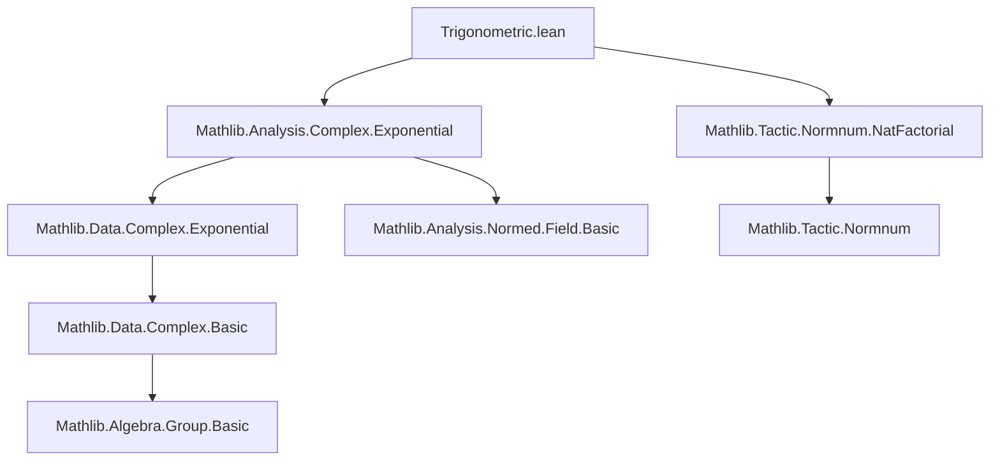
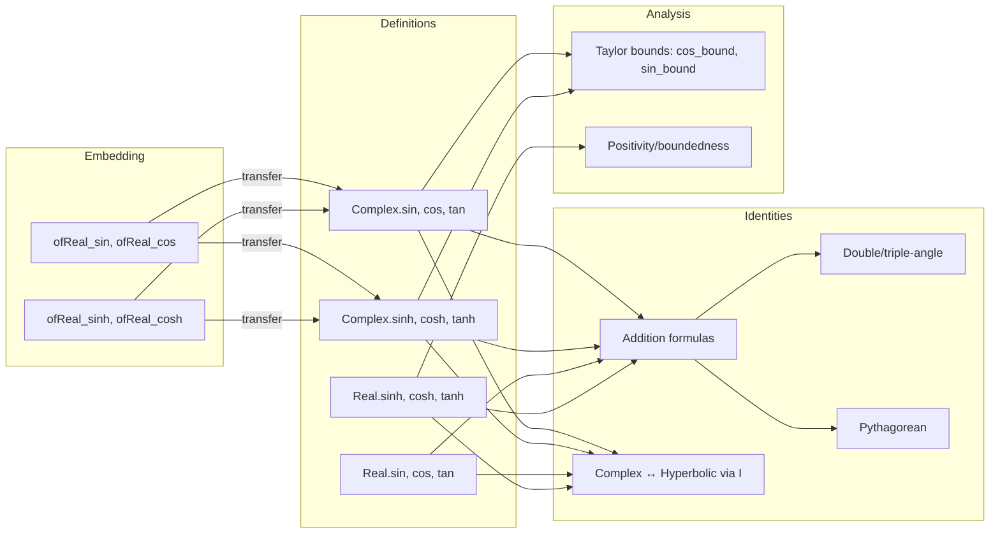

Here is the structured technical brief extracted from `Trigonometric.lean`:

---

### **1. Key Definitions & Theorems**

| Name | Type | Purpose |
|------|------|---------|
| `sin`, `cos`, `tan`, `cot`, `sinh`, `cosh`, `tanh` | `ℂ → ℂ` or `ℝ → ℝ` | Definitions of trigonometric and hyperbolic functions via `exp` (complex), or real parts (real). |
| `sinh_add`, `cosh_add`, `sin_add`, `cos_add` | `∀ x y, f (x + y) = …` | Addition formulas for hyperbolic and trigonometric functions. |
| `sin_sq_add_cos_sq`, `cosh_sq_sub_sinh_sq` | `∀ x, sin x ^ 2 + cos x ^ 2 = 1`, `cosh x ^ 2 - sinh x ^ 2 = 1` | Pythagorean identities. |
| `exp_mul_I` | `∀ x, exp (x * I) = cos x + sin x * I` | Euler’s formula. |
| `cos_two_mul`, `sin_two_mul`, `cos_three_mul`, `sin_three_mul` | Polynomial identities in `cos x`, `sin x` | Double/triple-angle formulas. |
| `sinh_mul_I`, `cosh_mul_I`, `tanh_mul_I` | `sinh (x * I) = sin x * I`, `cosh (x * I) = cos x`, `tanh (x * I) = tan x * I` | Bridge between trigonometric and hyperbolic functions via imaginary unit. |
| `exp_eq_exp_re_mul_sin_add_cos` | `∀ z, exp z = exp z.re * (cos z.im + sin z.im * I)` | Decomposition of complex exponential. |
| `exp_re`, `exp_im` | `(exp z).re = exp z.re * cos z.im`, `(exp z).im = exp z.re * sin z.im` | Real/imaginary parts of complex exponential. |
| `cos_bound`, `sin_bound` | `‖cos x - (1 - x²/2)‖ ≤ …`, `‖sin x - (x - x³/6)‖ ≤ …` | Taylor remainder bounds for `cos`, `sin` on unit disk. |
| `cos_pos_of_le_one` | `|x| ≤ 1 → 0 < cos x` | Positivity of cosine near zero. |
| `abs_tanh_lt_one` | `|tanh x| < 1` | Boundedness of hyperbolic tangent. |

---

### **2. Naming Conventions**

- **Prefixes**:
  - `is_`, `has_`: *not used* here.
  - `ofReal_`: embedding real functions into complex (`ofReal_sin`, `ofReal_cosh`, etc.).
  - `two_`, `cosh_`, `sinh_`, `sin_`, `cos_`, `tanh_`: function-specific prefixes.
- **Suffixes**:
  - `_eq`: definition or equivalence (e.g., `sinh_eq`, `tanh_eq`).
  - `_mul_I`: interaction with `I` (e.g., `sinh_mul_I`, `cos_mul_I`).
  - `_conj`: conjugation compatibility (`sin_conj`, `cosh_conj`).
  - `_ofReal_re`, `_ofReal_im`: real/imag parts of complex extension.
  - `_bound`: analytic bounds (`cos_bound`, `sin_bound`).
- **Pattern**: `f_add`, `f_sub`, `f_two_mul`, `f_three_mul`, `f_neg`, `f_zero`, `f_sq`, `f_conj`, `ofReal_f`.

---

### **3. Tactic Stack**

- **Core tactics**:
  - `simp` (heavily used, especially with `[simp]` attributes)
  - `rw` (rewriting lemmas, often with `←`, `eq_comm`, `mul_left_comm`, etc.)
  - `ring` (polynomial simplifications, especially in angle addition proofs)
  - `field_simp`, `div_eq_mul_inv`, `div_mul_cancel₀`
  - `norm_num`, `grind`, `gcongr`, `calc` (for inequalities and bounds)
  - `grw` (graded rewriting for normed spaces)
  - `congr`, `ext`, `apply`, `convert`
  - `cases` (e.g., `le_total x 0` for absolute value cases)
  - `ofReal_injective`, `ofReal_inj` (injectivity for real-to-complex embeddings)

---

### **4. Proof Logic**

- **Structure**:
  - **Definitions** via `exp` (complex), then real versions via real part.
  - **Lemmas** often proven in `Complex` first, then transferred to `Real` via `ofReal_injective`.
  - **Addition formulas**: proven by expanding via `exp`, using `exp_add`, `exp_neg`, and algebraic identities (`sinh_add_aux`, `cosh_add_aux`).
  - **Double/triple-angle**: derived from addition formulas + `ring`.
  - **Real-to-complex compatibility**: use `ofReal_injective` + `simp [f_add]`.
  - **Inequalities**: use Taylor remainder bounds (`exp_bound`), `norm_add_le`, `grw`, and `norm_num`.
  - **Positivity/boundedness**: rely on `exp_pos`, `two_pos`, `grind [exp_pos]`.

---

### **5. Imports**

- `Mathlib.Analysis.Complex.Exponential`: defines `exp`, `I`, conjugation, `exp_add`, `exp_conj`, `exp_bound`.
- `Mathlib.Tactic.Normnum.NatFactorial`: for factorial normalization (`norm_num` on `n!`).
- `Mathlib.Data.Complex.Basic` (implicit via `open Complex`): `I`, `conj`, `norm`, `re`, `im`, `ofReal`, etc.
- `Mathlib.Algebra.Group.Basic`, `Mathlib.Analysis.Normed.Field.Basic`, `Mathlib.Data.Real.Basic`, `Mathlib.Data.Complex.Exponential` (via `Complex.Exponential`).

---

### **6. Mermaid Diagrams**

#### **Dependency Graph (Module Scope)**

#### **Overview of Theory Flow**

---

Let me know if you'd like a formal dependency graph (e.g., `leanpkg`-level), or a theory graph for related files (e.g., `Complex.Exponential`, `Real.ArcTan`, `MeasureTheory.Integral.Trigonometric`).
