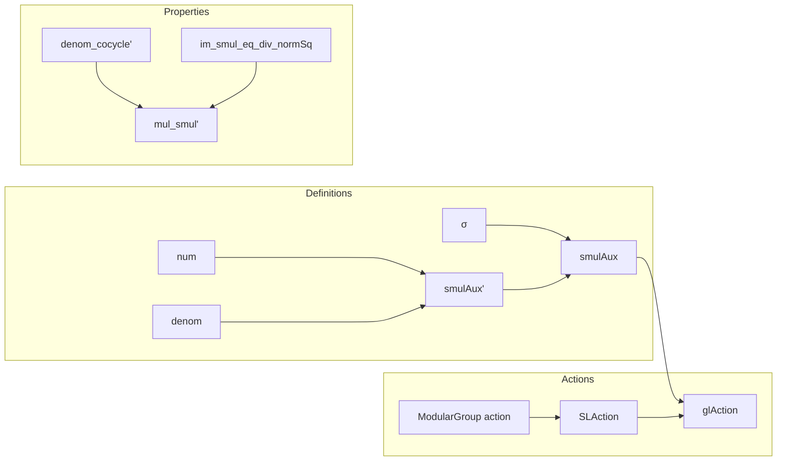

**Technical Brief: `MoebiusAction.lean`**

---

### 1. KEY DEFINITIONS & THEOREMS

| Name | Type / Signature | Purpose |
|------|------------------|---------|
| `num g z` | `ℂ → ℂ` | Numerator of fractional linear transformation: $g_{00} z + g_{01}$ |
| `denom g z` | `ℂ → ℂ` | Denominator: $g_{10} z + g_{11}$ |
| `σ g` | `ℂ →+* ℂ` | Ring automorphism: identity if $\det g > 0$, complex conjugation otherwise |
| `smulAux' g z` | `ℂ` | Unrestricted Moebius action: $\sigma_g\!\left(\frac{\text{num}\,g\,z}{\text{denom}\,g\,z}\right)$ |
| `smulAux g z` | `ℍ → ℍ` | Well-defined action on upper half-plane (ensures imaginary part stays positive) |
| `glAction` | `MulAction (GL(2, ℝ)) ℍ` | Group action of $GL(2,\mathbb{R})$ on $\mathbb{H}$ via Moebius transformations extended by conjugation |
| `SLAction` | `MulAction (SL(2, R)) ℍ` | Restriction of action to $SL(2,R)$ via `MulAction.compHom` |
| `modular_S_smul`, `modular_T_smul` | `ℍ → ℍ` | Explicit formulas for standard generators $S,T$ of modular group: $S\cdot z = -1/z$, $T\cdot z = z+1$ |
| `denom_cocycle'` | `denom (g * h) z = σ h (denom g (h • z)) * denom h z` | Cocycle condition for denominator under group multiplication |
| `mul_smul'` | `smulAux (g * h) z = smulAux g (smulAux h z)` | Associativity of the Moebius action |
| `im_smul_eq_div_normSq` | $(g \cdot z).\text{im} = \frac{|\det g| \cdot z.\text{im}}{|\text{denom}\,g\,z|^2}$ | Key formula for how imaginary part transforms |

---

### 2. NAMING CONVENTIONS

- **Prefixes**:
  - `num_`, `denom_`: for numerator/denominator functions and lemmas.
  - `σ_`: for properties of the automorphism $\sigma$ (e.g., `σ_num`, `σ_denom`, `σ_mul`).
  - `smulAux_`, `smulAux'_im`: for auxiliary definitions and properties of the Moebius action.
  - `coe_`: for coercion lemmas (e.g., `coe_smul`, `coe_specialLinearGroup_apply`).
  - `modular_`, `SL_`, `denom_`: domain-specific naming for modular group and $SL$-specific results.

- **Suffixes**:
  - `_im`, `_re`: for imaginary/real part lemmas.
  - `_ne_zero`, `_pos`: for non-vanishing/positivity results.
  - `_cocycle`: for cocycle identities.
  - `_zpow_smul`: for powers of group elements (e.g., `modular_T_zpow_smul`).

- **Notation**:
  - `↑ₘ A`: coercion to matrix in `GL(2,ℝ)`.
  - `↑ₘ[R] A`: coercion with explicit ring parameter.

---

### 3. TACTIC STACK

Frequently used tactics:
- `simp` (with many custom lemmas, especially `@[simp]`)
- `ring`, `field_simp`, `norm_cast`
- `split_ifs` (for case analysis on `if ... then ... else ...`)
- `ext` (extensionality for functions/structures)
- `congr`, `congr_arg`, `congr 1`
- `rcases`, `obtain`, `induction ... using ...`
- `nlinarith`, `grind` (custom tactic for algebraic simplification)
- `change`, `rw`, `conv_rhs`

---

### 4. PROOF LOGIC

- **Structure**: Most proofs follow a pattern:
  1. **Unfold definitions** (`smulAux`, `num`, `denom`, `σ`)
  2. **Simplify using `simp`** with `@[simp]` lemmas (e.g., `σ_num`, `σ_denom`, `denom_cocycle`)
  3. **Apply algebraic simplifications** (`ring`, `field_simp`, `norm_cast`)
  4. **Case split on determinant sign** (via `rcases ... lt_or_gt`)
  5. **Use properties of complex numbers** (`Complex.div_im`, `Complex.normSq`, `abs_div`, etc.)

- **Inductive proofs** appear in `SLModularAction.exists_SL2_smul_eq_of_apply_zero_one_ne_zero`, using `fin_two_induction`.

- **Cocycle identities** are proven by expanding definitions and applying `field_simp` + `ring`.

- **Action properties** (`one_smul`, `mul_smul'`) are verified by extensionality and simplification.

---

### 5. IMPORTS & DEPENDENCIES

- `Mathlib.Analysis.Complex.UpperHalfPlane.Basic`: defines $\mathbb{H}$, its topology, coercion to $\mathbb{C}$, etc.
- `Mathlib.Data.Fintype.Parity`: used for parity arguments (though not directly visible here, likely for `det` sign).
- `Mathlib.LinearAlgebra.Matrix.GeneralLinearGroup.Defs`: defines `GL(n,R)`, `det`, positivity subgroup `GL⁺`.

**Key scoped notations**:
- `MatrixGroups`, `ComplexConjugate`: for `σ`, `starRingEnd`, etc.

---

### 6. MODULAR GROUP-SPECIFIC RESULTS

- `SL(2, ℤ)` embeds into `GL(2, ℝ)⁺` via `coe`.
- Action of modular group generators:
  - $S \cdot z = -1/z$
  - $T^n \cdot z = z + n$
- Decomposition lemmas for arbitrary $g \in SL(2,\mathbb{R})$ into translations, $S$, and scalings.

---

### 7. MERMAID DIAGRAMS

#### Dependency Graph (High-Level)

```mermaid
graph TD
  A[UpperHalfPlane] --> B[ℂ]
  A --> C[ℍ]
  D[GL(2,ℝ)] --> A
  E[SL(2,ℝ)] --> D
  F[SL(2,ℤ)] --> E
  G[ModularGroup] --> F
  C -->|action| A
  D -->|smulAux| C
  E -->|SLAction| C
  F -->|SLModularAction| C
```

#### File Overview



---

### 8. THEORY CONTEXT

This file formalizes the **Moebius (fractional linear) action** of $GL(2,\mathbb{R})$ on the **upper half-plane** $\mathbb{H}$, a foundational object in:
- **Automorphic forms**
- **Modular curves**
- **Hyperbolic geometry**

The action is extended from $GL(2,\mathbb{R})^+$ (positive determinant) to all of $GL(2,\mathbb{R})$ using **complex conjugation**, ensuring that matrices with negative determinant act anti-holomorphically (e.g., $[[ -1, 0 ], [ 0, 1 ]] \cdot z = -\overline{z}$).

The modular group $SL(2,\mathbb{Z})$ inherits this action, and the file includes explicit formulas for its standard generators $S,T$, along with structural decomposition lemmas used in reduction theory (e.g., existence of $SL(2,\mathbb{R})$-translates to standard fundamental domains).

This is part of the **Lean Mathlib** project’s effort to formalize the theory of modular forms and Shimura varieties.

--- 

Let me know if you'd like a formalization roadmap or a summary of how this fits into the broader modular forms library.
