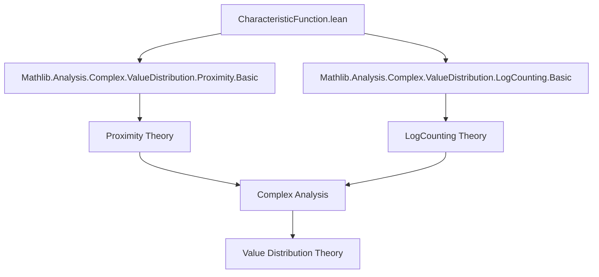
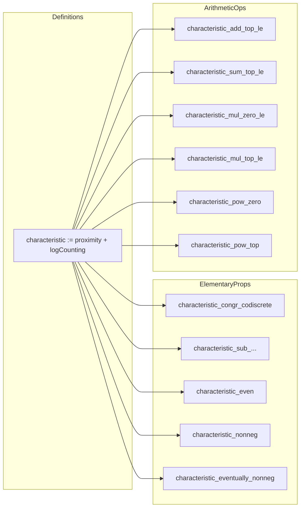

### Technical Brief: `CharacteristicFunction.lean`

---

#### **1. Key Definitions & Theorems**

| Name | Type / Signature | Purpose |
|------|------------------|---------|
| `characteristic` | `ℝ → ℝ` | Main object: $ T_f(r, a) = N_f(r, a) + m_f(r, a) $, sum of proximity and logarithmic counting functions for a meromorphic function $ f $ and value $ a \in \mathrm{WithTop}\,E $. |
| `characteristic_congr_codiscrete` | `f =ᶠ[codiscrete ℂ] g → r ≠ 0 → characteristic f a r = characteristic g a r` | Shows characteristic function is insensitive to changes on discrete sets (except possibly at $ r = 0 $). |
| `characteristic_sub_characteristic_eq_proximity_sub_proximity` | `Meromorphic f → characteristic f ⊤ - characteristic (f - a₀) ⊤ = proximity f ⊤ - proximity (f - a₀) ⊤` | Relates characteristic functions of $ f $ and $ f - a₀ $; poles cancel out in difference. |
| `characteristic_even` | `(characteristic f a).Even` | Symmetry: $ T_f(-r, a) = T_f(r, a) $, though domain is $ \mathbb{R}_{\ge 0} $, this reflects even extension. |
| `characteristic_nonneg` | `1 ≤ r → 0 ≤ characteristic f a r` | Positivity for $ r \ge 1 $. |
| `characteristic_eventually_nonneg` | `0 ≤ᶠ[atTop] characteristic f a` | Asymptotic non-negativity. |
| `characteristic_add_top_le` | `Meromorphic f₁ → Meromorphic f₂ → 1 ≤ r → T_{f₁+f₂}(r, ⊤) ≤ T_{f₁}(r, ⊤) + T_{f₂}(r, ⊤) + \log 2` | Subadditivity of characteristic function at $ \top $ (poles), up to $ \log 2 $. |
| `characteristic_add_top_eventuallyLE` | `characteristic (f₁ + f₂) ⊤ ≤ᶠ[atTop] characteristic f₁ ⊤ + characteristic f₂ ⊤ + \log 2` | Asymptotic version of above. |
| `characteristic_sum_top_le` | `∀ a ∈ s, Meromorphic (f a) → 1 ≤ r → T_{\sum s f}(r, ⊤) ≤ \sum s (T_{f a}(r, ⊤)) + \log |s|` | Generalizes subadditivity to finite sums. |
| `characteristic_mul_zero_le`, `characteristic_mul_top_le` | `1 ≤ r → T_{f₁ f₂}(r, 0) ≤ T_{f₁}(r, 0) + T_{f₂}(r, 0)` (and similarly for $ \top $) | Multiplicative subadditivity for zeros/poles. |
| `characteristic_pow_zero`, `characteristic_pow_top` | `Meromorphic f → T_{f^n}(r, a) = n \cdot T_f(r, a)` for $ a = 0 $ or $ \top $ | Homogeneity under powers. |

---

#### **2. Naming Conventions**

- **Prefixes**:
  - `characteristic_`: main object.
  - `proximity_`, `logCounting_`: components of `characteristic`.
- **Suffixes**:
  - `_le`: inequality upper bound.
  - `_eventuallyLE`: asymptotic inequality (w.r.t. `atTop` filter).
  - `_top`: value $ a = \top $ (poles).
  - `_zero`: value $ a = 0 $ (zeros).
  - `_mul`, `_add`, `_sum`, `_pow`: behavior under arithmetic operations.
- **Special**:
  - `_congr_codiscrete`: congruence modulo codiscrete filter.
  - `_sub_characteristic_eq_...`: difference of characteristics simplifies.

---

#### **3. Tactic Stack**

Frequently used tactics in proofs:

| Tactic | Role |
|--------|------|
| `simp` | Simplify definitions (`characteristic`, `proximity`, `logCounting`), use lemmas like `Pi.add_apply`, `Finset.sum_apply`. |
| `gcongr` | Handle inequalities by congruence (e.g., bounding sums of proximity/log-counting). |
| `ring` | Rearranging algebraic expressions (especially after `gcongr`). |
| `filter_upwards` | Prove asymptotic statements via `Filter.atTop`. |
| `rw` | Rewrite using known equalities (e.g., `add_add_add_comm`). |
| `apply`, `exact` | Direct proof steps for inequalities/equalities. |
| `simp_all` | In `@[simp]` lemmas, simplify all hypotheses and goals. |

---

#### **4. Proof Logic**

- **Structure**:
  1. **Definition**: `characteristic` is defined as sum of two already-defined functions.
  2. **Elementary properties**: Prove symmetry, non-negativity, asymptotic behavior using component lemmas.
  3. **Arithmetic behavior**:
     - For sums: reduce to component-wise inequalities (`proximity_add_top_le`, `logCounting_add_top_le`), then combine.
     - For products: split into zeros/poles, use multiplicative lemmas (`proximity_mul_*`, `logCounting_mul_*`).
     - For powers: use induction or direct simplification (`pow_mul`, `pow_add` in exponents).
  4. **Asymptotics**: Use `Filter.atTop`, `eventuallyLE`, and `filter_upwards` to lift finite-$ r $ bounds to asymptotic ones.

- **Common pattern**:
  ```lean
  calc proximity (...) + logCounting (...)
    _ ≤ (proximity f₁ + proximity f₂ + log 2) + (logCounting f₁ + logCounting f₂)
    _ = ...
  ```

---

#### **5. Imports**

| Module | Purpose |
|--------|---------|
| `Mathlib.Analysis.Complex.ValueDistribution.LogCounting.Basic` | Defines `logCounting`, counting zeros/poles with multiplicity. |
| `Mathlib.Analysis.Complex.ValueDistribution.Proximity.Basic` | Defines `proximity`, measuring closeness to a value on circles. |

These imports define the two components of `characteristic`. The file builds on them to define and analyze the full Nevanlinna characteristic.

---

#### **6. Mermaid Diagrams**

##### **Dependency Graph (Module Level)**



##### **Overview of File Structure**



---

#### **7. Theory Context**

- **Domain**: Value Distribution Theory (Nevanlinna theory) over $ \mathbb{C} $.
- **Analogy**: Characteristic function $ T_f(r, a) $ ↔ logarithmic height in Diophantine geometry.
- **Goal**: Relate growth of $ T_f(r, \cdot) $ to algebraic properties of $ f $ (e.g., rationality ⇔ linear growth).
- **Future Work**: Characterize rational functions via growth rate (c.f. Lang, Thm 2.6).

---

#### **8. Notation Summary**

| Symbol | Meaning |
|--------|---------|
| $ T_f(r, a) $ | `characteristic f a r` |
| $ m_f(r, a) $ | `proximity f a r` |
| $ N_f(r, a) $ | `logCounting f a r` |
| $ \top $ | Pole value (i.e., $ \infty $) |
| $ 0 $ | Zero value |
| $ \mathrm{WithTop}\,E $ | One-point compactification of $ E $, for values including $ \infty $ |

--- 

Let me know if you'd like a formalized summary in Lean syntax or a proof sketch of a specific theorem.
