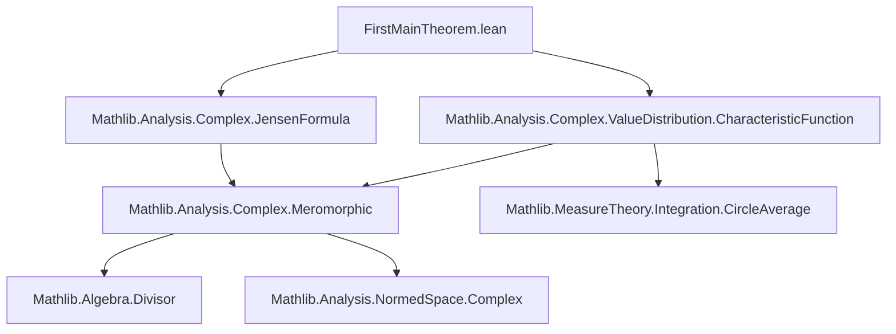
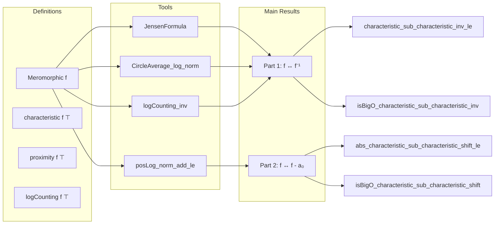

### Technical Brief: `FirstMainTheorem.lean`

---

#### **1. Key Definitions & Theorems**

| Name | Type / Signature | Purpose |
|------|------------------|---------|
| `characteristic f t` | `ℝ → ℝ` | Characteristic function (Nevanlinna theory): $ T_f(t) = m_f(t) + N_f(t) $, where $ m $ is proximity and $ N $ is counting function. |
| `proximity f t` | `ℝ → ℝ` | Proximity function: average of $ \log^+ \|f\| $ over circle of radius $ t $. |
| `logCounting f t` | `ℝ → ℝ` | Counting function: weighted sum of poles inside disk of radius $ t $. |
| `divisor f s` | `Divisor ℂ` | Divisor of meromorphic function $ f $ on set $ s $. |
| `meromorphicTrailingCoeffAt f z` | `ℂ` | Trailing coefficient of Laurent expansion of $ f $ at $ z $. |
| `characteristic_sub_characteristic_inv` | `characteristic f ⊤ - characteristic f⁻¹ ⊤ = circleAverage (log ‖f ·‖) 0 - (divisor f Set.univ).logCounting` | Exact formula for difference of characteristic functions of $ f $ and $ f^{-1} $. |
| `characteristic_sub_characteristic_inv_of_ne_zero` | For $ R \ne 0 $: difference = $ \log \| \text{meromorphicTrailingCoeffAt } f\ 0 \| $ | Quantitative control away from 0. |
| `characteristic_sub_characteristic_inv_at_zero` | At $ R = 0 $: difference = $ \log \|f(0)\| $ | Quantitative control at 0. |
| `characteristic_sub_characteristic_inv_le` | $ |T_f(R) - T_{f^{-1}}(R)| \le \max(|\log\|f(0)\||, |\log\|\text{trailingCoeff}\||) $ | First Main Theorem, Part 1 — quantitative bound. |
| `isBigO_characteristic_sub_characteristic_inv` | $ T_f - T_{f^{-1}} = O(1) $ as $ R \to \infty $ | First Main Theorem, Part 1 — asymptotic equivalence up to bounded error. |
| `abs_characteristic_sub_characteristic_shift_le` | $ |T_f(R) - T_{f - a_0}(R)| \le \log^+ \|a_0\| + \log 2 $ | First Main Theorem, Part 2 — quantitative bound for translation. |
| `isBigO_characteristic_sub_characteristic_shift` | $ T_f - T_{f - a_0} = O(1) $ as $ R \to \infty $ | First Main Theorem, Part 2 — asymptotic equivalence up to bounded error. |

---

#### **2. Naming Conventions**

- **Prefixes**:
  - `characteristic_...`: refers to properties of the characteristic function.
  - `proximity_...`, `logCounting_...`: subcomponents of the characteristic function.
  - `meromorphicTrailingCoeffAt`: technical object for local behavior of meromorphic functions.
- **Suffixes**:
  - `_le`: inequality bound (quantitative version).
  - `_of_ne_zero`, `_at_zero`: case analysis on argument (e.g., $ R = 0 $ or $ R \ne 0 $).
  - `_inv`, `_shift`: specific transformations: inversion $ f \mapsto f^{-1} $, translation $ f \mapsto f - a_0 $.
- **General pattern**: `action_target_property_case`, e.g., `characteristic_sub_characteristic_inv_of_ne_zero`.

---

#### **3. Tactic Stack**

Frequently used tactics in this file:

| Tactic | Usage |
|--------|-------|
| `calc` | Chain of equalities for exact identities. |
| `rw [...]` | Rewrite using lemmas, definitions, or symmetry. |
| `simp` / `simp only [...]` | Simplify goals using definitional equalities and lemmas. |
| `ring` | Algebraic simplification of arithmetic expressions. |
| `abel_nf` | Normalize abelian group expressions. |
| `apply ... using n` | Apply lemma with specific instantiation (used in `posLog_norm_add_le`). |
| `by_cases` | Split on decidable propositions (e.g., $ R = 0 $). |
| `convert ... using 2` | Match goal up to definitional equality, then prove remaining hypotheses. |
| `abel_nf` | Simplify additive expressions in normed abelian groups. |
| `tauto` | Tactic for tautological set-theoretic reasoning (e.g., subset inclusions). |

---

#### **4. Proof Logic**

- **Structure**:
  - **Part 1 (Inversion)**:
    1. Derive exact expression for $ T_f(R) - T_{f^{-1}}(R) $ via `characteristic_sub_characteristic_inv`.
    2. Split into cases $ R = 0 $ and $ R \ne 0 $.
    3. Use known formulas for:
       - Circle average of $ \log \|f\| $ (via `MeromorphicOn.circleAverage_log_norm`).
       - Log-counting of $ f^{-1} $ in terms of $ f $ (via `logCounting_inv`).
    4. Combine to get explicit constant bound → deduce $ O(1) $ asymptotics.

- **Part 2 (Translation)**:
  1. Use identity $ T_f - T_{f - a_0} = m_f - m_{f - a_0} $ (counting parts cancel for $ \top $).
  2. Express proximity difference as circle average of $ \log^+ \|f\| - \log^+ \|f - a_0\| $.
  3. Apply triangle inequality and estimate pointwise using $ \log^+ \|x\| - \log^+ \|x - a_0\| \le \log^+ \|a_0\| + \log 2 $.
  4. Integrate and bound → get uniform constant bound → deduce $ O(1) $.

- **Common pattern**:
  - Prove pointwise bound → integrate → deduce asymptotic boundedness via `isBigO_of_le'`.

---

#### **5. Imports**

| Module | Purpose |
|--------|---------|
| `Mathlib.Analysis.Complex.JensenFormula` | Tools for Jensen’s formula, circle averages, and meromorphic functions on $ \mathbb{C} $. |
| `Mathlib.Analysis.Complex.ValueDistribution.CharacteristicFunction` | Definitions and basic properties of proximity, counting, and characteristic functions. |

---

#### **8. Mermaid Diagrams**

##### **Dependency Graph (File-Level)**

##### **Overview of Theoretical Flow**

---

This file formalizes foundational results in Nevanlinna theory (Value Distribution Theory), establishing invariance of the characteristic function under inversion and translation of meromorphic functions on $ \mathbb{C} $, up to bounded error. It relies heavily on tools from complex analysis, measure theory, and divisor theory.
