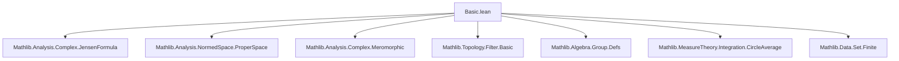

### Technical Metadata Brief: `Basic.lean`

---

#### **1. Key Definitions & Theorems**

| Name | Type / Signature | Purpose |
|------|------------------|---------|
| `Function.locallyFinsuppWithin.toClosedBall` | `r : ℝ → locallyFinsupp E ℤ →+ locallyFinsuppWithin (closedBall 0 |r|) ℤ` | Restricts a finitely supported integer-valued function to the closed ball of radius `r`. |
| `Function.locallyFinsuppWithin.logCounting` | `locallyFinsupp E ℤ →+ (ℝ → ℝ)` | Group morphism assigning to each finitely supported function `D` a real-valued function `r ↦ ∑ᶠ z, D(z)·log(r/‖z‖) + D(0)·log r`. Measures weighted count of support points in `‖z‖ ≤ r`. |
| `ValueDistribution.logCounting` | `f : 𝕜 → E` meromorphic, `a : WithTop E` ⇒ `ℝ → ℝ` | Logarithmic counting function for a meromorphic function `f` at value `a`. Counts zeros (if `a ≠ ⊤`) or poles (if `a = ⊤`) with multiplicities. |
| `logCounting_divisor` | `locallyFinsuppWithin.logCounting (divisor f univ) = logCounting f 0 - logCounting f ⊤` | Relates divisor-based and meromorphic-function-based definitions. |
| `logCounting_mul_zero_le` | `1 ≤ r ⇒ logCounting (f₁ * f₂) 0 r ≤ logCounting f₁ 0 r + logCounting f₂ 0 r` | Subadditivity of zero-counting under multiplication (for `r ≥ 1`). |
| `logCounting_add_top_le` | `1 ≤ r ⇒ logCounting (f₁ + f₂) ⊤ r ≤ logCounting f₁ ⊤ r + logCounting f₂ ⊤ r` | Subadditivity of pole-counting under addition (for `r ≥ 1`). |
| `logCounting_pow_zero` / `logCounting_pow_top` | `logCounting (f ^ n) 0 = n • logCounting f 0`, etc. | Homogeneity under powers. |
| `logCounting_divisor_eq_circleAverage_sub_const` | `logCounting (divisor f ⊤) R = circleAverage (log ‖f·‖) 0 R - log ‖meromorphicTrailingCoeffAt f 0‖` | Integral representation via Jensen’s formula (complex case). |

---

#### **2. Naming Conventions**

- **Prefixes**:
  - `logCounting_`: Main function family.
  - `locallyFinsuppWithin.`: For constructions on `locallyFinsupp` and its restrictions.
  - `ValueDistribution.`: For constructions specialized to meromorphic functions.
- **Suffixes**:
  - `_zero`: Zeros of `f` (`a = 0`).
  - `_top`: Poles of `f` (`a = ⊤`).
  - `_mul_`, `_add_`: Behavior under multiplication/addition.
  - `_le`, `_eventuallyLE`: Inequalities (pointwise or asymptotic).
  - `_even`, `_mono`, `_nonneg`: Structural properties.
- **Special**:
  - `divisor`, `posPart`, `negPart`, `meromorphicTrailingCoeffAt`: From complex/meromorphic analysis.

---

#### **3. Tactic Stack**

Frequent tactics used in proofs:

| Tactic | Usage |
|--------|-------|
| `simp` / `simp_all` | Simplification of definitions, especially `logCounting`, `divisor`, `toClosedBall`. |
| `aesop` | Automated reasoning for trivial goals (e.g., `map_zero'`, `mul_zero`). |
| `gcongr` | For monotonicity proofs, especially with `finsum` and `log`. |
| `rw` / `congr` / `congr'` | Rewriting using lemmas like `divisor_mul`, `logCounting.map_add`. |
| `intro` / `by_cases` | Case analysis on `a = ⊤`, `z = 0`, etc. |
| `have`, `suffices`, `calc` | Intermediate steps in inequality chains. |
| `filter_upwards` | For asymptotic arguments (`≤ᶠ[atTop]`). |
| `ring` | Algebraic simplifications in `ℝ`. |
| `linarith` | Linear arithmetic over reals (e.g., `1 ≤ r ⇒ 0 < r`). |
| `finsum_eq_sum_of_support_subset` | Replace infinite sum with finite sum over support. |

---

#### **4. Proof Logic**

- **Structure**:
  - Most proofs follow a **two-tiered approach**:
    1. Prove properties for `locallyFinsupp` (e.g., monotonicity, subadditivity).
    2. Lift to meromorphic functions via `divisor` and `logCounting` definitions.
  - **Induction** is used for finite sums (`Finset.induction`).
  - **Case analysis** on `a = ⊤` or `z = 0` is common to handle zeros vs poles or zero support points.
  - **Asymptotic arguments** (`≤ᶠ[atTop]`) reduce to pointwise statements for `r ≥ 1`.
  - **Jensen’s formula** is used to connect discrete counting with analytic integrals (complex case only).

- **Typical flow**:
  ```text
  intro r
  by_cases h : a = ⊤
  · simp [logCounting, h]
  · simp [logCounting, h]
  -- reduce to locallyFinsupp version
  apply locallyFinsuppWithin.logCounting_mono
  -- or similar
  ```

---

#### **5. Imports & Dependencies**

- **Core imports**:
  ```lean
  Mathlib.Analysis.Complex.JensenFormula
  ```
- **Key Mathlib modules used**:
  - `Mathlib.Analysis.NormedSpace.ProperSpace`
  - `Mathlib.Analysis.Complex.Meromorphic`
  - `Mathlib.Topology.Filter.Basic` (`atTop`, `codiscrete`)
  - `Mathlib.Algebra.Group.Defs` (`locallyFinsupp`, `posPart`, `negPart`)
  - `Mathlib.MeasureTheory.Integration.CircleAverage`
  - `Mathlib.Analysis.NormedSpace.FiniteDimension` (via `NormedSpace ℂ E`)
  - `Mathlib.Data.Set.Finite` (`finiteSupport`, `closedBall`)

---

#### **6. Mermaid Diagrams**

##### **Dependency Graph (Module-Level)**



##### **Conceptual Overview of Theory Flow**

```mermaid
flowchart LR
  A[Locally finite support D: E → ℤ] --> B[toClosedBall r D]
  B --> C[logCounting D : ℝ → ℝ]
  C --> D[Properties: even, monotone, subadditive]

  E[Meromorphic f: 𝕜 → E] --> F[divisor f univ]
  F --> G[posPart / negPart]
  G --> H[logCounting f a]

  D --> H
  H --> I[Asymptotic behavior: ≤ᶠ[atTop]]
  H --> J[Integral rep: circleAverage via Jensen]
```

##### **Module Structure Overview**

```mermaid
graph LR
  subgraph Function.locallyFinsuppWithin
    A[toClosedBall]
    B[logCounting]
    C[logCounting_mono]
    D[logCounting_nonneg]
    E[logCounting_le]
  end

  subgraph ValueDistribution
    F[logCounting f a]
    G[logCounting_zero / logCounting_top]
    H[logCounting_mul_zero_le]
    I[logCounting_add_top_le]
    J[logCounting_pow_zero]
  end

  subgraph Representation
    K[logCounting_divisor_eq_circleAverage_sub_const]
  end

  Function.locallyFinsuppWithin --> ValueDistribution
  ValueDistribution --> Representation
```



---

#### **7. Summary**

This file formalizes the **logarithmic counting function** from Nevanlinna theory in Lean 4, first abstractly for finitely supported integer-valued functions on normed additive groups, then concretely for meromorphic functions over nontrivially normed fields. It establishes foundational properties (evenness, monotonicity, subadditivity under addition/multiplication), asymptotic behavior, and—over ℂ—a representation via Jensen’s formula. The structure reflects a clean separation between combinatorial (divisor-based) and analytic (meromorphic function-based) perspectives, with heavy use of `locallyFinsupp` and `divisor` machinery.

The formalization is designed for extensibility toward deeper results in value distribution theory (e.g., First/Second Main Theorems), and includes careful handling of edge cases (e.g., `z = 0`, `r = 0`, `a = ⊤`) and asymptotics (`atTop`).
