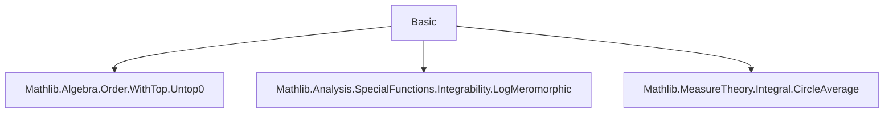

### Technical Brief: `Basic.lean` — Proximity Function in Value Distribution Theory

---

#### **1. Key Definitions & Theorems**

| Name | Type / Signature | Purpose |
|------|------------------|---------|
| `proximity` | `ℝ → ℝ` | Logarithmically weighted measure of how well a meromorphic function `f : ℂ → E` approximates a value `a : WithTop E` on circles of radius `R`. |
| `proximity_coe` | `proximity f a₀ = circleAverage (log⁺ ‖f · - a₀‖⁻¹) 0` | Simplifies definition for finite `a₀`. |
| `proximity_zero` | `proximity f 0 = circleAverage (log⁺ ‖f ·‖⁻¹) 0` | Special case for `a = 0`. |
| `proximity_zero_of_complexValued` | `proximity f 0 = circleAverage (log⁺ ‖f⁻¹ ·‖) 0` | Variant for complex-valued `f`. |
| `proximity_top` | `proximity f ⊤ = circleAverage (log⁺ ‖f ·‖) 0` | Special case for `a = ⊤` (infinity). |
| `proximity_congr_codiscreteWithin` | `f =ᶠ[codiscreteWithin (sphere 0 |r|)] g ∧ r ≠ 0 ⇒ proximity f a r = proximity g a r` | Equality of proximity functions when functions agree off a discrete set (except possibly at `r = 0`). |
| `proximity_coe_eq_proximity_sub_const_zero` | `proximity f a₀ = proximity (f - const a₀) 0` | Shift invariance: proximity to `a₀` equals proximity to `0` of shifted function. |
| `proximity_inv` | `proximity f⁻¹ ⊤ = proximity f 0` | Relation between proximity of `f` and `f⁻¹`. |
| `proximity_sub_proximity_inv_eq_circleAverage` | `proximity f ⊤ - proximity f⁻¹ ⊤ = circleAverage (log ‖f ·‖) 0` | Difference between proximity to `∞` and `0` equals average of `log ‖f‖`. |
| `proximity_even` | `(proximity f a).Even` | Proximity function is even: `proximity f a (-r) = proximity f a r`. |
| `proximity_nonneg` | `0 ≤ proximity f a` | Proximity is non-negative. |
| `proximity_const` | `proximity (const c) ⊤ r = log⁺ ‖c‖` | Proximity of constant function to `∞`. |
| `proximity_sum_top_le` | `proximity (∑ f a) ⊤ ≤ ∑ proximity (f a) ⊤ + log s.card` | Subadditivity of proximity at `∞` for finite sums. |
| `proximity_add_top_le` | `proximity (f₁ + f₂) ⊤ ≤ proximity f₁ ⊤ + proximity f₂ ⊤ + log 2` | Special case of above for two summands. |
| `proximity_mul_top_le` | `proximity (f₁ * f₂) ⊤ ≤ proximity f₁ ⊤ + proximity f₂ ⊤` | Subadditivity for multiplication at `∞`. |
| `proximity_mul_zero_le` | `proximity (f₁ * f₂) 0 ≤ proximity f₁ 0 + proximity f₂ 0` | Subadditivity for multiplication at `0`. |
| `proximity_pow_top` | `proximity (f ^ n) ⊤ = n • proximity f ⊤` | Homogeneity for powers at `∞`. |
| `proximity_pow_zero` | `proximity (f ^ n) 0 = n • proximity f 0` | Homogeneity for powers at `0`. |

---

#### **2. Naming Conventions**

- **Prefixes**:
  - `proximity_`: All definitions/lemmas related to the proximity function.
  - `log⁺` used for `posLog`, indicating truncated logarithm (non-negative part).
  - `untop₀`: Used to extract the underlying value from `WithTop E` when not `⊤`.
- **Suffixes**:
  - `_top`: For cases where `a = ⊤`.
  - `_zero`: For cases where `a = 0`.
  - `_coe`: For finite values (`a₀ : E`).
  - `_inv`: For relations involving inverses (`f⁻¹`).
  - `_le`: For inequalities (e.g., subadditivity).
  - `_eq`: For equalities (e.g., homogeneity).
- **Pattern**: `proximity_[property]_[target]`, where `target` is `top`, `zero`, or omitted for general.

---

#### **3. Tactic Stack**

Frequently used tactics in proofs:
- `simp` / `simp only` / `simp_rw`: To unfold definitions (`proximity`, `circleAverage`, etc.).
- `intro`, `ext`: For extensionality and variable introduction.
- `rw`: Rewriting using lemmas.
- `apply`, `exact`: For applying lemmas or hypotheses.
- `calc`: Chain of equalities/inequalities.
- `nth_rw`: To rewrite at a specific position.
- `filter_upwards`: For filter-based congruence arguments.
- `aesop`: For automated reasoning in congruence proofs.
- `by_cases`: To split on `a = ⊤`.
- `fun_prop`: For proving functorial properties (e.g., meromorphicity of sums/products).
- `fin_cases`: For finite type case analysis.

---

#### **4. Proof Logic**

- **Structure**:
  - Most proofs follow a pattern of:
    1. **Case split** on `a = ⊤` or `a = 0`.
    2. **Unfolding** `proximity` via `simp [proximity]`.
    3. **Reducing** to properties of `circleAverage`, often using:
       - `circleAverage_congr_codiscreteWithin`
       - `circleAverage_mono`
       - `circleAverage_add`, `circleAverage_sum`
       - `circleIntegrable_*` lemmas (e.g., `circleIntegrable_posLog_norm_meromorphicOn`)
    4. **Applying known inequalities** like `posLog_mul`, `posLog_norm_sum_le`.
    5. **Using algebraic simplifications** (`smul_eq_mul`, `inv_pow`, etc.).
- **Induction**: Not used here; proofs rely on algebraic and measure-theoretic properties.
- **Filter arguments**: Used in congruence lemmas (`proximity_congr_*`) to handle discrete exceptions.

---

#### **5. Imports**

- `Mathlib.Algebra.Order.WithTop.Untop0`: For `WithTop`, `untop₀`, and order-theoretic structure.
- `Mathlib.Analysis.SpecialFunctions.Integrability.LogMeromorphic`: For integrability of `log⁺ ‖f‖` for meromorphic `f`.
- `Mathlib.MeasureTheory.Integral.CircleAverage`: For definition and properties of `circleAverage`.

These imports define the ambient setting: complex analysis, measure theory on circles, and order-theoretic handling of `∞`.

---

#### **8. Mermaid Diagrams**

##### **Dependency Graph (Module-Level)**



##### **Conceptual Overview of Proximity Function**

```mermaid
flowchart LR
  A[Meromorphic f : ℂ → E] --> B[Value a : WithTop E]
  B -->|a = ⊤| C[proximity f ⊤ R = circleAverage (log⁺ ‖f‖) 0 R]
  B -->|a = a₀ ∈ E| D[proximity f a₀ R = circleAverage (log⁺ ‖f - a₀‖⁻¹) 0 R]
  C --> E[Quantifies approximation to ∞]
  D --> F[Quantifies approximation to finite a₀]
  E & F --> G[Used in Nevanlinna Theory: T = N + m]
  G --> H[Value Distribution Theory]
```

##### **Proof Strategy Flow (Example: `proximity_mul_top_le`)**

```mermaid
flowchart LR
  Start[Start: proximity (f₁ * f₂) ⊤] --> Unfold[Unfold proximity]
  Unfold --> ApplyNormMul[Use ‖f₁ * f₂‖ = ‖f₁‖ * ‖f₂‖]
  ApplyNormMul --> PosLogMul[Apply posLog_mul ≤ log⁺‖f₁‖ + log⁺‖f₂‖]
  PosLogMul --> CircleAvgMono[Apply circleAverage_mono]
  CircleAvgMono --> SplitAvg[Split circleAverage via circleAverage_add]
  SplitAvg --> DefEq[Re-express via proximity f₁ ⊤ + proximity f₂ ⊤]
  DefEq --> End[QED]
```

---

### Summary

This file formalizes the **proximity function** from Nevanlinna theory, a core object in value distribution theory. It defines the function, establishes its basic properties (evenness, non-negativity, behavior under arithmetic operations), and proves key inequalities and equalities used in further development (e.g., the First Main Theorem). The formalization leverages `circleAverage`, `posLog`, and integrability results for meromorphic functions, and is carefully structured to support future work in complex hyperbolic geometry and Diophantine approximation.
