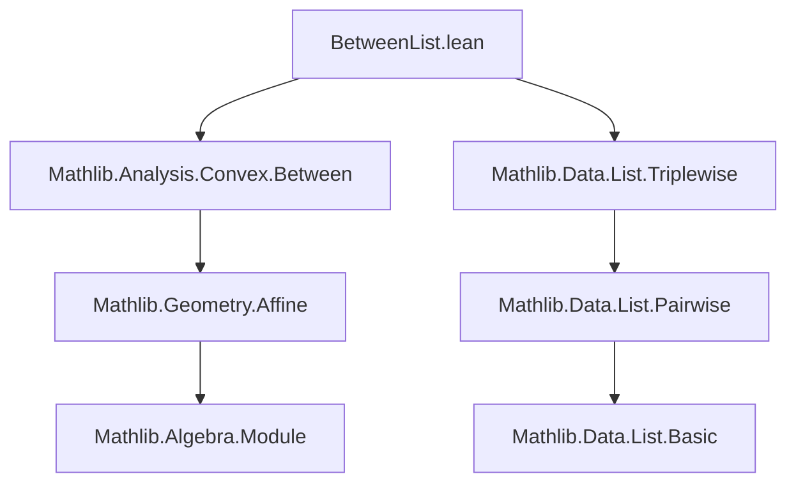
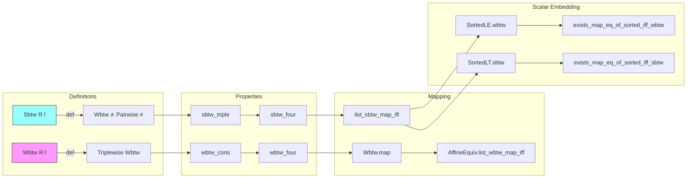

### Technical Brief: `BetweenList.lean`

---

#### **1. Key Definitions & Theorems**

| Name | Type | Purpose |
|------|------|---------|
| `List.Wbtw R l` | `Prop` | Defines *weak betweenness*: points in list `l` lie on a line in order (allowing coincidences). Defined as `l.Triplewise (Wbtw R)`. |
| `List.Sbtw R l` | `Prop` | Defines *strict betweenness*: points in `l` are weakly between and pairwise distinct. Defined as `l.Wbtw R ∧ l.Pairwise (· ≠ ·)`. |
| `wbtw_cons` | `lemma` | Characterizes `Wbtw` for cons-lists: `(p :: l).Wbtw R ↔ l.Pairwise (Wbtw R p) ∧ l.Wbtw R`. |
| `sbtw_triple` | `lemma` | For 3-element lists, `Sbtw` reduces to the standard ternary strict betweenness relation. |
| `wbtw_four` / `sbtw_four` | `lemma` | Characterize `Wbtw`/`Sbtw` for 4-element lists via all 4 triples. |
| `Sbtw.wbtw` | `lemma` | Projection: strict betweenness implies weak betweenness. |
| `Sbtw.pairwise_ne` | `lemma` | Projection: strict betweenness implies pairwise distinctness. |
| `sbtw_iff_triplewise_and_ne_pair` | `lemma` | Equivalence: `l.Sbtw R ↔ l.Triplewise (Sbtw R) ∧ ∀ a, l ≠ [a, a]`. |
| `Sbtw.map` | `lemma` | `Wbtw`/`Sbtw` preserved under affine maps (via `AffineMap.map`). |
| `list_wbtw_map_iff` / `list_sbtw_map_iff` | `lemma` | For injective affine maps (or affine equivalences), `Wbtw`/`Sbtw` is preserved *and reflected*. |
| `SortedLE.wbtw` | `lemma` | A sorted list of scalars (in `R`) is weakly between in the affine line. |
| `SortedLT.sbtw` | `lemma` | A strictly sorted list of scalars is strictly between. |
| `exists_map_eq_of_sorted_nonempty_iff_wbtw` | `lemma` | A nonempty list lies on a line in order iff it is the image of a sorted scalar list under a line map. |
| `exists_map_eq_of_sorted_iff_wbtw` | `lemma` | Same as above, but for *any* list (including empty), using arbitrary endpoints `p₁, p₂`. |
| `exists_map_eq_of_sorted_nonempty_iff_sbtw` | `lemma` | Strict version: nonempty list is strictly between iff it’s the image of a *strictly* sorted scalar list under a line map, with nontrivial endpoints or singleton. |
| `exists_map_eq_of_sorted_iff_sbtw` | `lemma` | Full strict characterization: list is strictly between iff it’s the image of a strictly sorted scalar list under a line map between *distinct* points. |

---

#### **2. Naming Conventions**

- **Prefixes**:
  - `wbtw_`, `sbtw_`: for `Wbtw`, `Sbtw`-related lemmas.
  - `list_*_map_iff`: for equivalences involving list mapping under affine maps.
- **Suffixes**:
  - `_cons`: for cons-list induction steps.
  - `_nil`, `_singleton`, `_pair`, `_triple`, `_four`: for small-list cases.
  - `_iff_*`: for biconditional characterizations.
- **General**:
  - `SortedLE`/`SortedLT` used for scalar lists; `Wbtw`/`Sbtw` for affine points.
  - `lineMap p₁ p₂` denotes the affine map $ r \mapsto p₁ + r \cdot \vec{p₁p₂} $.

---

#### **3. Tactic Stack**

- **Core tactics**: `simp`, `rw`, `induction`, `cases`, `aesop`, `grind`, `nlinarith`, `linarith`, `ring`, `gcongr`.
- **Specialized**:
  - `Triplewise.map`, `Pairwise.map`, `of_map`, `map_inj_left`: for reasoning about list transformations.
  - `mem_cons`, `head_cons`, `getLast_cons`, `length_cons`: list-specific rewrites.
  - `AffineEquiv`, `AffineMap`-related lemmas: `lineMap_lineMap_left`, `lineMap_injective`, `lineMap_eq_lineMap_iff`.

---

#### **4. Proof Logic**

- **Inductive structure**: Most proofs proceed by induction on the list `l`, often splitting on `l = []`, `l = [p]`, or `l.length = 1`.
- **Triplewise reasoning**: Central to `Wbtw`/`Sbtw` definitions; proofs frequently use `triplewise_cons`, `pairwise_cons`, and `Triplewise.map`.
- **Affine geometry reduction**: Key strategy: reduce geometric betweenness to scalar order via `lineMap` and sorted lists (`SortedLE`/`SortedLT`).
- **Equivalence chaining**: Many results are biconditionals (`↔`), proven by mutual implication, often using:
  - `sbtw_iff_triplewise_and_ne_pair` to decompose strict betweenness.
  - `exists_map_eq_of_sorted_*` lemmas to bridge between geometric and scalar representations.
- **Nontriviality & injectivity**: Critical assumptions (e.g., `Nontrivial P`, `p₁ ≠ p₂`, `hf.Injective`) used to ensure line maps are well-behaved.

---

#### **5. Imports & Dependencies**

- **Core**:
  - `Mathlib.Analysis.Convex.Between`: provides `Wbtw R p q r` (ternary betweenness in affine spaces).
  - `Mathlib.Data.List.Triplewise`: provides `Triplewise` and `Pairwise` list predicates.
- **Algebraic structure**:
  - `Ring R`, `PartialOrder R`, `Module R V`, `AddTorsor V P`: affine space over ring `R`.
  - `IsOrderedRing R`, `LinearOrderedField R`, `IsStrictOrderedRing R`: for ordered/strictly ordered behavior.
- **Affine tools**:
  - `AffineEquiv`, `AffineMap`: for mapping between affine spaces.
  - `lineMap`: the canonical affine embedding of `R` into a line in `P`.

---

#### **6. Mermaid Diagrams**

##### **Dependency Graph (Module-Level)**



##### **Conceptual Overview (Theory Flow)**



##### **Proof Strategy Flow (Example: `exists_map_eq_of_sorted_iff_sbtw`)**

```mermaid
flowchart TD
  A[l.Sbtw R] --> B[Decompose via sbtw_iff_triplewise_and_ne_pair]
  B --> C{Case: l = []}
  C -->|empty| D[Use nontriviality to pick p₁ ≠ p₂]
  C -->|nonempty| E[Use head/getLast]
  E --> F[Apply exists_map_eq_of_sorted_nonempty_iff_sbtw]
  F --> G[Extract sorted scalar list l']
  G --> H[Verify l'.SortedLT via pairwise distinctness]
  H --> I[Check endpoint inequality]
  I --> J[Reconstruct via lineMap]
```

--- 

This module formalizes *affine linearity* of point lists, bridging geometric betweenness with scalar order via affine maps. It is foundational for convex geometry and ordered affine structures.
