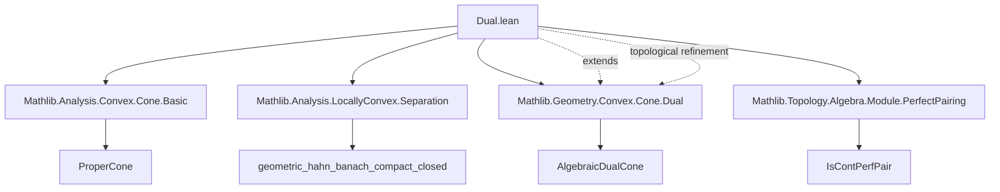
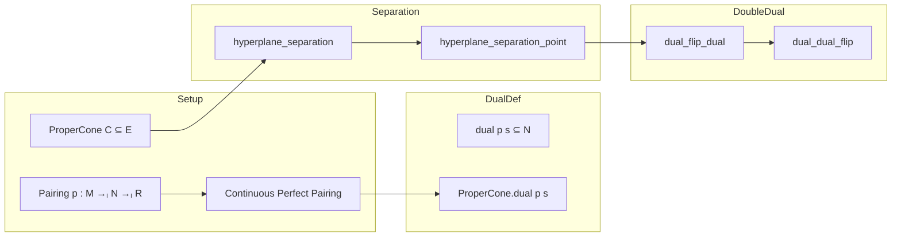

**Technical Brief: `Dual.lean` — Topological Dual of a Cone and Farkas’ Lemma**

---

### 1. KEY DEFINITIONS & THEOREMS

| Name | Type / Signature | Purpose |
|------|------------------|---------|
| `PointedCone.dual` | `dual p s : Set N` | Cone of functionals `y ∈ N` s.t. `∀ x ∈ s, 0 ≤ p x y` |
| `ProperCone.dual` | `dual p s : ProperCone R N` | Refinement of `dual` to a *proper cone* (closed, pointed, solid, nonempty interior) using continuity and perfectness of `p` |
| `ProperCone.hyperplane_separation` | `∃ f : StrongDual ℝ E, (∀ x ∈ C, 0 ≤ f x) ∧ ∀ x ∈ K, f x < 0` | Geometric Farkas’ lemma: disjoint compact convex `K` and proper cone `C` can be strictly separated by a hyperplane |
| `ProperCone.hyperplane_separation_point` | `∃ f, (∀ x ∈ C, 0 ≤ f x) ∧ f x₀ < 0` | Point separation version: point outside a proper cone can be strictly separated |
| `ProperCone.dual_flip_dual` | `dual p.flip (dual p C) = C` | Double dual theorem: proper cone equals its double dual under continuous perfect pairing |
| `ProperCone.dual_dual_flip` | `dual p (dual p.flip C) = C` | Symmetric version of double dual (swap roles of `E` and `F`) |
| `ProperCone.subset_dual_dual` | `s ⊆ dual p.flip (dual p s)` | Weak inclusion: any set embeds into its double dual |

---

### 2. NAMING CONVENTIONS

- **Prefixes**:
  - `dual_`: operations involving dual cones (`dual`, `dual_empty`, `dual_singleton`, `dual_union`, etc.)
  - `hyperplane_separation`: separation theorems (Farkas’ lemma)
  - `dual_flip_dual`, `dual_dual_flip`: double dual identities (flip refers to swapping arguments of pairing `p`)
- **Suffixes**:
  - `_point`: pointwise separation version
  - `_flip`: dual with respect to flipped pairing `p.flip`
- **Notable**:
  - `mem_dual` and `dual_singleton` are `@[simp]`, indicating they are used in simplification
  - `isClosed_dual` proves closedness of dual cone under continuity of `p`

---

### 3. TACTIC STACK

| Tactic | Frequency | Role |
|--------|-----------|------|
| `simp` / `simp_rw` | High | Simplifying membership, unions, intersections, `dual`, `mem_dual`, `subset_dual_dual` |
| `aesop` | Medium | Solving straightforward goals involving set inclusions, lattice operations |
| `exact`, `refine`, `by_contra!` | Medium | Constructing witnesses (e.g., separating functional), contradiction steps |
| `ext` | Medium | Extensionality for sets/submodules |
| `rw`, `convert`, `apply` | Medium | Rewriting definitions, applying lemmas |
| `simpa` | Medium | Simplifying with assumptions (e.g., `simpa [*] using …`) |
| `exact?` / `linarith` | Low | Rarely needed; mostly handled by `aesop`/`simp` |

---

### 4. PROOF LOGIC

- **Structure of main proofs**:
  - **Farkas’ lemma** (`hyperplane_separation`):
    1. Reduce to nonempty `K` (trivial if empty).
    2. Apply *geometric Hahn–Banach* for compact-convex vs closed-convex disjoint sets.
    3. Extract separating functional `f`, open sets `u, v`.
    4. Show `v < 0` using `0 ∈ C`.
    5. Prove `f x ≥ 0` on `C` by contradiction (scale argument using cone properties).
  - **Double dual theorem** (`dual_flip_dual`):
    1. Use `subset_dual_dual` for `⊆`.
    2. For `⊇`, assume `x ∉ C`, apply `hyperplane_separation_point` to get `f` with `f|_C ≥ 0`, `f x < 0`.
    3. Conclude `x ∉ dual.flip (dual p C)` via definition of dual.
    4. Conclude equality by antisymmetry.

- **Induction**: Not used.
- **Case analysis**: On emptiness of `K`, membership in `C`, or `x₀ ∉ C`.
- **Contrapositive reasoning**: Central to double dual proof.

---

### 5. IMPORTS & DEPENDENCIES

| Module | Role |
|--------|------|
| `Mathlib.Analysis.Convex.Cone.Basic` | Basic cone theory (convex cones, proper cones) |
| `Mathlib.Analysis.LocallyConvex.Separation` | Hahn–Banach separation theorems (e.g., `geometric_hahn_banach_compact_closed`) |
| `Mathlib.Geometry.Convex.Cone.Dual` | Algebraic dual cone (for comparison) |
| `Mathlib.Topology.Algebra.Module.PerfectPairing` | Continuous perfect pairings (`IsContPerfPair`) and strong dual |

**Key assumptions**:
- `R = ℝ`, `E` is a *locally convex topological real vector space* (`LocallyConvexSpace ℝ E`)
- Pairing `p` is *continuous and perfect* (`[p.IsContPerfPair]`)
- Cone `C` is *proper* (`ProperCone ℝ E`): closed, pointed, solid, with nonempty interior

---

### 6. MERMAID DIAGRAMS

#### Dependency Graph (Top-Level)

#### Overview of Theory Flow

---

### 7. SUMMARY

This file develops the **topological dual cone** in the context of *continuous perfect pairings*, generalizing the algebraic dual cone from `Mathlib.Geometry.Convex.Cone.Dual`. It proves **Farkas’ lemma** as a geometric separation result and establishes the **double dual theorem** for proper cones in locally convex spaces — a cornerstone of convex analysis and functional analysis. The formalization leverages:
- `LocallyConvexSpace` for Hahn–Banach separation,
- `IsContPerfPair` to ensure continuity and bijectivity of the pairing,
- `ProperCone` structure to guarantee closedness and nondegeneracy.

The proofs are constructive in the sense of Lean’s logic, relying on classical analysis (via `geometric_hahn_banach_compact_closed`) and set-theoretic reasoning.
