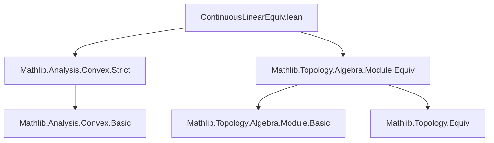

**Technical Brief: `ContinuousLinearEquiv.lean`**

---

### 1. Key Definitions & Theorems

| Name | Type | Purpose |
|------|------|---------|
| `strictConvex_preimage` | `∀ (s : Set F) (e : E ≃L[𝕜] F), StrictConvex 𝕜 (e ⁻¹' s) ↔ StrictConvex 𝕜 s` | Shows that strict convexity is preserved under preimage by a continuous linear equivalence (CLE). |
| `strictConvex_image` | `∀ (s : Set E) (e : E ≃L[𝕜] F), StrictConvex 𝕜 (e '' s) ↔ StrictConvex 𝕜 s` | Shows that strict convexity is preserved under image by a CLE. |

- **`StrictConvex 𝕜 s`**: A predicate asserting that the set `s` is *strictly convex* over the field `𝕜` (i.e., for any distinct `x, y ∈ s`, the open segment `(1 - t) • x + t • y` lies in the interior of `s` for all `t ∈ (0, 1)`).
- **`E ≃L[𝕜] F`**: Type of *continuous linear equivalences* between topological `𝕜`-modules `E` and `F`. This is an equivalence in the category of topological vector spaces over `𝕜`.

---

### 2. Naming Conventions

- **Prefixes**:
  - `strictConvex_`: Indicates properties related to strict convexity.
- **Suffixes**:
  - `_preimage`, `_image`: Denote whether the statement concerns preimage or image under a map.
- **Notable patterns**:
  - `e.symm.toLinearMap`, `e.toLinearMap`: Accessing underlying linear maps from CLEs.
  - `e.right_inv`, `e.symm.right_inv`: Use of equivalence properties (e.g., `right_inv` for surjectivity/inverse law).

---

### 3. Tactic Stack

| Tactic | Usage |
|--------|-------|
| `rw` | Rewriting using `e.image_eq_preimage_symm` and `e.symm.strictConvex_preimage`. |
| `⟨…, …⟩` | Proving biconditional by splitting into two implications. |
| `Function.LeftInverse.preimage_preimage` | Used to simplify double preimages via left inverse property. |
| `h.linear_preimage` | Applies known lemmas about preservation of strict convexity under linear preimage (from `Mathlib.Topology.Algebra.Module.Equiv`). |
| `e.symm.continuous`, `e.injective`, `e.continuous` | Supplying continuity and injectivity hypotheses required by `linear_preimage`. |

No heavy automation (e.g., `aesop`, `ring`, `simp_rw`) is used—proofs are mostly structural and rely on existing lemmas.

---

### 4. Proof Logic

- **For `strictConvex_preimage`**:
  - Prove biconditional by two directions:
    - **(→)**: Use that `e.symm` is a left inverse of `e`, so `e ⁻¹' s = symm ⁻¹' s`. Then apply `linear_preimage` lemma for `symm.toLinearMap`, using its continuity and injectivity.
    - **(←)**: Apply `linear_preimage` for `e.toLinearMap`, using its continuity and injectivity.

- **For `strictConvex_image`**:
  - Rewrite image as preimage under inverse: `e '' s = symm ⁻¹' s`.
  - Apply `strictConvex_preimage` to `symm : F ≃L[𝕜] E`.

Both proofs rely on:
- Algebraic properties of CLEs (`e.symm.toLinearMap`, `e.toLinearMap`, inverses).
- Known lemmas about strict convexity under linear maps (from `Mathlib.Topology.Algebra.Module.Equiv`).

---

### 5. Imports

| Import | Role |
|--------|------|
| `Mathlib.Analysis.Convex.Strict` | Defines `StrictConvex` and related lemmas (e.g., `linear_preimage`). |
| `Mathlib.Topology.Algebra.Module.Equiv` | Defines `ContinuousLinearEquiv`, its structure (linear part, continuity, inverse), and basic lemmas like `image_eq_preimage_symm`, `linear_preimage`. |

---

### 8. Mermaid Diagrams

#### Dependency Graph (Module-Level)



#### Overview of File Logic Flow

```mermaid
flowchart LR
  A[ContinuousLinearEquiv e : E ≃L[𝕜] F] --> B[Preimage e ⁻¹' s]
  A --> C[Image e '' s]
  B --> D[strictConvex_preimage]
  C --> E[strictConvex_image]
  D --> F[Uses e.symm.toLinearMap, continuity, injectivity]
  E --> G[Rewrites image as preimage via e.symm]
  F --> H[Applies linear_preimage lemma]
  G --> H
```

#### Theory Context

```mermaid
graph LR
  subgraph "Convex Analysis"
    SC[StrictConvex 𝕜 s]
    LC[LinearConvexity]
  end

  subgraph "Topological Vector Spaces"
    TVS[Topological 𝕜-Module]
    CLM[ContinuousLinearMap]
  end

  subgraph "Equivalences"
    CLE[ContinuousLinearEquiv E ≃L[𝕜] F]
  end

  SC -->|Preserved under| CLE
  CLE -->|Underlies| CLM
  CLM -->|Acts on| SC
  TVS -->|Defines| CLE
```

--- 

This file contributes to the formalization of functional analysis in Lean, specifically the stability of geometric properties (strict convexity) under topological isomorphisms.
