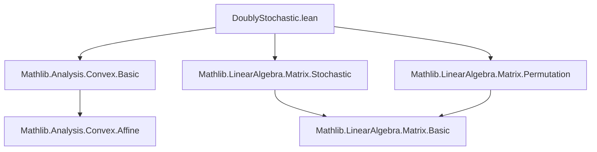
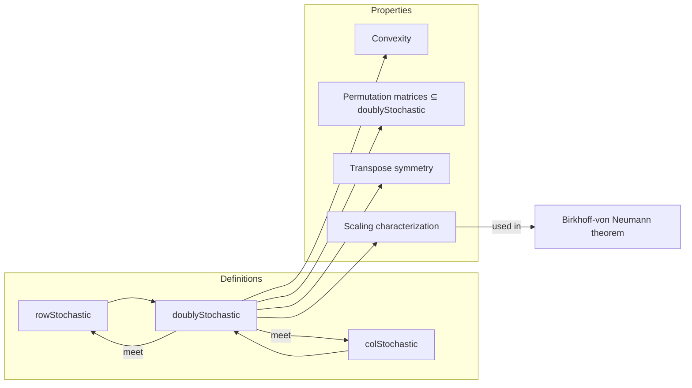

### Technical Brief: `DoublyStochastic.lean`

---

#### **1. Key Definitions & Theorems**

| Name | Type / Signature | Purpose |
|------|------------------|---------|
| `doublyStochastic` | `Submonoid (Matrix n n R)` | Defines the submonoid of doubly stochastic matrices: nonnegative entries, row sums = 1, column sums = 1. |
| `mem_doublyStochastic` | `M ∈ doublyStochastic R n ↔ (∀ i j, 0 ≤ M i j) ∧ M *ᵥ 1 = 1 ∧ 1 ᵥ* M = 1` | Membership criterion in terms of vector multiplication. |
| `mem_doublyStochastic_iff_sum` | `M ∈ doublyStochastic R n ↔ (∀ i j, 0 ≤ M i j) ∧ (∀ i, ∑ j, M i j = 1) ∧ (∀ j, ∑ i, M i j = 1)` | Equivalent formulation using explicit row/column sums. |
| `doublyStochastic_eq_rowStochastic_inf_colStochastic` | `doublyStochastic R n = rowStochastic R n ⊓ colStochastic R n` | Shows doubly stochastic = meet (intersection) of row- and column-stochastic submonoids. |
| `convex_doublyStochastic` | `Convex R (doublyStochastic R n)` | Convexity of the set of doubly stochastic matrices over `R`. |
| `permMatrix_mem_doublyStochastic` | `{σ : Equiv.Perm n} → σ.permMatrix R ∈ doublyStochastic R n` | Permutation matrices are doubly stochastic. |
| `transpose_mem_doublyStochastic_iff` | `M.transpose ∈ doublyStochastic R n ↔ M ∈ doublyStochastic R n` | Doubly stochasticity is preserved under transpose. |
| `exists_mem_doublyStochastic_eq_smul_iff` | `(∃ M' ∈ doublyStochastic R n, M = s • M') ↔ ...` | Characterizes matrices that are scalar multiples of doubly stochastic ones (key for Birkhoff’s theorem). |

---

#### **2. Naming Conventions**

- **Prefixes**:
  - `nonneg_`, `sum_row_`, `sum_col_`, `mulVec_`, `one_vecMul_`, `le_one_`: describe properties of elements in `doublyStochastic`.
  - `permMatrix_`, `transpose_`: relate to constructions (permutation, transpose).
- **Suffixes**:
  - `_iff`: equivalence with a conjunction of simpler conditions.
  - `_mem_`: membership criteria.
  - `_eq_`: equality of sets/submonoids.
- **`doublyStochastic`** is used as both a `Submonoid` and a predicate via `mem_doublyStochastic`.

---

#### **3. Tactic Stack**

- **Core tactics**: `simp`, `rw`, `refine`, `intro`, `ext`, `grind`
- **Algebraic reasoning**: `ring`, `linarith`, `apply`, `exact`
- **Sum manipulation**: `sum_nonneg`, `sum_add_distrib`, `mul_sum`, `sum_eq_zero_iff_of_nonneg`
- **Set-theoretic reasoning**: `SetLike.mem_coe`, `Submonoid.mem_inf`, `Subsemigroup.mem_mk`
- **Specialized**: `grind only [...]` used heavily for rewriting via lemmas and simplifying using definitional equalities.

---

#### **4. Proof Logic**

- **Structure**: Most proofs follow a pattern:
  1. **Unfold definitions** (`simp only [...] at ⊢` or `rw [mem_doublyStochastic]`).
  2. **Decompose conjunctions** (e.g., `hM.1`, `hM.2.1`, `hM.2.2`).
  3. **Apply known lemmas** (e.g., `sum_row_of_mem_doublyStochastic`, `permMatrix_mem_rowStochastic`).
  4. **Use algebraic simplifications** (`sum_add_distrib`, `mul_sum`, `mul_nonneg`).
  5. **Leverage `grind`** for automated rewriting chains, especially when equating submonoid definitions.

- **Induction**: Not used directly in this file; proofs rely on algebraic properties and set-theoretic reasoning.

- **Scaling argument** (`exists_mem_doublyStochastic_eq_smul_iff`) uses case analysis on `s = 0` or `s > 0`, and constructs inverse scaling via `s⁻¹`.

---

#### **5. Imports**

| Import | Role |
|--------|------|
| `Mathlib.Analysis.Convex.Basic` | Provides `Convex` and related notions. |
| `Mathlib.LinearAlgebra.Matrix.Permutation` | Defines `permMatrix`, `Equiv.Perm`, and related lemmas. |
| `Mathlib.LinearAlgebra.Matrix.Stochastic` | Defines `rowStochastic`, `colStochastic`, and their basic properties. |

---

#### **6. Mermaid Diagrams**

##### **Dependency Graph (Module-Level)**

##### **Conceptual Overview (Theory Flow)**

---

#### **7. Theory Context & Future Work**

- **Current status**: Defines doubly stochastic matrices as a `Submonoid`, proves convexity, closure under multiplication, and inclusion of permutation matrices.
- **TODO**: Define row/column stochastic *submonoids* explicitly (currently only as sets), and prove `doublyStochastic = rowStochastic ⊓ colStochastic` as a submonoid meet (not just set-theoretic).
- **Goal**: Lay groundwork for **Birkhoff’s theorem** (every doubly stochastic matrix is a convex combination of permutation matrices), as suggested by the tags and `exists_mem_doublyStochastic_eq_smul_iff`.

--- 

Let me know if you'd like a formalization of the Birkhoff–von Neumann theorem next.
