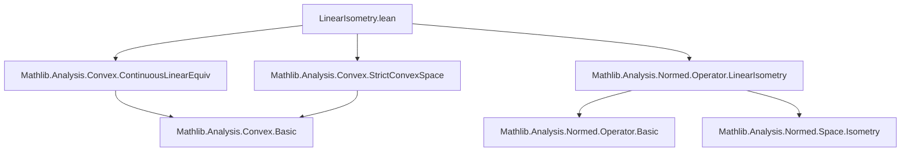
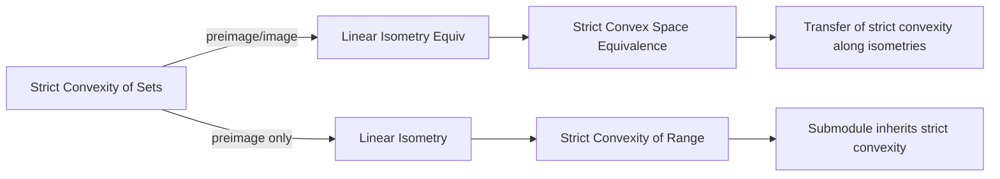

**Technical Brief: `LinearIsometry.lean`**

---

### 1. **Key Definitions & Theorems**

| Name | Type / Signature | Purpose |
|------|------------------|---------|
| `LinearIsometryEquiv.strictConvex_preimage` | `(e : E ≃ₗᵢ[𝕜] F) → StrictConvex 𝕜 (e ⁻¹' s) ↔ StrictConvex 𝕜 s` | Preimage of a strictly convex set under a linear isometry equivalence is strictly convex iff the original set is. |
| `LinearIsometryEquiv.strictConvex_image` | `(e : E ≃ₗᵢ[𝕜] F) → StrictConvex 𝕜 (e '' s) ↔ StrictConvex 𝕜 s` | Image of a strictly convex set under a linear isometry equivalence is strictly convex iff the original set is. |
| `StrictConvex.linearIsometry_preimage` | `(hs : StrictConvex 𝕜 s) → (e : E →ₗᵢ[𝕜] F) → StrictConvex 𝕜 (e ⁻¹' s)` | Preimage of a strictly convex set under a (non-surjective) linear isometry is strictly convex. |
| `LinearIsometryEquiv.strictConvexSpace_iff` | `(e : E ≃ₗᵢ[𝕜] F) → StrictConvexSpace 𝕜 E ↔ StrictConvexSpace 𝕜 F` | Linear isometry equivalences preserve strict convexity of the whole space. |
| `LinearIsometry.strictConvexSpace_range_iff` | `(e : E →ₗᵢ[𝕜] F) → StrictConvexSpace 𝕜 (e.range) ↔ StrictConvexSpace 𝕜 E` | A linear isometry’s range is strictly convex iff the domain is. |
| `LinearIsometry.strictConvexSpace_range` | `[StrictConvexSpace 𝕜 E] → StrictConvexSpace 𝕜 (e.range)` | Instantiates strict convexity of the range of a linear isometry from a strict convex space. |
| `LinearIsometry.strictConvexSpace` | `[StrictConvexSpace 𝕜 F] → StrictConvexSpace 𝕜 E` | If the codomain is strictly convex, then the domain of an isometric embedding is too. |
| `Submodule.instStrictConvexSpace` | `[StrictConvexSpace 𝕜 E] → (p : Submodule 𝕜 E) → StrictConvexSpace 𝕜 p` | Any submodule (i.e., linear subspace) of a strict convex space inherits strict convexity. |

---

### 2. **Naming Conventions**

- **Prefixes**:
  - `strictConvex_`: for properties about strict convexity of sets/spaces.
  - `linearIsometry_`: for results involving linear isometries (`→ₗᵢ[𝕜]`) or equivalences (`≃ₗᵢ[𝕜]`).
- **Suffixes**:
  - `_preimage`, `_image`: indicate set-theoretic preimage/image behavior.
  - `_range`: refers to the range (image) of a linear map.
  - `_iff`: indicates an equivalence (↔) rather than just one direction.
- **`inst` prefix**: used for typeclass instances (e.g., `Submodule.instStrictConvexSpace`).

---

### 3. **Tactic Stack**

- `simp only [...]`: heavily used to simplify using lemmas like `map_zero`, `image_closedBall`, `strictConvex_image`.
- `rw [...]`: for rewriting using equalities (e.g., `← f.isometry.preimage_closedBall`).
- `exact ...`: for direct proof steps (e.g., `exact (strictConvex_closedBall _ _ _).linearIsometry_preimage _`).
- `apply ...`: used implicitly via `morphism`-style reasoning (e.g., `e.strictConvex_space_iff.mpr`).
- `cases`/`intro`/`constructor`: not explicitly visible but likely used in underlying `strictConvexSpace` proofs (e.g., `strictConvex_closedBall`).

No heavy automation like `aesop` or `linarith` appears in this snippet.

---

### 4. **Proof Logic**

- **Structure**: Most proofs follow a *reduction strategy*:
  1. Reduce to known facts about continuous linear maps (via `e.toContinuousLinearEquiv` or `e.continuous`, `e.injective`).
  2. Use `isometry` properties (e.g., `preimage_closedBall`) to translate geometric properties (like strict convexity of balls) back to the domain.
  3. For equivalences (`≃ₗᵢ`), use `↔`-based reasoning (`simp only [...]` + `←`/`→` rewriting).
  4. For submodules, factor through the inclusion map (`subtypeₗᵢ`) and apply previous lemmas.

- **Induction**: Not used here — all arguments are *direct* and rely on algebraic-topological properties of isometries.

---

### 5. **Imports**

| Import | Purpose |
|--------|---------|
| `Mathlib.Analysis.Convex.ContinuousLinearEquiv` | Provides lemmas about strict convexity under continuous linear equivalences (used via `e.toContinuousLinearEquiv`). |
| `Mathlib.Analysis.Convex.StrictConvexSpace` | Defines `StrictConvexSpace` and basic lemmas (e.g., `strictConvexSpace_iff`, `strictConvex_closedBall`). |
| `Mathlib.Analysis.Normed.Operator.LinearIsometry` | Defines `LinearIsometry`, `LinearIsometryEquiv`, and their basic properties (e.g., `isometry`, `injective`, `toContinuousLinearEquiv`). |

---

### 6. **Mermaid Diagrams**

#### **Dependency Graph (Module-Level)**

#### **Overview of Theoretical Flow**

---

### 7. **Domain-Specific AI Agent Notes**

- **Key reasoning pattern**: *Transfer geometric properties along isometric embeddings/equivalences*.
- **Critical lemmas for automation**: `strictConvex_preimage`, `strictConvex_space_iff`, `strictConvex_closedBall`.
- **Common proof obligations**: Show that a set is strictly convex by reducing to known cases via isometry.
- **Instance priority awareness**: `Submodule.instStrictConvexSpace` has priority `900` to avoid conflicts with more specific instances (e.g., `LinearIsometry.strictConvexSpace_range`).

--- 

Let me know if you'd like a formalization plan for extending this file (e.g., to convexity of affine subspaces or non-strict convexity).
