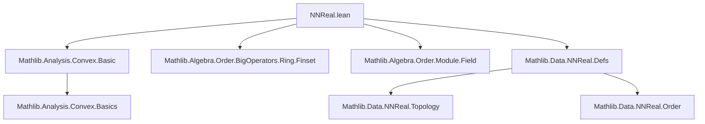
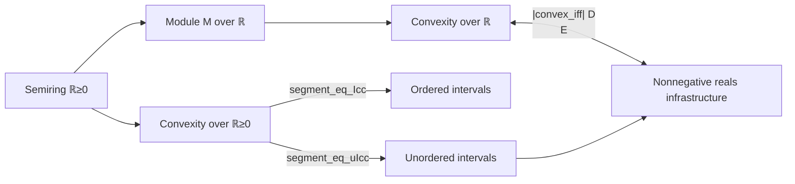

**Technical Brief: `NNReal.lean` — Convexity over the Nonnegative Reals**

---

### 1. **Key Definitions & Theorems**

| Name | Type / Signature | Purpose |
|------|------------------|---------|
| `Icc_subset_segment` | `∀ x y : ℝ≥0, Icc x y ⊆ segment ℝ≥0 x y` | Shows that the closed interval in `ℝ≥0` is contained in the segment (convex hull) between two points in `ℝ≥0`. |
| `segment_eq_Icc` | `∀ x y : ℝ≥0, x ≤ y → segment ℝ≥0 x y = Icc x y` | Identifies the segment in `ℝ≥0` with the usual closed interval when the endpoints are ordered. |
| `segment_eq_uIcc` | `∀ x y : ℝ≥0, segment ℝ≥0 x y = uIcc x y` | Relates the segment in `ℝ≥0` to the *unordered* interval `uIcc` (i.e., `Icc x y ∪ Icc y x`). |
| `convex_iff` | `∀ M [AddCommMonoid M] [Module ℝ M] (s : Set M), Convex ℝ≥0 s ↔ Convex ℝ s` | Equates convexity over the semiring `ℝ≥0` with convexity over the field `ℝ` for subsets of an `ℝ`-module. |

> **Note**: All proofs rely on corresponding lemmas from `Mathlib.Data.NNReal.Defs` (e.g., `Nonneg.*` lemmas), indicating reuse of a shared infrastructure for nonnegative reals.

---

### 2. **Naming Conventions**

- **Prefixes**:
  - `Icc_`: standard interval notation (`Icc x y` = `[x, y]`).
  - `segment_`: convex combinations over a semiring/module.
  - `convex_`: convexity predicates.
- **Suffixes**:
  - `_subset_`, `_eq_`, `_iff_`: standard Lean convention for inclusion, equality, and equivalence lemmas.
- **Module-scoped lemmas** are declared `protected`, indicating they live under the `NNReal` namespace.

---

### 3. **Tactic Stack**

| Tactic | Usage Frequency | Role |
|--------|-----------------|------|
| `refine` | High | Structured proof construction (e.g., in `convex_iff`). |
| `intro` | Medium | Introducing hypotheses/variables. |
| `ext` + `simpa` | Medium | Extensionality + simplification to reduce goals (e.g., verifying scalar membership). |
| `exact` | Medium | Finalizing goals with existing facts. |
| `Nonneg.*` lemmas | Implicit | Delegation to `Mathlib.Data.NNReal.Defs` infrastructure (e.g., `Nonneg.Icc_subset_segment`). |

No heavy automation (`aesop`, `ring`, `linarith`) appears explicitly — proofs are mostly structural and rely on pre-proved lemmas.

---

### 4. **Proof Logic**

- **Structure**:  
  - **`Icc_subset_segment` / `segment_eq_Icc` / `segment_eq_uIcc`**: Directly lifted from `Nonneg.*` lemmas — no inductive or case-based reasoning needed.  
  - **`convex_iff`**:  
    - *Forward direction*: Uses `refine` to construct a proof by showing that any `ℝ≥0`-convex combination is also an `ℝ`-convex combination.  
      - Key step: lift scalars `a, b : ℝ≥0` to `ℝ` via `⟨a, ha⟩`, `⟨b, hb⟩`, and use `zero_le _` to satisfy scalar nonnegativity constraints required for `ℝ≥0`-convexity.  
    - *Backward direction*: Uses `Convex.lift`, a general result that convexity over a subsemiring (here `ℝ≥0 ⊆ ℝ`) implies convexity over the larger ring (here `ℝ`), provided the set is stable under scalar multiplication by nonnegative reals — which holds trivially for subsets of an `ℝ`-module.

---

### 5. **Imports**

| Import | Role |
|--------|------|
| `Mathlib.Analysis.Convex.Basic` | Provides `segment`, `Convex`, and basic convexity lemmas. |
| `Mathlib.Algebra.Order.BigOperators.Ring.Finset` | Likely for finite sum manipulations (though not used directly here). |
| `Mathlib.Algebra.Order.Module.Field` | Supplies module/field order-theoretic structure (e.g., scalar multiplication monotonicity). |
| `Mathlib.Data.NNReal.Defs` | Core definitions and lemmas about `ℝ≥0` as a semiring, including `Nonneg.*` lemmas reused here. |

> **Scope**: This module sits at the intersection of *ordered algebra* (semiring `ℝ≥0`) and *convex geometry* over modules.

---

### 8. **Mermaid Diagrams**

#### **Dependency Graph (File-Level)**

#### **Conceptual Overview (Theory Flow)**

> **Interpretation**:  
> - `NNReal.lean` bridges *ordered algebra* (`ℝ≥0` as a semiring) and *convex geometry* over modules.  
> - It leverages existing `Mathlib` infrastructure (`Mathlib.Data.NNReal.Defs`) to avoid duplication, and connects to analysis via `Mathlib.Analysis.Convex.Basic`.  
> - The `convex_iff` lemma is the central result: it shows that convexity over `ℝ≥0` is no stricter than over `ℝ` — a key simplification for optimization and geometry over nonnegative reals.

--- 

Let me know if you'd like a formalized dependency graph (e.g., for `leanproject`), or expansion of any lemma’s proof sketch.
