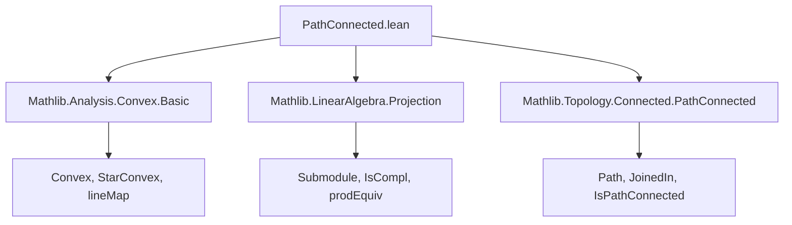

### Technical Brief: `PathConnected.lean`

---

#### **1. Key Definitions & Theorems**

| Name | Type / Signature | Purpose |
|------|------------------|---------|
| `Path.segment a b` | `Path a b` | Bundled path from `a` to `b` along the straight line segment, defined via `lineMap`. |
| `Path.range_segment` | `Set.range (segment a b) = [a -[ℝ] b]` | Describes the image of the segment path as the closed segment `[a -[ℝ] b]`. |
| `Path.segment_same` | `segment a a = refl a` | Segment from a point to itself is the constant path. |
| `Path.segment_symm` | `(segment a b).symm = segment b a` | Symmetry of segment paths. |
| `Path.segment_add_segment` | `segment a b + segment c d = segment (a + c) (b + d)` | Additivity of segment paths under pointwise addition. |
| `Path.cast_segment` | `segment a b .cast hac hbd = segment c d` | Compatibility of segment with path casting (substitution of equal endpoints). |
| `Path.eqOn_extend_segment` | `EqOn (segment a b).extend (lineMap a b) I` | The segment path extends the affine line map on the unit interval. |
| `JoinedIn.of_segment_subset` | `(segment x y ⊆ s) → JoinedIn s x y` | If the segment lies in `s`, then `x` and `y` are joined in `s`. |
| `StarConvex.isPathConnected` | `StarConvex ℝ a s → a ∈ s → IsPathConnected s` | Star-convex sets are path connected. |
| `Convex.isPathConnected` | `Convex ℝ s → s.Nonempty → IsPathConnected s` | Nonempty convex sets are path connected. |
| `Convex.isConnected` | `Convex ℝ s → s.Nonempty → IsConnected s` | Nonempty convex sets are connected (follows from path-connected ⇒ connected). |
| `Convex.isPreconnected` | `Convex ℝ s → IsPreconnected s` | Convex sets are preconnected (handles empty case separately). |
| `Submodule.isPathConnected` | `IsPathConnected (s : Set E)` | Submodules (as subsets) are path connected (since they’re convex and nonempty). |
| `IsTopologicalAddGroup.pathConnectedSpace` | `PathConnectedSpace E` | Any topological vector space over `ℝ` is path connected. |
| `isPathConnected_compl_of_isPathConnected_compl_zero` | `IsCompl p q → IsPathConnected ({0}ᶜ : Set p) → IsPathConnected (qᶜ : Set E)` | Complement of a subspace is path connected if complement of a complementary subspace is. |

---

#### **2. Naming Conventions**

- **Prefixes**:
  - `segment_`: for properties of the `Path.segment` construction.
  - `isPathConnected`, `isConnected`, `isPreconnected`: for properties of sets.
  - `convex_`, `starConvex_`: for geometric properties of sets.
  - `extend_`, `symm`, `add`, `cast`: standard path operations.

- **Suffixes**:
  - `_same`, `_symm`, `_add_segment`: describe algebraic or categorical behavior.
  - `_of_`: for implication-based theorems (e.g., `of_segment_subset`).
  - `_compl_`: for complement-related results.

- **Notable patterns**:
  - `segment a b` is the canonical path.
  - `lineMap a b` is the underlying affine map.
  - `[a -[ℝ] b]` denotes the closed segment (as a set).

---

#### **3. Tactic Stack**

Frequently used tactics in proofs:

- `simp` — heavily used, especially with `segment`, `lineMap`, and set operations.
- `ext` — for extensionality (proving paths equal by pointwise equality).
- `rw` — rewriting using lemmas like `range_segment`, `segment_eq_image_lineMap`.
- `subst_vars` — for simplifying equalities like `c = a`, `d = b`.
- `convert ... using 1` — for flexible proof construction (e.g., in `isPathConnected_compl_of_isPathConnected_compl_zero`).
- `rwa` — rewrite + assumption.
- `image_eq_range`, `mem_add`, `prod_univ`, `LinearEquiv.image_eq_preimage_symm` — used in set-theoretic manipulations.

No heavy automation (e.g., `aesop`, `linarith`) is used — proofs are mostly direct and structural.

---

#### **4. Proof Logic**

- **Path definitions**: Paths are defined via `lineMap`, and properties are proven by extensionality (`ext`) and simplification (`simp`).
- **Segment properties**: Proven by unfolding definitions and applying `simp` with lemmas like `lineMap_apply_module`.
- **Path-connectedness proofs**:
  - Use `JoinedIn.of_segment_subset` to construct paths in subsets.
  - For convex sets: pick a point (using nonemptiness), then use star-convexity (or convexity ⇒ star-convexity) to get segments inside the set.
  - For submodules: use convexity of submodules and nonemptiness.
- **Complement path-connectedness**:
  - Uses equivalence `E ≃ p × q` (from `IsCompl p q`) to reduce to product space.
  - Then uses continuity and product structure to lift path-connectedness.

---

#### **5. Imports**

- `Mathlib.Analysis.Convex.Basic` — for `Convex`, `StarConvex`, `lineMap`.
- `Mathlib.LinearAlgebra.Projection` — for `Submodule`, `IsCompl`, `prodEquivOfIsCompl`.
- `Mathlib.Topology.Connected.PathConnected` — for `PathConnectedSpace`, `IsPathConnected`, `JoinedIn`, `Path` typeclass.

---

#### **6. Mermaid Diagrams**

##### **Dependency Graph (Module-Level)**

##### **Overview of Theory Flow**

```mermaid
flowchart LR
  A[Path.segment a b] --> B[Basic properties: range, symmetry, additivity]
  B --> C[JoinedIn via segment_subset]
  C --> D[StarConvex ⇒ IsPathConnected]
  D --> E[Convex ⇒ IsPathConnected]
  E --> F[Convex ⇒ isConnected, isPreconnected]
  F --> G[Submodule ⇒ IsPathConnected]
  G --> H[TVS over ℝ ⇒ PathConnectedSpace]
  H --> I[Complement path-connectedness via IsCompl]
```

---

#### **7. Summary**

This module formalizes the foundational relationship between convexity and path-connectedness in topological vector spaces over `ℝ`. It introduces the canonical straight-line path (`Path.segment`) and proves its algebraic and topological properties. Using this, it shows that convex sets (and submodules) are path connected, and hence connected and preconnected. The final result confirms that any real topological vector space is path connected — a key structural property used throughout analysis and geometry.

The proofs are constructive and rely on explicit path constructions, with heavy use of `simp`-based simplification and extensionality arguments. The theory is tightly integrated with convex geometry, linear algebra, and topology.
