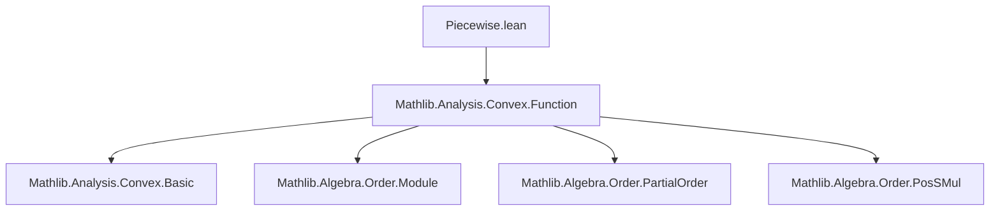
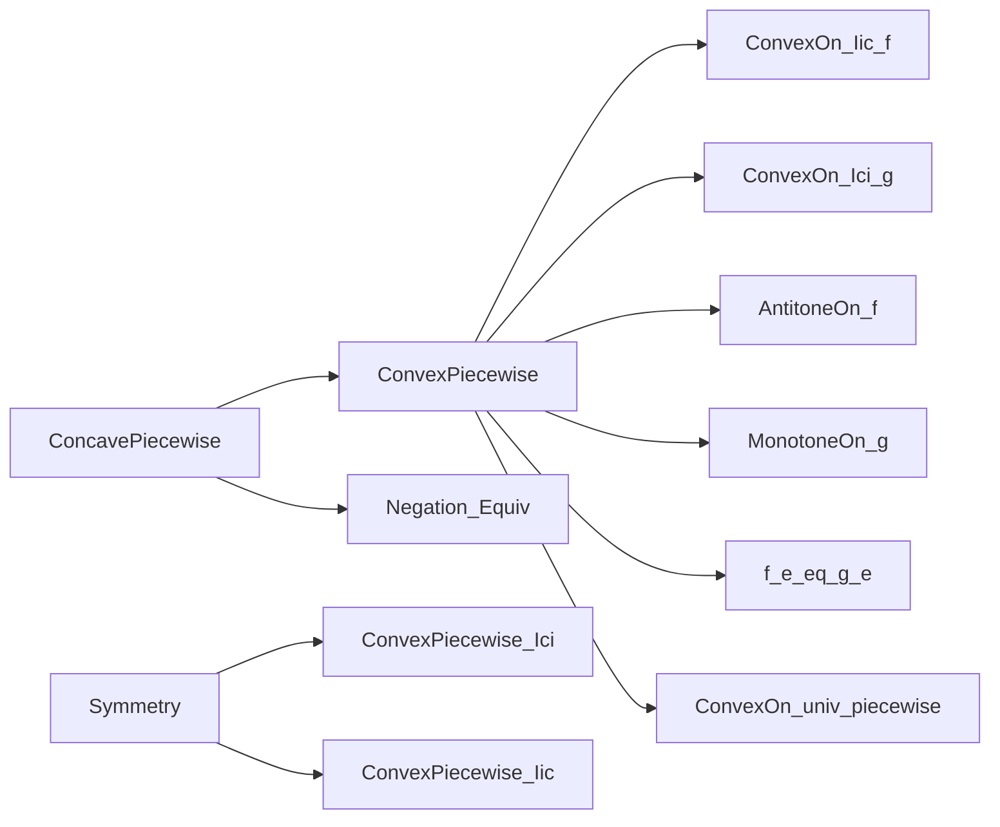
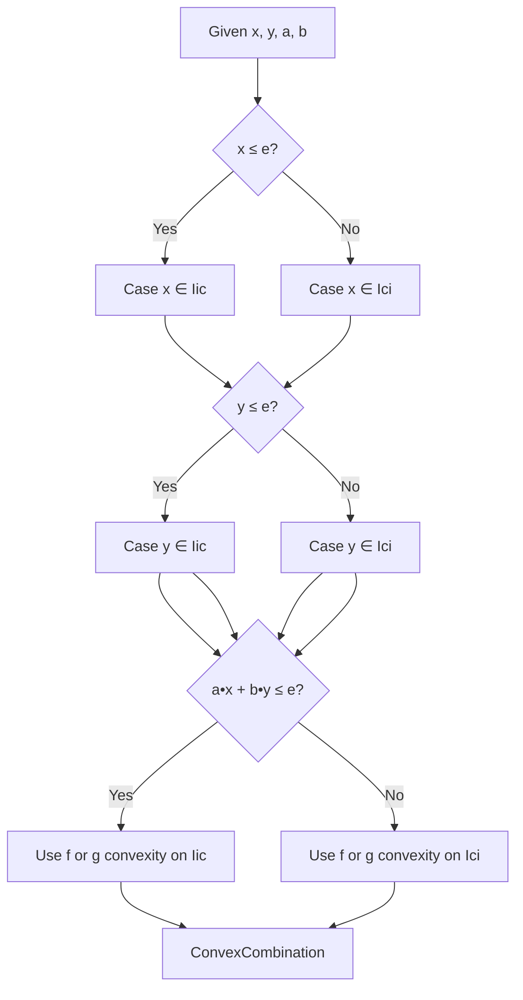

### Technical Brief: `Piecewise.lean`

---

#### **1. Key Definitions & Theorems**

| Name | Type | Purpose |
|------|------|---------|
| `convexOn_univ_piecewise_Iic_of_antitoneOn_Iic_monotoneOn_Ici` | `ConvexOn 𝕜 (Set.Iic e) f → ConvexOn 𝕜 (Set.Ici e) g → AntitoneOn f (Set.Iic e) → MonotoneOn g (Set.Ici e) → f e = g e → ConvexOn 𝕜 Set.univ ((Set.Iic e).piecewise f g)` | Proves convexity of a piecewise function where the left part (`f`) is decreasing & convex on `(-∞, e]`, the right part (`g`) is increasing & convex on `[e, ∞)`, and they agree at `e`. |
| `convexOn_univ_piecewise_Ici_of_monotoneOn_Ici_antitoneOn_Iic` | `ConvexOn 𝕜 (Set.Ici e) f → ConvexOn 𝕜 (Set.Iic e) g → MonotoneOn f (Set.Ici e) → AntitoneOn g (Set.Iic e) → f e = g e → ConvexOn 𝕜 Set.univ ((Set.Ici e).piecewise f g)` | Same as above, but with the boundary point `e` assigned to the *right* function (`g` on left, `f` on right), via symmetry. |
| `concaveOn_univ_piecewise_Iic_of_monotoneOn_Iic_antitoneOn_Ici` | `ConcaveOn 𝕜 (Set.Iic e) f → ConcaveOn 𝕜 (Set.Ici e) g → MonotoneOn f (Set.Iic e) → AntitoneOn g (Set.Ici e) → f e = g e → ConcaveOn 𝕜 Set.univ ((Set.Iic e).piecewise f g)` | Concave analog of the first convex theorem (swap monotonicity and concavity). |
| `concaveOn_univ_piecewise_Ici_of_antitoneOn_Ici_monotoneOn_Iic` | `ConcaveOn 𝕜 (Set.Ici e) f → ConcaveOn 𝕜 (Set.Iic e) g → AntitoneOn f (Set.Ici e) → MonotoneOn g (Set.Iic e) → f e = g e → ConcaveOn 𝕜 Set.univ ((Set.Ici e).piecewise f g)` | Concave analog of the second convex theorem. |

> **Note**: All theorems rely on `Set.piecewise` to define the piecewise function, and crucially use the condition `f e = g e` to ensure continuity at the breakpoint.

---

#### **2. Naming Conventions**

- **Prefixes**:
  - `convexOn_` / `concaveOn_`: indicates the property being proved.
  - `univ_`: indicates the domain of the resulting function is `Set.univ`.
  - `piecewise_Iic_` / `piecewise_Ici_`: indicates which interval (`Iic` = `(-∞, e]`, `Ici` = `[e, ∞)`) is used as the domain of the *first* function in `piecewise`.
- **Suffixes**:
  - `_of_antitoneOn_Iic_monotoneOn_Ici`: describes the monotonicity assumptions on `f` and `g`.
  - `_of_monotoneOn_Iic_antitoneOn_Ici`: swapped monotonicity pattern.

> Pattern:  
> `convexOn_univ_piecewise_[Iic/Ici]_of_[monotonicity pattern]`

---

#### **3. Tactic Stack**

Frequent tactics used in proofs:

| Tactic | Role |
|--------|------|
| `obtain hx | hx := le_or_gt x e` | Case analysis on position of `x` relative to `e`. |
| `rw [Set.piecewise_eq_of_mem / notMem ...]` | Simplify `piecewise` definition based on membership. |
| `trans` | Chain inequalities via transitivity. |
| `gcongr` | Prove inequalities involving scalar multiplication and addition (e.g., `a • x ≤ a • y` when `x ≤ y`, `a ≥ 0`). |
| `exact` / `refine` | Apply known lemmas or construct proofs with holes (`?_`). |
| `ext` + `by_cases` + `simp` | Prove extensional equality of functions (used in `convexOn_univ_piecewise_Ici_of_monotoneOn_Ici_antitoneOn_Iic`). |
| `rw [← neg_convexOn_iff, ← Set.piecewise_neg]` | Reduce concavity to convexity via negation. |
| `neg_inj.mpr` | Convert equality of negatives to equality of originals. |

---

#### **4. Proof Logic**

The core proof strategy is **case analysis on the positions of `x`, `y`, and `a • x + b • y` relative to `e`**, leveraging:

- **Convexity of `f` and `g`** on their respective domains.
- **Monotonicity** (`AntitoneOn` / `MonotoneOn`) to compare values across the boundary.
- **Equality at `e`** (`f e = g e`) to bridge cases where the convex combination crosses the breakpoint.

**Typical flow** (for convex case):

1. **Case split** on `x ≤ e` or `x > e`, and similarly for `y`.
2. For each case, determine whether the convex combination `a • x + b • y` lies in `Iic e` or `Ici e`.
3. Use `piecewise_eq_of_mem` / `notMem` to rewrite the piecewise function.
4. Apply convexity of `f` or `g` where both points lie in the same domain.
5. For cross-boundary cases, use monotonicity to bound the convex combination by expressions involving `f(e)` or `g(e)`, then apply convexity and `f e = g e`.

The second convex theorem (`Ici` version) reduces to the first via symmetry:  
`(Set.Ici e).piecewise f g = (Set.Iic e).piecewise g f`, proven by extensionality and simplification.

Concave theorems follow by applying `neg_convexOn_iff` and `Set.piecewise_neg`.

---

#### **5. Imports**

- `Mathlib.Analysis.Convex.Function`: Provides foundational definitions and lemmas about convex/concave functions, including:
  - `ConvexOn`, `ConcaveOn`
  - `neg_convexOn_iff`
  - `Convex.combo_le_max`
  - `Set.piecewise` lemmas (`piecewise_eq_of_mem`, `piecewise_eq_of_notMem`, etc.)

> **Scope**: This module is part of the *convex analysis* library in Mathlib, specifically targeting *piecewise-defined* convex/concave functions.

---

#### **6. Mermaid Diagrams**

##### **Dependency Graph (Module-Level)**

##### **Theoretical Overview (Proof Structure)**

##### **Case Analysis Tree (Core Proof)**

---

This file formalizes a classical result in convex analysis: *a piecewise function made of two convex pieces, glued at a point where they agree and with compatible monotonicity, is globally convex*. The Lean formalization is highly structured, leveraging case analysis and order-theoretic reasoning.
