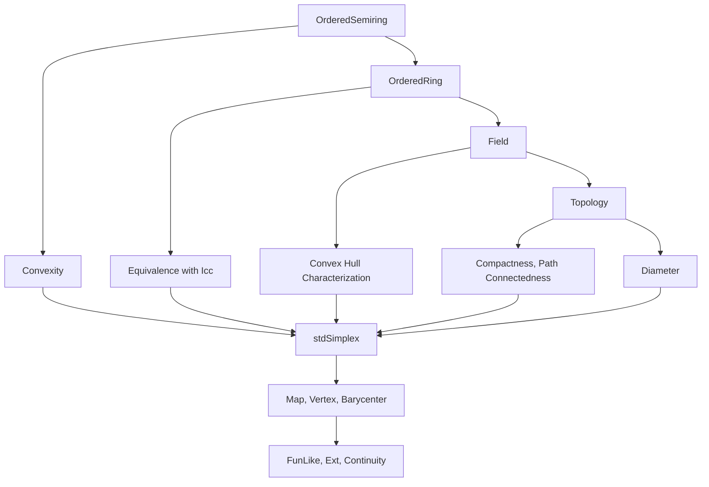
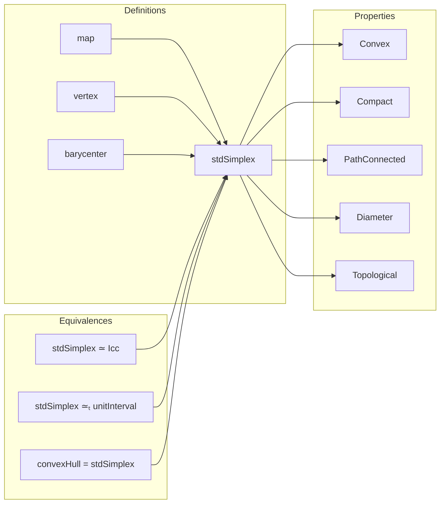

### Technical Brief: `StdSimplex.lean`

---

#### **1. Key Definitions & Theorems**

| Name | Type / Signature | Purpose |
|------|------------------|---------|
| `stdSimplex` | `def stdSimplex : Set (ι → 𝕜)` | Set of functions `ι → 𝕜` with non-negative coordinates summing to `1`. |
| `stdSimplex_eq_inter` | `theorem` | Expresses `stdSimplex` as intersection of half-spaces (`0 ≤ f x`) and hyperplane (`∑ f = 1`). |
| `convex_stdSimplex` | `theorem` | `stdSimplex` is convex over an ordered ring. |
| `stdSimplex_of_subsingleton` | `lemma` | If `𝕜` is subsingleton, `stdSimplex = univ`. |
| `stdSimplex_of_isEmpty_index` | `lemma` | If `ι` is empty and `𝕜` nontrivial, `stdSimplex = ∅`. |
| `stdSimplex_unique` | `lemma` | If `ι` is a singleton, `stdSimplex = {fun _ ↦ 1}`. |
| `mem_Icc_of_mem_stdSimplex` | `theorem` | Each coordinate of `f ∈ stdSimplex` lies in `[0, 1]`. |
| `single_mem_stdSimplex` | `theorem` | `Pi.single i 1 ∈ stdSimplex`. |
| `segment_single_subset_stdSimplex` | `lemma` | Segment between two vertices lies in `stdSimplex`. |
| `stdSimplex_fin_two` | `lemma` | `stdSimplex 𝕜 (Fin 2)` equals the segment between the two vertices. |
| `stdSimplexEquivIcc` | `def` | Equivalence `stdSimplex 𝕜 (Fin 2) ≃ Icc 0 1`. |
| `stdSimplexHomeomorphUnitInterval` | `def` | Homeomorphism `stdSimplex ℝ (Fin 2) ≃ₜ unitInterval`. |
| `convexHull_basis_eq_stdSimplex` | `theorem` | `stdSimplex` is the convex hull of the canonical basis vectors. |
| `convexHull_rangle_single_eq_stdSimplex` | `theorem` | Same as above, using `Pi.single i 1`. |
| `Set.Finite.convexHull_eq_image` | `theorem` | Convex hull of finite set `s` is image of `stdSimplex` under linear combination map. |
| `stdSimplex_subset_closedBall` | `theorem` | `stdSimplex ⊆ closedBall 0 1` (sup-norm ≤ 1). |
| `bounded_stdSimplex`, `isClosed_stdSimplex`, `isCompact_stdSimplex` | `theorem` | Topological properties over `ℝ`. |
| `isPathConnected_stdSimplex` | `theorem` | `stdSimplex` is path-connected (hence connected). |
| `diam_stdSimplex_le`, `diam_stdSimplex_of_subsingleton`, `diam_stdSimplex` | `theorem` | Diameter of `stdSimplex` under sup-metric. |
| `map` | `def` | Induced map `stdSimplex S X → stdSimplex S Y` from `f : X → Y`. |
| `vertex` | `abbrev` | Vertex map `X → stdSimplex S X`, `x ↦ Pi.single x 1`. |
| `barycenter` | `def` | Center of mass of vertices: constant function `(Fintype.card X)⁻¹`. |

---

#### **2. Naming Conventions**

- **Prefixes**:
  - `stdSimplex_`: Main module prefix for definitions/lemmas about the simplex.
  - `mem_`, `le_`, `sum_`, `diam_`, `continuous_`, `isCompact_`, `isClosed_`, `bounded_`, `isPathConnected_`: Standard mathlib conventions.
- **Suffixes**:
  - `_eq`: Equality characterizations.
  - `_subset`, `_eq_inter`, `_eq_image`: Set-theoretic descriptions.
  - `_of_`: Special cases (e.g., `subsingleton`, `isEmpty`, `unique`, `nontrivial`).
  - `_apply`: Evaluations at points (e.g., `barycenter_apply`).
- **Function names**:
  - `map`, `vertex`, `barycenter`: Structural constructions.
  - `single_mem_`, `ite_eq_mem_`: Membership lemmas for basic elements.

---

#### **3. Tactic Stack**

Frequently used tactics:
- `simp`, `simp_rw`, `rwa`, `rw`
- `aesop`, `grind`, `exact`, `refine`, `apply_rules`
- `ext`, `funext`, `subtype.ext`
- `cases`, `obtain`, `intro`, `rintro`
- `convert`, `congr_arg`, `congr`
- `nontriviality`, `subsingleton`, `subsingleton'`
- `fun_prop`, `continuous_*`, `isCompact_*`, `isClosed_*`, `isBounded_*`

---

#### **4. Proof Logic**

- **Structure**: Modular, with sections for:
  - Ordered semiring → ordered ring → field → topology.
- **Common proof patterns**:
  - **Extensionality**: `ext`, `funext`, `subtype.ext`.
  - **Set equality**: `ext`, `Subset.antisymm`.
  - **Convexity**: Use `convex_stdSimplex` + `segment_subset`.
  - **Membership**: Split conjunction, use `Finset.sum_nonneg`, `Finset.single_le_sum`.
  - **Topological properties**: Use `isClosed_iInter`, `isClosed_eq`, `isBounded_iff_subset_closedBall`.
  - **Diameter**: Use `diam_le_of_forall_dist_le`, `dist_pi_le_iff`, `dist_single_single`.
  - **Equivalences**: Construct `toFun`, `invFun`, prove `left_inv`, `right_inv`.
  - **Homeomorphisms**: Prove continuity of `toFun` and `invFun` separately.

---

#### **5. Imports**

| Import | Purpose |
|--------|---------|
| `Mathlib.Analysis.Convex.Combination` | Convex combinations, convex hulls. |
| `Mathlib.Analysis.Convex.PathConnected` | Path-connectedness of convex sets. |
| `Mathlib.Topology.Algebra.Monoid.FunOnFinite` | Linear maps induced by functions between finite types (`FunOnFinite.linearMap`). |
| `Mathlib.Topology.UnitInterval` | Unit interval topology, homeomorphisms. |

---

#### **6. Mermaid Diagrams**

##### **Dependency Graph (High-Level)**

##### **File Overview**

---

#### **7. Theory Context**

- **Category-theoretic view**: `stdSimplex` is the *free convex space* on a finite type.
- **Geometric view**: Standard geometric simplex in `𝕜^ι`, with vertices at `Pi.single i 1`.
- **Topological view**: Over `ℝ`, it is a compact, convex, path-connected subset of `ℝ^ι`.
- **Combinatorial view**: Convex hull of basis vectors; barycenter is uniform distribution.

---

#### **8. Summary**

`StdSimplex.lean` formalizes the theory of standard simplices over ordered semirings/rings/fields, with emphasis on:
- Convex geometry (convex hulls, segments, barycenters),
- Topology (compactness, path-connectedness, diameter),
- Functoriality (`map` induced by `X → Y`),
- Equivalences (e.g., `stdSimplex ℝ (Fin 2) ≃ unitInterval`).

It serves as a foundational module for convex geometry in Lean, especially in contexts involving finite-dimensional simplices, barycentric coordinates, and simplicial constructions.
