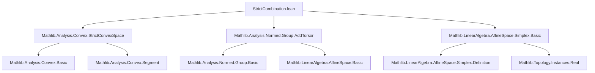
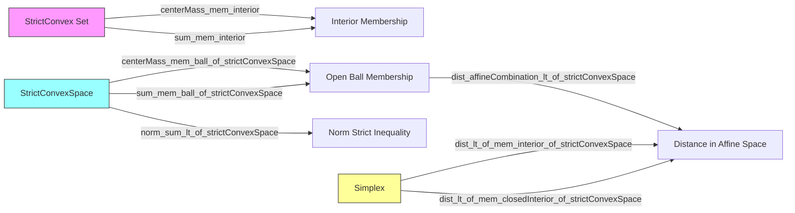

**Technical Brief: `StrictCombination.lean`**

---

### 1. **Key Definitions & Theorems**

| Name | Type / Signature | Purpose |
|------|------------------|---------|
| `StrictConvex.centerMass_mem_interior` | `StrictConvex R s → (∀ i ∈ t, 0 ≤ w i) → … → t.centerMass w z ∈ interior s` | Shows that the *center of mass* (weighted average) of points in a strictly convex set lies in the *interior*, provided weights are nonnegative, sum nonzero, and at least two distinct points have nonzero weight. |
| `StrictConvex.sum_mem_interior` | `StrictConvex R s → … → ∑ k ∈ t, w k • z k ∈ interior s` | Same as above, but for the *weighted sum* (equivalent to center of mass when weights sum to 1). |
| `centerMass_mem_ball_of_strictConvexSpace` | `∀ i ∈ t, 0 ≤ w i → … → t.centerMass w z ∈ ball p r` | In a *strictly convex normed space*, center of mass of points in a *closed ball* lies in the *open ball*, if weights are nonnegative, sum nonzero, and at least two distinct points have nonzero weight. |
| `sum_mem_ball_of_strictConvexSpace` | `… → ∑ k ∈ t, w k • z k ∈ ball p r` | Same as above for weighted sum (weights sum to 1). |
| `norm_sum_lt_of_strictConvexSpace` | `… → ‖∑ k ∈ t, w k • z k‖ < r` | Special case of `sum_mem_ball_of_strictConvexSpace` for the origin-centered ball: strict inequality on the norm. |
| `dist_affineCombination_lt_of_strictConvexSpace` | `… → dist (t.affineCombination ℝ p w) p₀ < r` | Extends the strict inequality to *affine combinations* in a *strictly convex affine space* (via torsor structure). |
| `dist_lt_of_mem_closedInterior_of_strictConvexSpace` | `p ∈ s.closedInterior → (∀ i, p ≠ s.points i) → (∀ i, dist (s.points i) p₀ ≤ r) → dist p p₀ < r` | In a *simplex* in a strictly convex space, any point in the *closed interior* (i.e., interior of the closed simplex) that is not equal to any vertex lies strictly inside the ball of radius `r` around `p₀`, if all vertices lie in the closed ball. |
| `dist_lt_of_mem_interior_of_strictConvexSpace` | `p ∈ s.interior → (∀ i, dist (s.points i) p₀ ≤ r) → dist p p₀ < r` | Immediate corollary of the previous lemma for the *interior* (not just closed interior). |

> **Note**: `centerMass w z = ∑ k ∈ t, w k • z k / ∑ k ∈ t, w k`, and `affineCombination` generalizes this to affine spaces without a distinguished origin.

---

### 2. **Naming Conventions**

- **Prefixes**:
  - `StrictConvex.`: Lemmas about strictly convex *sets*.
  - `centerMass_`, `sum_`, `norm_sum_`, `dist_`: Based on the object being bounded (center of mass, sum, norm, distance).
  - `affineCombination_`: For affine combinations in torsor setting.
- **Suffixes**:
  - `_of_strictConvexSpace`: Applies in the *strictly convex space* setting (global, not just a set).
  - `_of_mem_closedInterior`, `_of_mem_interior`: Based on membership assumptions.
- **Helper patterns**:
  - `h0`, `h1`: Nonnegativity and unit-sum assumptions on weights.
  - `hi`, `hj`, `hi0`, `hj0`, `hij`: Indices and distinctness/nonzero-weight assumptions.
  - `hz`, `hp`: Membership of points in closed ball / closed simplex.

---

### 3. **Tactic Stack**

Frequent tactics used in proofs:

| Tactic | Role |
|--------|------|
| `induction t using Finset.induction` | Structural induction on finite sets (key for center of mass lemmas). |
| `simp`, `simp only`, `simp_rw` | Simplification of sums, center of mass definitions, and affine combination expressions. |
| `grind` / `by grind` | Custom tactic (likely from `Mathlib.Tactic`) for automated reasoning over inequalities, sums, and finite sets. |
| `by_cases`, `exfalso`, `rcases`, `obtain` | Case analysis, contradiction, and existential unpacking. |
| `rw`, `congr`, `ext` | Rewriting definitions (e.g., `centerMass_eq_of_sum_1`, `affineCombination_eq_weightedVSubOfPoint_vadd_of_sum_eq_one`), congruence, extensionality. |
| `grw` | Goal-directed rewriting (likely from `Mathlib.Tactic`). |
| `exact`, `grind`, `grw` | Final proof steps using previously established facts. |

---

### 4. **Proof Logic**

- **Inductive structure** on finite sets (`Finset.induction`) is central to proving properties of `centerMass`.
- **Case analysis** on whether weights vanish (`w i = 0`), whether points coincide (`z i = z j`), and whether the sum over a subset vanishes.
- **Reduction to known lemmas**:
  - `strictConvex_iff_div.1` used to reduce to the binary convex combination case.
  - `centerMass_eq_of_sum_1` to convert between `centerMass` and `∑ w k • z k`.
  - `affineCombination_eq_weightedVSubOfPoint_vadd_of_sum_eq_one` to reduce affine combinations to vector-space expressions.
- **Contrapositive reasoning**:
  - When all nonzero-weight points coincide, contradiction with `z i ≠ z j`.
  - When all weights vanish on a subset, contradiction with nonzero weight assumptions.
- **Metric-to-norm translation**:
  - `dist_eq_norm_vsub`, `mem_ball_zero_iff`, `mem_closedBall_zero_iff` used to move between distance and norm settings.

---

### 5. **Imports & Dependencies**

| Import | Purpose |
|--------|---------|
| `Mathlib.Analysis.Convex.StrictConvexSpace` | Defines strictly convex sets/spaces, key for convexity assumptions. |
| `Mathlib.Analysis.Normed.Group.AddTorsor` | Provides torsor structure for affine spaces over normed groups. |
| `Mathlib.LinearAlgebra.AffineSpace.Simplex.Basic` | Defines simplices, their points, interior, affine combinations, etc. |

> **Core theory scope**: Strict convexity in normed/affine spaces, finite convex combinations, and metric geometry of simplices.

---

### 6. **Mermaid Diagrams**

#### **Dependency Graph (Module-Level)**

#### **Overview of Theoretical Flow**

---

### 7. **Domain-Specific AI Agent Implications**

- **Focus areas for reasoning**: Strict convexity, finite convex combinations, interior vs. boundary behavior.
- **Key proof patterns**: Induction on finite sets + case analysis on weights/points + reduction to binary convexity.
- **Automation opportunities**: `grind`-style automation for inequalities and finite sums; pattern matching on `centerMass`/`affineCombination`.
- **Extension hooks**: Lemmas are designed for reuse in metric geometry, optimization over simplices, and strict convexity-based uniqueness arguments.

--- 

Let me know if you'd like a formalized *summary tactic* or a *proof sketch generator* for this module.
