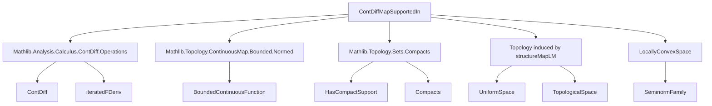

Here's a structured technical brief extracted from `ContDiffMapSupportedIn.lean`, focusing on formal metadata for AI agent training:

---

### **1. Key Definitions & Theorems**

| Name | Type / Purpose |
|------|----------------|
| `ContDiffMapSupportedIn E F n K` | `Type _` — bundled `n`-times continuously differentiable maps `E → F` vanishing outside compact `K`. |
| `ContDiffMapSupportedInClass B E F n K` | `Class` — abstract interface for types of bundled maps with `ContDiff` and support in `K`. |
| `structureMapLM 𝕜 n i` | `𝓓^{n}_{K}(E, F) →ₗ[𝕜] E →ᵇ (E [×i]→L[ℝ] F)` — linear map sending `f` to its `i`-th iterated derivative (zero if `i > n`). |
| `structureMapCLM 𝕜 n i` | `𝓓^{n}_{K}(E, F) →L[𝕜] E →ᵇ (E [×i]→L[ℝ] F)` — continuous linear version of `structureMapLM`. |
| `iteratedFDerivWithOrderLM 𝕜 n k i` | `𝓓^{n}_{K}(E, F) →ₗ[𝕜] 𝓓^{k}_{K}(E, E [×i]→L[ℝ] F)` — `i`-th derivative operator, defined as `0` if `k + i > n`. |
| `iteratedFDerivLM 𝕜 i` | `𝓓_{K}(E, F) →ₗ[𝕜] 𝓓_{K}(E, E [×i]→L[ℝ] F)` — smooth-case derivative operator (`n = ⊤`). |
| `seminorm 𝕜 E F n K i` | `Seminorm 𝕜 𝓓^{n}_{K}(E, F)` — sup-norm of `i`-th derivative, denoted `N[𝕜]_{K,n,i}`. |
| `topologicalSpace` / `uniformSpace` | `TopologicalSpace` / `UniformSpace` on `𝓓^{n}_{K}(E, F)` induced by `structureMapLM`s. |
| `continuous_iff_comp` | `∀ i, Continuous (structureMapCLM ℝ n i ∘ φ) ↔ Continuous φ` — universal property of the topology. |
| `isTopologicalAddGroup` | `IsTopologicalAddGroup` — addition is continuous and inverses are continuous. |
| `locallyConvexSpace` | `LocallyConvexSpace ℝ` — topology is locally convex (induced by seminorms). |

---

### **2. Naming Conventions**

- **Prefixes**:
  - `is_`: properties (e.g., `isTopologicalAddGroup`, `isUniformAddGroup`).
  - `inst_`: typeclass instances (e.g., `instSMul`, `instSub`).
  - `to_`: coercion/embedding (e.g., `toBoundedContinuousFunctionLM`, `toFun`).
  - `postcomp_`: post-composition with linear maps (e.g., `postcompLM`).
  - `structureMap_`: derivative-based structure maps defining the topology.
- **Suffixes**:
  - `_LM`: linear map (not necessarily continuous).
  - `_CLM`: continuous linear map.
  - `_withOrder`: regularity-aware version (explicit `n`, `k`, `i`).
  - `_sup`: supremum over finite sets of seminorms (e.g., `supSeminorm`).
- **Notation**:
  - `𝓓^{n}_{K}(E, F)` for `ContDiffMapSupportedIn E F n K`.
  - `𝓓_{K}(E, F)` for smooth case (`n = ⊤`).
  - `N[𝕜]_{K, n, i}` for seminorms.

---

### **3. Tactic Stack**

Frequent tactics used:
- `simp` / `simp_rw` — simplification with definitional equalities.
- `ext` / `ext x` — extensionality for functions/structures.
- `split_ifs` — case analysis on `if` expressions.
- `rw [← ...]` — rewriting using algebraic identities (e.g., `add_zero`, `neg_zero`).
- `have` / `rcases` / `cases` — intermediate lemma introduction and destructuring.
- `exact`, `refine`, `apply` — proof construction.
- `fast_instance%` — instance inference for algebraic structures.
- `congr` — congruence reasoning (e.g., for function extensionality).
- `push_neg` — negation normal form for inequalities.

---

### **4. Proof Logic**

- **Induction**: Not used directly (no inductive types in this file).
- **Case analysis**: On `i ≤ n` or `k + i ≤ n` (e.g., in `iteratedFDerivWithOrderLM`).
- **Definitional rewriting**: Heavy use of `rfl`, `congr`, and `simp` to resolve definitional equalities (e.g., `structureMapLM_eq_of_scalars`).
- **Support reasoning**: Leverages `EqOn f 0 Kᶜ` to deduce `support f ⊆ K` and `tsupport f ⊆ K`.
- **Topology construction**: Induced topology via `iInf` over `structureMapLM`s; continuity/seminorm properties follow from universal properties.
- **Seminorm bounds**: Prove inequalities via `seminorm_le_iff_withOrder`, reducing to pointwise derivative bounds on `K`.

---

### **5. Imports**

| Module | Purpose |
|--------|---------|
| `Mathlib.Analysis.Calculus.ContDiff.Operations` | `ContDiff`, `iteratedFDeriv`, closure under algebraic ops. |
| `Mathlib.Topology.ContinuousMap.Bounded.Normed` | `BoundedContinuousFunction`, normed space structure. |
| `Mathlib.Topology.Sets.Compacts` | Compact sets, support theory, `HasCompactSupport`. |

---

### **6. Mermaid Diagrams**

#### **Dependency Graph**


#### **Overview of File Structure**
```mermaid
flowchart LR
  subgraph Definitions
    A[ContDiffMapSupportedIn] --> B[ContDiffMapSupportedInClass]
    A --> C[Notation: 𝓓^{n}_{K}, 𝓓_{K}]
  end

  subgraph Algebra
    C --> D[AddCommGroup]
    C --> E[Module]
  end

  subgraph Calculus
    C --> F[iteratedFDerivWithOrderLM]
    C --> G[iteratedFDerivLM]
    C --> H[structureMapLM/CLM]
  end

  subgraph Topology
    C --> I[topologicalSpace]
    C --> J[uniformSpace]
    I --> K[IsTopologicalAddGroup]
    J --> L[IsUniformAddGroup]
    I --> M[LocallyConvexSpace]
  end

  subgraph Seminorms
    C --> N[seminorm]
    C --> O[supSeminorm]
    N --> P[WithSeminorms]
  end

  subgraph Properties
    C --> Q[support_subset]
    C --> R[tsupport_subset]
    C --> S[bounded_iteratedFDeriv]
  end
```

---

### **7. Key Implementation Notes**

- **Support condition**: Uses `EqOn f 0 Kᶜ` instead of `tsupport f ⊆ K` for easier rewriting.
- **Regularity handling**: Distinguishes smooth (`n = ⊤`) and finite-order cases (`n ∈ ℕ∞`), reserving concise names for the smooth case.
- **Definitional care**: Avoids `if` in smooth case (`iteratedFDerivLM`) to prevent DTT issues; uses decidability of `ℕ∞` for definitional equalities.
- **Scalability**: `structureMapLM`/`CLM` define the topology universally; continuity/seminorm properties follow from induced structure.

--- 

This metadata captures the formal essence of the file for AI agent training, emphasizing naming, structure, and proof patterns.
