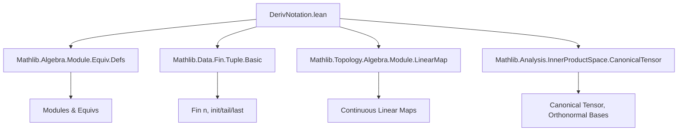
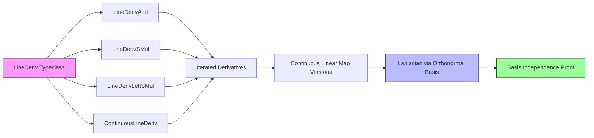

**Technical Brief: `DerivNotation.lean`**

---

### 1. **Key Definitions & Theorems**

| Name | Type / Signature | Purpose |
|------|------------------|---------|
| `LineDeriv.lineDerivOp` | `V → E → F` | Core notation class for line (directional) derivative operator; abstracts `∂_v f`. |
| `LineDeriv.iteratedLineDerivOp` | `(Fin n → V) → E → E` | Iterated line derivative over `n` directions; encodes higher-order derivatives. |
| `LineDerivAdd.lineDerivOp_add` | `∂_v (x + y) = ∂_v x + ∂_v y` | Additivity of line derivative in function argument. |
| `LineDerivAdd.lineDerivOp_left_add` | `∂_{v + w} x = ∂_v x + ∂_w x` | Additivity of line derivative in direction argument. |
| `LineDerivSMul.lineDerivOp_smul` | `∂_v (r • x) = r • ∂_v x` | Compatibility of line derivative with scalar multiplication (right action). |
| `LineDerivLeftSMul.lineDerivOp_left_smul` | `∂_{r • v} x = r • ∂_v x` | Compatibility of line derivative with scalar multiplication (left action on direction). |
| `ContinuousLineDeriv.continuous_lineDerivOp` | `Continuous (∂_v)` | Continuity of the line derivative operator. |
| `LineDeriv.lineDerivOpCLM` | `V → E →L[R] F` | Line derivative as a *continuous linear map* (when structure permits). |
| `LineDeriv.iteratedLineDerivOpCLM` | `(Fin n → V) → E →L[R] E` | Iterated line derivative as a continuous linear map. |
| `LineDeriv.bilinearLineDerivTwo` | `V₁ → E →ₗ E →ₗ V₃` | Second derivative as a bilinear map (used to define Laplacian abstractly). |
| `LineDeriv.tensorLineDerivTwo` | `V₁ → E ⊗ E →ₗ V₃` | Second derivative lifted to tensor product. |
| `Laplacian.laplacian` | `E → F` | Abstract Laplacian operator (notation: `Δ`). |
| `LineDeriv.laplacianCLM` | `V₁ →L V₃` | Laplacian defined via orthonormal basis: `∑_i ∂_{v_i} ∘ ∂_{v_i}`. |
| `tensorLineDerivTwo_canonicalCovariantTensor_eq_sum` | `tensorLineDerivTwo f (canonicalCovariantTensor) = ∑_i ∂_{v i} (∂_{v i} f)` | Key lemma: expresses second derivative on canonical tensor as sum of second partials. |
| `laplacianCLM_eq_sum` | `laplacianCLM f = ∑_i ∂_{v i} (∂_{v i} f)` | Main theorem: Laplacian is independent of orthonormal basis choice (via change of basis invariance of canonical tensor). |

---

### 2. **Naming Conventions**

- **Prefixes**:
  - `lineDerivOp_`: operations on line derivative (e.g., `lineDerivOp_add`, `lineDerivOp_smul`).
  - `iteratedLineDerivOp_`: operations on iterated derivatives (e.g., `iteratedLineDerivOp_succ_left`).
  - `bilinearLineDerivTwo_`, `tensorLineDerivTwo_`: second derivative constructions.
  - `laplacianCLM`: Laplacian as a *continuous linear map*.

- **Suffixes**:
  - `_add`, `_smul`, `_left_add`, `_left_smul`: indicate algebraic compatibility (additivity, scalar action).
  - `_CLM`: “Continuous Linear Map” variant.
  - `_eq_`: equality lemmas (e.g., `tensorLineDerivTwo_eq_lineDerivOp_lineDerivOp`).

- **Notation**:
  - `∂_{v}`: line derivative in direction `v`.
  - `∂^{m}`: iterated derivative over finite direction tuple `m : Fin n → V`.
  - `Δ`: Laplacian.

---

### 3. **Tactic Stack**

Frequently used tactics:
- `rfl`, `simp`, `simp_rw`: for definitional equalities and simplification.
- `induction n with | zero | succ n IH =>`: structural induction on natural numbers.
- `congr 1`: to apply congruence to function compositions.
- `rw [...]`: rewriting using lemmas (e.g., `tail_init_eq_init_tail`, `init_def`, `tail_def`).
- `fun_prop`: for proving continuity in topological contexts (e.g., `ContinuousLineDeriv.continuous_lineDerivOp`).
- `lift.tmul`: for working with tensor product lift.
- `calc`: for multi-step equational reasoning.

---

### 4. **Proof Logic**

- **Inductive structure** dominates proofs about `iteratedLineDerivOp`, especially:
  - Base case `n = 0` or `n = 1` is definitional (`rfl`).
  - Inductive step uses `iteratedLineDerivOp_succ_left` to reduce to smaller `n`.
- **Algebraic properties** (additivity, scalar compatibility) are proven by:
  - Recognizing `∂_v` or `∂^{m}` as an `AddMonoidHom` or `ModuleHom`.
  - Applying generic lemmas like `map_zero`, `map_neg`, `map_sum`.
- **Basis independence of Laplacian**:
  - Define Laplacian via an orthonormal basis (`laplacianCLM`).
  - Show it equals `tensorLineDerivTwo f (canonicalCovariantTensor)`, which is basis-independent.
  - Conclude independence via `laplacianCLM_eq_sum` and properties of `canonicalCovariantTensor`.

---

### 5. **Imports & Scope**

**Primary dependencies**:
- `Mathlib.Algebra.Module.Equiv.Defs`: module equivalences.
- `Mathlib.Data.Fin.Tuple.Basic`: finite index types (`Fin n`) and tuple operations (`init`, `tail`, `last`).
- `Mathlib.Topology.Algebra.Module.LinearMap`: continuous linear maps between topological modules.
- `Mathlib.Analysis.InnerProductSpace.CanonicalTensor`: canonical tensor in finite-dimensional inner product spaces.

**Scope**:
- Focused on *abstract derivative calculus* on modules over rings/rings with topology.
- Designed for generalized function spaces (Schwartz, distributions, Sobolev).
- Not yet used beyond Schwartz functions (as of comment), but extensible.

---

### 6. **Mermaid Diagrams**

#### **Dependency Graph (Module-Level)**

#### **Overview of Theory Flow**

---

### 7. **Summary**

This file establishes a *type-class-based calculus* for directional (line) derivatives and the Laplacian in abstract settings (modules, topological vector spaces). It emphasizes:
- **Notation**: `∂_v`, `∂^m`, `Δ`.
- **Structure**: additivity, scalar compatibility, continuity.
- **Higher-order**: iterated derivatives, bilinear/tensor formulations.
- **Invariance**: Laplacian is basis-independent via canonical tensor.

It serves as a foundational layer for analysis on generalized function spaces, with future use cases in distribution theory and PDEs.

--- 

*End of Technical Brief.*
