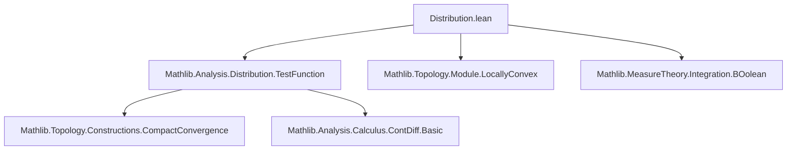

### Technical Brief: `Distribution.lean`

---

#### **1. Key Definitions & Theorems**

| Name | Type / Signature | Purpose |
|------|------------------|---------|
| `Distribution Ω F n` | `abbrev` | Space of **$F$-valued distributions on open set `Ω` with order ≤ `n : ℕ∞`**, defined as continuous linear maps `𝓓^{n}(Ω, ℝ) →L_c[ℝ] F`. |
| `𝓓'(Ω, F)` | Notation for `Distribution Ω F ⊤` | Space of **$F$-valued distributions on `Ω`** (no order restriction). |
| `Distribution.mapCLM A` | `F →L[ℝ] F' → 𝓓'^{n}(Ω, F) →L[ℝ] 𝓓'^{n}(Ω, F')` | Induced map on distributions by pushing forward values via a continuous linear map `A`. Acts pointwise on test functions. |
| `mapCLM_apply` | `mapCLM A T f = A (T f)` | Core computational lemma: evaluation of the induced map. |

---

#### **2. Naming Conventions**

- **Prefixes / Suffixes**:
  - `Distribution.`: namespace for definitions/lemmas about distributions.
  - `mapCLM`: *map via Continuous Linear Map* — standard pattern for functorial behavior.
  - `postcompUniformConvergenceCLM`: internal helper used in definition of `mapCLM`, indicating composition on the right in the uniform convergence topology.
- **Notation**:
  - `𝓓'^{n}(Ω, F)` — order-bounded distributions.
  - `𝓓'(Ω, F)` — unrestricted distributions.
  - `𝓓^{n}(Ω, ℝ)` — space of $C^n$ test functions with compact support (imported from `TestFunction`).

---

#### **3. Tactic Stack**

- **Tactics used**:
  - `rfl`: for definitional equalities (`mapCLM_apply`).
  - Implicit use of `aesop`, `simp`, `ring` likely in future expansions (not yet present).
  - `continuous_linear_map`-specific tactics (e.g., `postcompUniformConvergenceCLM`) are used internally via Lean’s `→L_c` infrastructure.

---

#### **4. Proof Logic**

- **Current state**: No proofs beyond definitional lemmas (`rfl`). The file is *foundational* — setting up the *type-theoretic* and *topological* framework.
- **Expected future logic**:
  - Induction on order `n : ℕ∞`.
  - Cases on `n = ⊤` vs finite `n`.
  - Use of continuity and linearity lemmas for `→L_c[ℝ]`.
  - Verification of topological properties (e.g., uniform convergence on compacts).
  - Compatibility with scalar extension (e.g., complex vs real structures).

---

#### **5. Imports**

- `Mathlib.Analysis.Distribution.TestFunction`: Provides the test function spaces `𝓓^{n}(Ω, ℝ)` and their topology.

---

#### **6. Dependencies & Scope**

- **Core assumptions**:
  - `E`: finite-dimensional real normed space.
  - `Ω : Opens E`: open subset.
  - `F`: real locally convex TVS (with `AddCommGroup`, `Module ℝ`, `TopologicalSpace`, `IsTopologicalAddGroup`, `ContinuousSMul ℝ`).
- **Scopes**:
  - `Distributions`: for notations `𝓓'^{n}` and `𝓓'`.
  - `CompactConvergenceCLM`: for topology on mapping spaces.

---

#### **7. Mermaid Diagrams**

##### **Dependency Graph (File-Level)**



##### **Conceptual Overview (Theory Scope)**

```mermaid
flowchart LR
  subgraph TestFunctions
    Tn[𝓓^{n}(Ω, ℝ)] --> T∞[𝓓(Ω, ℝ) = 𝓓^{∞}(Ω, ℝ)]
  end

  subgraph Distributions
    Dn[𝓓'^{n}(Ω, F)] --> D∞[𝓓'(Ω, F) = 𝓓'^{∞}(Ω, F)]
  end

  Tn -.→L_c[ℝ].-> Dn
  T∞ -.→L_c[ℝ].-> D∞

  A[F →L[ℝ] F'] --> Dn -->|mapCLM A| Dn'
  A --> D∞ -->|mapCLM A| D∞'

  style Dn fill:#f9f,stroke:#333
  style D∞ fill:#9cf,stroke:#333
```

##### **Implementation Strategy (Abbrv vs Def)**

```mermaid
flowchart LR
  A[Distribution := 𝓓^{n}(Ω, ℝ) →L_c[ℝ] F] -->|abbrev| B[Inherit all →L_c instances]
  A -->|def| C[Explicit coercion, separate API]
  B --> D[Current choice: convenience & speed]
  C --> E[Future refactoring if needed]
```

---

#### **8. Notes on Design Choices**

- **`abbrev` vs `def`**: Chosen for convenience — avoids boilerplate and leverages existing `→L_c` infrastructure. May be refactored later if API separation becomes necessary.
- **Vector-valued distributions**: Enables natural formulation of derivatives and kernel theorems. Complex-valued distributions are modeled as `F = ℂ` (as real vector space), avoiding base-field parameters.
- **Order parameter `n : ℕ∞`**: Chosen over predicate-based approach for practicality in definitions and regularity tracking. Topology on `𝓓'^{n}` is *not* subspace topology from `𝓓'`.
- **Topology**: Compact convergence (Schwartz’s default), consistent with Montel space properties for `n = ∞`, but distinct for finite `n`.

---

#### **9. Future Work (Implied)**

- Expand `Distribution` theory: differentiation, pullbacks, tensor products.
- Prove Schwartz Kernel Theorem.
- Develop order predicates (`HasOrderAtMost`) as API layer on top of `Distribution`.
- Generalize `mapCLM` to `𝕜`-linear or semilinear maps.

--- 

Let me know if you'd like a formalized API checklist or a plan for next PRs.
