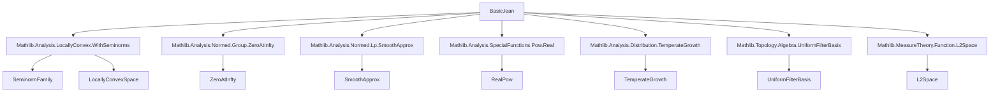
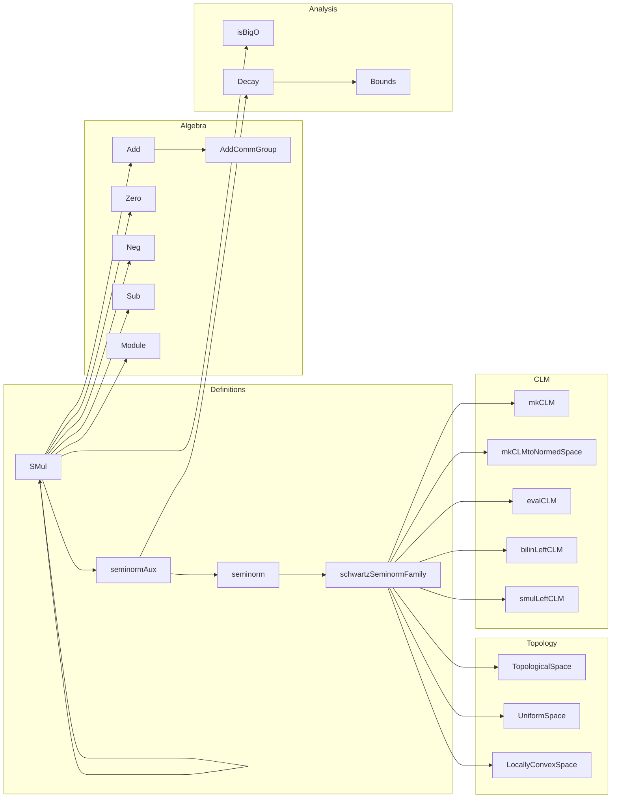

Here is the structured technical metadata extracted from the provided `Basic.lean` file:

---

### **1. Key Definitions & Theorems**

| Name | Type / Signature | Purpose |
|------|------------------|---------|
| `SchwartzMap` | `structure` | Defines Schwartz functions: smooth maps $ f : E \to F $ such that all derivatives decay faster than any polynomial. |
| `SchwartzMap.seminormAux` | `ℕ × ℕ → 𝓢(E, F) → ℝ` | Auxiliary seminorm: best constant $ C $ in $ \|x\|^k \cdot \|\partial^n f(x)\| \le C $. |
| `SchwartzMap.seminorm` | `ℕ × ℕ → Seminorm 𝕜 𝓢(E, F)` | Actual seminorm on Schwartz space, derived from `seminormAux`. |
| `schwartzSeminormFamily` | `SeminormFamily 𝕜 𝓢(E, F) (ℕ × ℕ)` | Family of all Schwartz seminorms. |
| `SchwartzMap.compCLM` *(not shown in snippet but mentioned in docstring)* | `𝓢(D, E) →L[𝕜] 𝓢(E, F)` | Composition with a temperate function (right action), continuous linear. |
| `SchwartzMap.integralCLM` *(docstring only)* | `𝓢(ℝ, F) →L[ℝ] F` | Integration over $ \mathbb{R} $, continuous linear. |
| `SchwartzMap.one_add_le_sup_seminorm_apply` | `theorem` | Uniform bound: $ (1 + \|x\|)^k \cdot \|\partial^n f(x)\| \le C \cdot \sup_{(k',n') \le (k,n)} p_{k',n'}(f) $. |
| `SchwartzMap.instIsUniformAddGroup` | `instance` | Schwartz space is a uniform additive group. |
| `SchwartzMap.instLocallyConvexSpace` | `instance` | Schwartz space is a locally convex topological vector space. |
| `SchwartzMap.mkCLM`, `SchwartzMap.mkCLMtoNormedSpace` | `def` | General constructions of continuous (semi)linear maps between Schwartz spaces. |
| `SchwartzMap.smulLeftCLM` | `def` | Multiplication by a temperate function $ g $, as a continuous linear operator on $ \mathcal{S}(E, F) $. |
| `SchwartzMap.bilinLeftCLM` | `def` | Bilinear pairing with a fixed temperate function, as a continuous linear map. |
| `SchwartzMap.evalCLM` | `def` | Evaluation at a vector $ m \in F $, as a continuous linear map $ \mathcal{S}(E, \mathrm{Hom}(F,G)) \to \mathcal{S}(E,G) $. |

---

### **2. Naming Conventions**

- **Structure fields**: `toFun`, `smooth'`, `decay'`
- **Auxiliary definitions**: `seminormAux`, `bounds_nonempty`, `decay_add_le_aux`, `decay_neg_aux`, `decay_smul_aux`
- **Seminorms**: `seminormAux`, `seminorm`, `schwartzSeminormFamily`
- **Algebraic operations**: `instSMul`, `instAdd`, `instNeg`, `instZero`, `instSub`, `instAddCommGroup`, `instModule`
- **Continuous linear maps**: `mkCLM`, `mkCLMtoNormedSpace`, `bilinLeftCLM`, `smulLeftCLM`, `evalCLM`
- **Properties**: `isBigO_cocompact_rpow`, `one_add_le_sup_seminorm_apply`, `norm_iteratedFDeriv_le_seminorm`
- **Topology**: `instTopologicalSpace`, `instContinuousSMul`, `instIsTopologicalAddGroup`, `instLocallyConvexSpace`

Prefixes/suffixes:
- `inst*`: typeclass instances (`instAdd`, `instSMul`, etc.)
- `seminorm*`: seminorm-related definitions
- `*Aux`: auxiliary lemmas used in proofs
- `*CLM`: continuous linear maps (CLM = Continuous Linear Map)
- `*At`: pointwise properties (`contDiffAt`, `differentiableAt`)
- `coe*`: coercion-related (`coe_zero`, `coeHom`)

---

### **3. Tactic Stack**

Frequently used tactics:
- `simp`, `rw`, `grw` (rewrite with `simp`-like behavior)
- `gcongr`, `move_mul`, `norm_cast`
- `cases`, `rcases`, `obtain`
- `exact`, `refine`, `apply`
- `linarith`, ` positivity`, `ring`
- `grw`, `push_cast`, `norm_num`
- `have`, `suffices`, `calc`
- `fun_prop`, `grind`, `grw` (custom tactics from mathlib for smoothness, asymptotics, etc.)

---

### **4. Proof Logic**

- **Structure definitions**: Use `structure` with `toFun`, `smooth'`, `decay'`.
- **Decay property**: Prove existence of bounds via `decay'`, then refine to positive bounds using `max C 1`.
- **Seminorms**: Defined as `sInf` over bounding constants; properties derived via `csInf_le`, `le_csInf`.
- **Algebraic closure**: Prove closure under addition, scalar mult, negation by constructing witnesses for `decay'` using lemmas like `decay_add_le_aux`, `decay_smul_aux`.
- **Continuity**: Prove continuity of linear maps using `mkCLM`, bounding derivatives via `seminorm_le_bound` and `one_add_le_sup_seminorm_apply`.
- **Topology**: Induced by seminorm family via `moduleFilterBasis.topology'`, then use `WithSeminorms.toLocallyConvexSpace`.
- **Asymptotics**: Use `isBigO_cocompact_rpow`, `isBigO_cocompact_zpow` to relate decay to big-O at infinity.

Induction is used in `one_add_le_sup_seminorm_apply` (binomial expansion), and `Finset` induction for sums.

---

### **5. Imports**

Primary dependencies:
- `Mathlib.Analysis.LocallyConvex.WithSeminorms`
- `Mathlib.Analysis.Normed.Group.ZeroAtInfty`
- `Mathlib.Analysis.Normed.Lp.SmoothApprox`
- `Mathlib.Analysis.SpecialFunctions.Pow.Real`
- `Mathlib.Analysis.Distribution.TemperateGrowth`
- `Mathlib.Topology.Algebra.UniformFilterBasis`
- `Mathlib.MeasureTheory.Function.L2Space`

Core mathlib modules used:
- `ContDiff`, `Asymptotics`, `Seminorm`, `UniformSpace`, `Topology.Algebra.Module`, `Analysis.Normed`, `MeasureTheory`.

---

### **6. Mermaid Diagrams**

#### **Dependency Graph (High-Level)**

#### **Overview of `Basic.lean` Structure**

---

Let me know if you'd like a formalized dependency graph in `lean` or a more detailed breakdown of specific sections (e.g., `CLM`, `Seminorms`).
