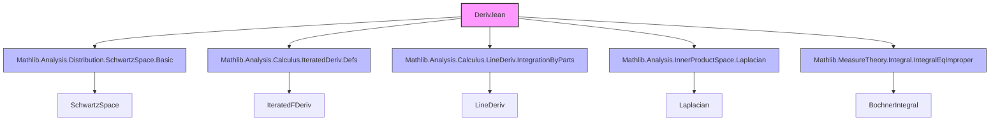

**Technical Brief: Derivatives of Schwartz Functions (`Deriv.lean`)**  
*Based on Lean 4 formalization in Mathlib*

---

### 1. KEY DEFINITIONS & THEOREMS

| Name | Type / Signature | Purpose |
|------|------------------|---------|
| `derivCLM` | `𝓢(ℝ, F) →L[𝕜] 𝓢(ℝ, F)` | Continuous $𝕜$-linear derivative operator on 1D Schwartz space. |
| `fderivCLM` | `𝓢(E, F) →L[𝕜] 𝓢(E, E →L[ℝ] F)` | Continuous $𝕜$-linear Fréchet derivative operator on Schwartz maps $E \to F$. |
| `lineDerivOp` (`∂_{m} f`) | `E → 𝓢(E, F) → 𝓢(E, F)` | Directional derivative in direction $m \in E$, defined via `fderivCLM` and evaluation. |
| `laplacian` (`Δ f`) | `𝓢(E, F) → 𝓢(E, F)` | Laplacian on Schwartz maps, defined via `laplacianCLM` and orthonormal basis sum. |
| `iteratedLineDerivOp_eq_iteratedFDeriv` | `∂^{m} f x = iteratedFDeriv ℝ n f x m` | Identifies iterated directional derivatives with iterated Fréchet derivatives applied to a tuple of directions. |
| `laplacian_eq_sum` | `Δ f = ∑ᵢ ∂_{b i} (∂_{b i} f)` | Laplacian equals sum of second directional derivatives over any orthonormal basis. |
| `integral_bilinear_lineDerivOp_right_eq_neg_left` | `∫ L(f, ∂_v g) = -∫ L(∂_v f, g)` | Integration by parts for directional derivatives with bilinear maps. |
| `integral_bilinear_laplacian_right_eq_left` | `∫ L(f, Δ g) = ∫ L(Δ f, g)` | Integration by parts for the Laplacian (no sign change due to two derivatives). |

---

### 2. NAMING CONVENTIONS

- **Prefixes**:
  - `derivCLM`, `fderivCLM`, `lineDerivOpCLM`: denote *continuous linear maps* (CLM) representing derivatives.
  - `tsupport_`: properties of *topological support* under derivative operations.
  - `integral_bilinear_...`: integration-by-parts theorems for bilinear pairings.
  - `iteratedLineDerivOp_...`: iterated directional derivatives.

- **Suffixes**:
  - `_right_eq_neg_left`, `_right_eq_left`: indicate position of derivative (right argument) and sign.
  - `_subset`: support inclusion statements.
  - `_apply`: pointwise evaluation identities (e.g., `derivCLM_apply`, `fderivCLM_apply`).

- **Notation**:
  - `∂_{m} f`: directional derivative in direction $m$.
  - `∂^{m} f`: iterated directional derivative along a finite sequence $m : \text{Fin } n \to E$.
  - `Δ f`: Laplacian.

---

### 3. TACTIC STACK

Frequently used tactics in proofs:
- `simp` / `simp_rw`: simplification with definitions and lemmas (e.g., `simp only [...]` for seminorms).
- `rw`: rewriting using equalities like `iteratedLineDerivOp_succ_left`.
- `induction ... with | zero | succ => ...`: structural induction on natural numbers.
- `ext`: extensionality to prove equality of functions.
- `simpa`: simplification with target simplification (e.g., `simpa using ...`).
- `exact`, `apply`, `intro`: basic proof construction.
- `ring`, `linarith`: for norm/inequality reasoning (less frequent here).
- `aesop`: for automated goal solving (not explicitly used here, but likely in dependent files).

---

### 4. PROOF LOGIC

- **Inductive structure**: Many proofs (e.g., `iteratedLineDerivOp_eq_iteratedFDeriv`, `tsupport_iteratedLineDerivOp_subset`) proceed by induction on `n : ℕ`.
- **Reduction to known calculus**: Derivative identities reduce to standard calculus facts (`fderiv_add`, `deriv_add`, `hasFDerivAt`, `hasDerivAt`) and smoothness of Schwartz functions.
- **Support arguments**: Use monotonicity of support under differentiation (`tsupport_fderiv_subset`, `tsupport_lineDerivOp_subset`) and induction for iterated derivatives.
- **Integration by parts**: Derived from general theorems for functions with derivatives (`integral_bilinear_hasDerivAt_right_eq_neg_left_of_integrable`, `integral_bilinear_hasLineDerivAt_right_eq_neg_left_of_integrable`), verified via integrability and differentiability assumptions.
- **Laplacian computations**: Use orthonormal basis expansion (`laplacian_eq_sum`) and reduce to directional derivative integration-by-parts.

---

### 5. IMPORTS (PRIMARY DEPENDENCIES)

| Module | Role |
|--------|------|
| `Mathlib.Analysis.Distribution.SchwartzSpace.Basic` | Defines Schwartz space `𝓢(E, F)` and its topology/seminorms. |
| `Mathlib.Analysis.Calculus.IteratedDeriv.Defs` | Defines `iteratedFDeriv`, smoothness, and related calculus. |
| `Mathlib.Analysis.Calculus.LineDeriv.IntegrationByParts` | General integration-by-parts for line derivatives. |
| `Mathlib.Analysis.InnerProductSpace.Laplacian` | Laplacian definition and basic properties in inner product spaces. |
| `Mathlib.MeasureTheory.Integral.IntegralEqImproper` | Connects Bochner integral with improper Riemann integrals (for 1D case). |

---

### 6. DEPENDENCY & OVERVIEW DIAGRAM

#### Overview of `Deriv.lean`:

- **Goal**: Formalize calculus of Schwartz functions (`𝓢(E, F)`) — derivatives, Laplacian, and integration by parts.
- **Structure**:
  1. **Derivatives**: Define `derivCLM`, `fderivCLM`, `lineDerivOp`, and prove they preserve Schwartz class.
  2. **Support**: Show derivatives do not enlarge support (`tsupport_..._subset`).
  3. **Laplacian**: Define as instance of `Laplacian` typeclass; prove basis-independent formula.
  4. **Integration by Parts**: Prove sign/negativity patterns for 1D, directional, and Laplacian cases.

---

### 7. NOTATION & TYPECLASS INSTANCES

- `LineDeriv E 𝓢(E, F) 𝓢(E, F)`: Directional derivative as a linear operator on Schwartz space.
- `Laplacian 𝓢(E, F) 𝓢(E, F)`: Laplacian as an endomorphism on Schwartz space.
- `SMulCommClass ℝ 𝕜 F`: Ensures compatibility of real and scalar multiplication for derivative rules.
- `RCLike 𝕜`: Ensures $𝕜 = ℝ$ or $ℂ$, needed for continuity and linearity.

---

### 8. SUMMARY

This file formalizes the *calculus of Schwartz functions* in infinite-dimensional (but finite-dimensional domain) settings, with emphasis on:
- Preservation of Schwartz class under differentiation,
- Equivalence of iterated directional and Fréchet derivatives,
- Support control,
- Laplacian as sum of second derivatives,
- Integration by parts for derivatives and Laplacian.

It serves as a foundational module for distribution theory, PDEs on Schwartz spaces, and Fourier analysis in Lean.
