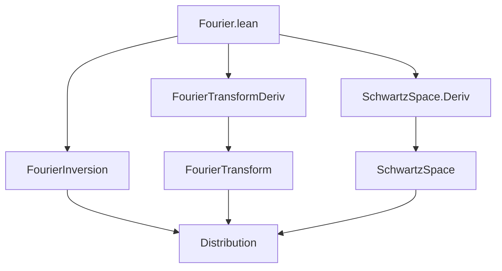
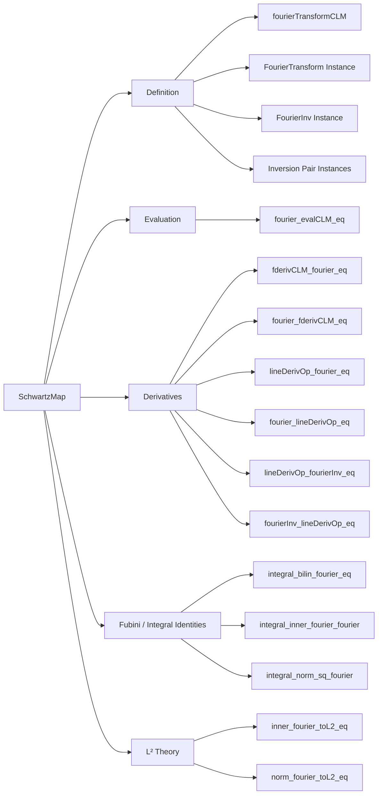

**Technical Brief: Fourier Transform on Schwartz Functions (Lean 4 File: `Fourier.lean`)**  
*Based on the provided source file, authored by Sébastien Gouëzel and Moritz Doll (2024)*

---

### 1. KEY DEFINITIONS & THEOREMS

| Name | Type / Signature | Purpose |
|------|------------------|---------|
| `fourierTransformCLM` | `𝓢(V, E) →L[𝕜] 𝓢(V, E)` | Defines the Fourier transform as a **continuous linear map** on the Schwartz space. |
| `instFourierTransform` | `FourierTransform 𝓢(V, E) 𝓢(V, E)` | Instance giving `𝓕 : 𝓢(V, E) → 𝓢(V, E)` as the coercion of `fourierTransformCLM`. |
| `instFourierTransformInv` | `FourierTransformInv 𝓢(V, E) 𝓢(V, E)` | Defines the inverse Fourier transform via composition with negation. |
| `instFourierPair`, `instFourierInvPair` | `FourierPair`, `FourierInvPair` | Encode the Fourier inversion theorems: `𝓕⁻ ∘ 𝓕 = id`, `𝓕 ∘ 𝓕⁻ = id`. |
| `fderivCLM_fourier_eq` | `fderivCLM (𝓕 f) = 𝓕 (-(2πi) • smulRightCLM (innerSL ℝ) f)` | Derivative of Fourier transform = Fourier transform of multiplication by $-(2\pi i)\cdot\mathrm{inner}$. |
| `fourier_fderivCLM_eq` | `𝓕 (fderiv f) = (2πi) • smulRightCLM (innerSL ℝ) (𝓕 f)` | Fourier transform of derivative = multiplication by $(2\pi i)\cdot\mathrm{inner}$. |
| `lineDerivOp_fourier_eq` | `∂_m (𝓕 f) = 𝓕 (-(2πi) • smulLeftCLM (inner ℝ · m) f)` | Line derivative in direction $m$ commutes with Fourier transform up to multiplication. |
| `fourier_lineDerivOp_eq` | `𝓕 (∂_m f) = (2πi) • smulLeftCLM (inner ℝ · m) (𝓕 f)` | Fourier transform of line derivative = multiplication by $(2\pi i)\cdot\mathrm{inner}(\cdot,m)$. |
| `integral_bilin_fourier_eq` | `∫ ξ, M (𝓕 f ξ) (g ξ) = ∫ x, M (f x) (𝓕 g x)` | Fourier transform is **self-adjoint** w.r.t. any continuous bilinear form $M$. |
| `integral_inner_fourier_fourier` | `∫ ξ, ⟪𝓕 f ξ, 𝓕 g ξ⟫ = ∫ x, ⟪f x, g x⟫` | **Plancherel’s theorem** for Schwartz functions (inner product version). |
| `integral_norm_sq_fourier` | `∫ ‖𝓕 f‖² = ∫ ‖f‖²` | **Parseval/Plancherel identity** for $L^2$-norms. |
| `inner_fourier_toL2_eq` | `⟪𝓕 f, 𝓕 g⟫_{L^2} = ⟪f, g⟫_{L^2}` | Fourier transform extends to a unitary on $L^2$. |

> **Note**: `𝓕` denotes the Fourier transform; `𝓕⁻` its inverse.

---

### 2. NAMING CONVENTIONS

- **Prefixes**:
  - `fourier_`: core Fourier transform properties (`fourier_coe`, `fourier_fderivCLM_eq`, `fourierInv_apply_eq`)
  - `integral_`: bilinear/sesquilinear integral identities (`integral_bilin_fourier_eq`, `integral_inner_fourier_fourier`)
  - `lineDerivOp_`: directional derivatives (`lineDerivOp_fourier_eq`, `lineDerivOp_fourierInv_eq`)
  - `fderivCLM_`: Fréchet derivative in continuous linear map sense
- **Suffixes**:
  - `_eq`: equality statements (e.g., `fourier_fderivCLM_eq`)
  - `_CLM`: continuous linear maps (`fourierTransformCLM`, `evalCLM`)
  - `_smul`, `_mul`, `_inner`: specific bilinear/sesquilinear operations
- **`inst` prefix**: typeclass instances (`instFourierTransform`, `instContinuousFourier`, etc.)

---

### 3. TACTIC STACK

| Tactic | Usage Frequency | Purpose |
|--------|-----------------|---------|
| `ext` | Very High | Extensionality for functions, integrals, equalities in Schwartz space |
| `simp` / `simp_rw` | High | Simplification using definitions (`fourier_eq`, `fourierInv_apply_eq`, etc.) |
| `rw` | High | Rewriting with lemmas (e.g., inversion, evaluation, continuity) |
| `change` | Medium | Re-expressing goals to match known lemmas |
| `gcongr` | Medium | Handling inequalities in seminorm bounds (in `fourierTransformCLM` definition) |
| `convert` | Medium | Upgrading equalities via intermediate terms (e.g., `integral_bilin_fourierInv_eq`) |
| `have : … := by fun_prop` | Medium | Proving temperate growth conditions for inner products |
| `exact`, `apply`, `refine` | Medium | Constructing proofs, especially in seminorm estimates |
| `simpa` | Medium | Simplifying using assumptions (e.g., `simpa using ...`) |
| `ring`, `norm_num` | Low | Arithmetic simplifications (rarely needed due to symbolic constants like `2 * π`) |

---

### 4. PROOF LOGIC

- **Definition Phase** (`section definition`):
  - Construct `fourierTransformCLM` via `mkCLM`, verifying:
    - Additivity, homogeneity, continuity (via `contDiff_fourier`)
    - Seminorm bounds using integrability and growth estimates (`integrable_pow_mul`, `pow_mul_norm_iteratedFDeriv_fourier_le`)
  - Build typeclass instances (`FourierTransform`, `FourierPair`, etc.) using inversion theorems from distribution theory (`f.continuous.fourierInv_fourier_eq`).

- **Derivative Calculus** (`section deriv`):
  - Use known calculus lemmas (`fderiv_fourier`, `fourier_fderiv`) and evaluate at points.
  - Apply `fourier_evalCLM_eq` to commute Fourier transform with evaluation maps.
  - Use `hasTemperateGrowth` lemmas for inner products to simplify `smulLeftCLM`/`smulRightCLM`.

- **Integral Identities** (`section fubini`):
  - Reduce to vector-valued Fourier integral identities (`VectorFourier.integral_bilin_fourierIntegral_eq_flip`).
  - Use `fourierInv_apply_eq` and inversion theorems to derive inverse Fourier versions.
  - For Plancherel, specialize sesquilinear form to inner product (`innerSL ℂ`).

- **$L^2$ Theory** (`section L2`):
  - Derive unitarity of Fourier transform on $L^2$ via inner product preservation.
  - Use `toLp` coercion and `norm_eq_sqrt_re_inner` to lift to Hilbert space norms.

---

### 5. IMPORTS & DEPENDENCIES

| Module | Role |
|--------|------|
| `Mathlib.Analysis.Distribution.SchwartzSpace.Deriv` | Derivatives and smoothness in Schwartz space |
| `Mathlib.Analysis.Fourier.FourierTransformDeriv` | Derivative rules for Fourier transform |
| `Mathlib.Analysis.Fourier.Inversion` | Fourier inversion theorems (key for `FourierPair`) |

> **Core dependencies**: `RCLike`, `NormedSpace`, `InnerProductSpace`, `MeasureTheory`, `SMulCommClass`, `CompleteSpace`, `BorelSpace`, `FiniteDimensional`.

---

### 6. MERMAID DIAGRAMS

#### Dependency Graph (Module-Level)

#### Overview of File Structure

---

### 7. SUMMARY

This file formalizes the **Fourier analysis on Schwartz functions** over a finite-dimensional real inner product space $V$, taking values in a complex normed space $E$. It:

- Constructs the Fourier transform as a **continuous linear isomorphism** on the Schwartz space,
- Proves **derivative/multiplication duality** (Fourier transform turns derivatives into multiplication and vice versa),
- Establishes **self-adjointness** and **Plancherel’s theorem** (unitarity on $L^2$),
- Uses a uniform, typeclass-based interface (`FourierTransform`, `FourierPair`, etc.) for future extensions.

The proofs rely heavily on:
- Integrability and smoothness properties of Schwartz functions,
- Vector-valued Fourier integral estimates,
- Fubini-type theorems for bilinear/sesquilinear forms,
- Inversion theorems from distribution theory.

This is foundational for harmonic analysis on locally compact abelian groups and PDEs in Lean.
