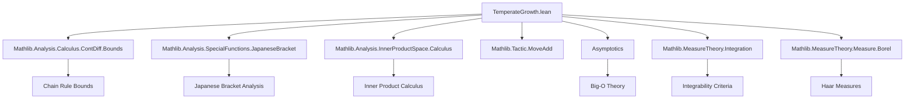

### Technical Brief: `TemperateGrowth.lean`

---

#### **1. Key Definitions & Theorems**

| Name | Type / Signature | Purpose |
|------|------------------|---------|
| `HasTemperateGrowth` | `f : E → F → Prop` | Defines a function to have *temperate growth*: smooth (`ContDiff ℝ ∞`) and all iterated Fréchet derivatives are *polynomially bounded*. |
| `hasTemperateGrowth_iff_isBigO` | `f.HasTemperateGrowth ↔ ...` | Equivalence between polynomial boundedness of derivatives and Big-O notation w.r.t. the `⊤` filter (i.e., global bounds). |
| `HasTemperateGrowth.isBigO` | `hf → n → ∃ k, iteratedFDeriv n f =O[⊤] (1 + ‖·‖)^k` | Extracts the Big-O bound for each derivative order. |
| `HasTemperateGrowth.isBigO_uniform` | `hf → N → ∃ k, ∀ n ≤ N, iteratedFDeriv n f =O[⊤] (1 + ‖·‖)^k` | Uniform bound over all derivatives up to order `N`. |
| `HasTemperateGrowth.norm_iteratedFDeriv_le_uniform` | `hf → n → ∃ k C, ∀ N ≤ n, x, ‖iteratedFDeriv N f x‖ ≤ C * (1 + ‖x‖)^k` | Explicit quantitative version of uniform polynomial bounds. |
| `HasTemperateGrowth.comp'` | `f, g, t, ht, ht', hg₁, hg₂, hf → (g ∘ f).HasTemperateGrowth` | Composition theorem: if `g` has temperate growth *on the range of `f`*, and `f` has temperate growth, then `g ∘ f` does too. |
| `HasTemperateGrowth.comp` | `hf, hg → (g ∘ f).HasTemperateGrowth` | Simplified composition for globally temperate `f`, `g`. |
| `HasTemperateGrowth.add`, `sub`, `neg`, `sum` | `f, g` temperate ⇒ `f ± g`, `-f`, `∑ f i` temperate | Closure under linear operations. |
| `HasTemperateGrowth.smul`, `mul`, `pow` | `f, g` temperate ⇒ `f • g`, `f * g`, `f ^ k` temperate | Closure under multiplication and scalar multiplication (via bilinear maps). |
| `HasTemperateGrowth.id`, `id'` | `id : E → E` has temperate growth | Identity function is temperate. |
| `ContinuousLinearMap.hasTemperateGrowth` | `f : E →L[ℝ] F → f.HasTemperateGrowth` | Continuous linear maps are temperate. |
| `hasTemperateGrowth_one_add_norm_sq_rpow` | `(x ↦ (1 + ‖x‖²)^r).HasTemperateGrowth` | Bessel potential functions are temperate (requires careful local analysis near 0). |
| `HasTemperateGrowth` (measure) | `μ : Measure E → Prop` | A measure has temperate growth if `(1 + ‖x‖)^(-n)` is integrable for some `n`. |
| `integrablePower` | `μ → ℕ` | Choice of exponent `n` witnessing temperate growth. |
| `HasTemperateGrowth.exists_eLpNorm_lt_top` | `μ.HasTemperateGrowth → ∃ k, ‖(1 + ‖·‖)^(-k)‖_{L^p(μ)} < ∞` | Tempered measures have polynomially decaying tails in all `L^p` spaces. |

---

#### **2. Naming Conventions**

- **Prefixes**:
  - `HasTemperateGrowth.`: Predicate for functions or measures.
  - `norm_iteratedFDeriv_le_`: Bounds on norms of iterated derivatives.
  - `isBigO_`: Big-O characterizations.
  - `comp`, `comp'`: Composition lemmas (`comp'` is more general, uses `Set.range f ⊆ t`).
  - `of_fderiv`: Proving temperate growth of `f` from that of `fderiv f`.
- **Suffixes**:
  - `_uniform`: Uniform bounds over a finite range of derivative orders.
  - `_aux`: Deprecated alias (e.g., `norm_iteratedFDeriv_le_uniform_aux`).
- **Attribute annotations**:
  - `@[fun_prop]`: Marks lemmas as *functorial properties* (used by `fun_prop` tactic).
  - `@[to_fun (attr := fun_prop)]`: Marks operations preserving the property.

---

#### **3. Tactic Stack**

Frequent tactics used in proofs:

| Tactic | Role |
|--------|------|
| `simp_rw` | Rewriting with simplification (especially for `isBigO`, norms, powers). |
| `gcongr` | Goal-directed congruence for inequalities (used heavily in norm estimates). |
| `grind` | Custom simplifier for real arithmetic and inequalities (likely defined in the file or imported). |
| `ring` | Polynomial simplification (e.g., in `comp` proof). |
| `filter_upwards` | For almost-everywhere statements (measure theory). |
| `cases` / `rcases` | Decomposing existential hypotheses. |
| `choose` | Extracting witnesses from `∀ ∃` statements. |
| `grw` | Goal-directed rewriting (custom tactic, likely from `Mathlib.Tactic`). |
| `mod_cast` | Typeclass casting for numeric types. |
| ` positivity` | Automated positivity proofs. |
| `aesop` | Not explicitly used here, but `grind` likely subsumes its role. |

---

#### **4. Proof Logic**

- **Structure of proofs**:
  - Most lemmas follow a *two-step pattern*:
    1. Prove smoothness (`ContDiff ℝ ∞`) using `contDiff_const`, `contDiff.add`, `contDiff.comp`, etc.
    2. Prove polynomial boundedness of derivatives using:
       - `hasTemperateGrowth_iff_isBigO` to reduce to Big-O,
       - `isBigO_uniform` for uniform bounds,
       - `norm_iteratedFDeriv_le_uniform` for explicit constants,
       - `norm_iteratedFDeriv_comp_le'` for chain rule estimates in composition.
- **Induction**:
  - Used in `HasTemperateGrowth.sum` (Finset induction) and `HasTemperateGrowth.pow` (natural number induction).
- **Case analysis**:
  - In `hasTemperateGrowth_one_add_norm_sq_rpow`, case split on `0 ≤ r - n` to handle growth vs decay.
- **Measure-theoretic arguments**:
  - Use `integrable_of_le_of_pow_mul_le` and `integral_pow_mul_le_of_le_of_pow_mul_le` to deduce integrability from pointwise bounds.
  - Rely on `exists_eLpNorm_lt_top` to lift temperate measures to `L^p` settings.

---

#### **5. Imports & Dependencies**

| Module | Purpose |
|--------|---------|
| `Mathlib.Analysis.Calculus.ContDiff.Bounds` | Bounds on derivatives, chain rule estimates (`norm_iteratedFDeriv_comp_le'`). |
| `Mathlib.Analysis.SpecialFunctions.JapaneseBracket` | Japanese bracket `(1 + ‖x‖²)` and related analysis. |
| `Mathlib.Analysis.InnerProductSpace.Calculus` | Calculus in inner product spaces (e.g., `inner`, `norm_sq`). |
| `Mathlib.Tactic.MoveAdd` | Tactics for additive groups (used in norm manipulations). |
| `Asymptotics` | Big-O notation (`=O[⊤]`), filter-based asymptotics. |
| `Mathlib.MeasureTheory.Integration` | Integrability, `L^p` norms, `eLpNorm`. |
| `Mathlib.MeasureTheory.Measure.Borel` | Borel σ-algebras, Haar measures. |

---

#### **6. Mermaid Diagrams**

##### **Dependency Graph (High-Level)**



##### **Overview of Theory Flow**

```mermaid
flowchart LR
  subgraph Functions
    F1[HasTemperateGrowth f] --> F2[Smoothness]
    F1 --> F3[Polynomial Bounds on Derivatives]
    F3 --> F4[Big-O Characterization]
    F4 --> F5[Composition]
    F4 --> F6[Linear Ops: +, -, sum]
    F4 --> F7[Multiplication: smul, mul, pow]
  end

  subgraph Measures
    M1[HasTemperateGrowth μ] --> M2[Integrability of (1+‖x‖)^(-n)]
    M2 --> M3[Existence of integrablePower]
    M3 --> M4[L^p Integrability]
  end

  F5 --> F5a[Applications: PDEs, distributions]
  M4 --> M4a[Applications: Tempered distributions, Fourier analysis]
```

---

#### **7. Summary**

This file formalizes the theory of *temperate growth* for functions and measures in the context of infinite-dimensional analysis (Banach/inner product spaces). It provides:

- A robust framework for smooth functions with polynomially bounded derivatives.
- Closure properties under composition, addition, multiplication, and scalar multiplication.
- Measure-theoretic analogues: integrability of polynomially decaying functions.
- Applications to `L^p` theory and asymptotic analysis.

The formalization is highly structured, leveraging `fun_prop` attributes and custom tactics (`grind`, `grw`) to automate routine estimates. It serves as a foundation for further work in distribution theory, PDEs, and harmonic analysis in infinite dimensions.

--- 

Let me know if you'd like a formalization roadmap or a list of lemmas ready for automation (e.g., `fun_prop`-friendly lemmas).
