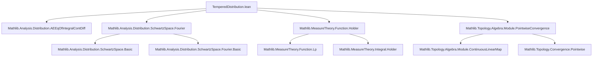

### Technical Brief: `TemperedDistribution.lean`

---

#### **1. Key Definitions & Theorems**

| Name | Type / Signature | Purpose |
|------|------------------|---------|
| `TemperedDistribution E F` | `𝓢(E, ℂ) →Lₚₜ[ℂ] F` | Space of continuous linear maps from Schwartz functions to a normed space $F$, equipped with the **pointwise convergence topology** (i.e., topology of uniform convergence on compact sets is *not* used). |
| `MeasureTheory.Measure.toTemperedDistribution` | `μ : Measure E → μ.HasTemperateGrowth → 𝓢'(E, ℂ)` | Embeds a measure of temperate growth into tempered distributions via integration: $g \mapsto \int g \, d\mu$. |
| `Function.HasTemperateGrowth.toTemperedDistribution` | `f.HasTemperateGrowth → 𝓢'(E, F)` | Embeds a function of temperate growth via $g \mapsto \int g \cdot f \, d\mu$. |
| `SchwartzMap.toTemperedDistributionCLM` | `𝓢(E, F) →L[ℂ] 𝓢'(E, F)` | Canonical continuous linear embedding of Schwartz functions into tempered distributions. |
| `MeasureTheory.Lp.toTemperedDistribution` | `Lp F p μ → 𝓢'(E, F)` | Embeds $L^p$-functions ($p \ge 1$) into tempered distributions via Hölder pairing. |
| `TemperedDistribution.smulLeftCLM` | `(g : E → ℂ) → 𝓢'(E, F) →L[ℂ] 𝓢'(E, F)` | Multiplication by a temperate growth function $g$ as a continuous linear operator on distributions. |
| `TemperedDistribution.instLineDeriv` | `LineDeriv E 𝓢'(E, F) 𝓢'(E, F)` | Directional derivative $\partial_m$ on tempered distributions, defined dually via $-\partial_m$ on Schwartz functions. |
| `TemperedDistribution.laplacianCLM` | `𝓢'(E, F) →L[ℂ] 𝓢'(E, F)` | Distributional Laplacian, defined via sum of second directional derivatives. |
| `TemperedDistribution.fourierCLM` (alias `fourier`) | `𝓕 : 𝓢'(E, F) →L[ℂ] 𝓢'(E, F)` | Fourier transform on tempered distributions, defined dually via Fourier transform on Schwartz functions. |
| `TemperedDistribution.delta` | `E → 𝓢'(E, ℂ)` | Dirac delta at point $x$, defined via evaluation at $x$. |
| `fourier_delta_zero` | `𝓕 (delta 0) = volume.toTemperedDistribution` | Fourier transform of delta at 0 is the constant function 1 (as a distribution). |

**Key Theorems (Proofs):**
- `toTemperedDistribution_apply`, `toTemperedDistributionCLM_apply_apply`, `Lp.toTemperedDistribution_apply`: All verify action on test functions via integrals.
- `smulLeftCLM_smulLeftCLM_apply`, `smulLeftCLM_add`, etc.: Algebraic properties of multiplication operators.
- `lineDerivOp_toTemperedDistributionCLM_eq`, `laplacian_toTemperedDistributionCLM_eq`, `fourier_toTemperedDistributionCLM_eq`: Compatibility of classical operators with distributional ones on Schwartz functions.
- `fourierInv_fourier_eq`, `fourier_fourierInv_eq`: Fourier inversion on tempered distributions.
- `lineDerivOp_fourier_eq`, `fourier_lineDerivOp_eq`, etc.: Interactions between Fourier transform and derivatives/multiplication.

---

#### **2. Naming Conventions**

- **Prefixes:**
  - `toTemperedDistribution`: Embedding into tempered distributions.
  - `smulLeftCLM`, `derivCLM`, `laplacianCLM`, `fourierCLM`: Continuous linear maps.
  - `lineDerivOp`, `laplacian`, `fourier`: Operations on distributions (often overloaded via typeclasses).
- **Suffixes:**
  - `_apply`, `_apply_apply`: Simplification lemmas for evaluation on test functions.
  - `_eq`: Theorems stating equality of two constructions (e.g., classical vs distributional).
- **Typeclass instances:**
  - `instLineDeriv`, `instFourierTransform`, `instCoeToTemperedDistribution`: Instance naming follows Lean conventions.

---

#### **3. Tactic Stack**

- **Core tactics:** `rfl`, `simp`, `ext`, `congr`, `aesop`
- **Analysis-specific:**
  - `filter_upwards`, `integral_congr_ae`, `ae_eq_zero_of_integral_contDiff_smul_eq_zero`
  - `fun_prop`, `norm_num`, `field_simp`, `ring`, `linarith`
- **Topology/functional analysis:**
  - `PointwiseConvergenceCLM.continuous_of_continuous_eval`
  - `ContinuousLinearMap.coe_coe`, `LinearMap.ker_eq_bot'`
- **Measure theory:**
  - `volume_tac`, `haveI := Fact.mk ...`, `apply ae_eq_zero_of_integral_contDiff_smul_eq_zero`

---

#### **4. Proof Logic**

- **Duality-based reasoning:** Most definitions and proofs rely on duality: define operations on distributions by dualizing operations on Schwartz functions (e.g., $\partial_m f(g) := -f(\partial_m g)$).
- **Uniform convergence on compact sets (pointwise convergence topology):** Used to ensure continuity of linear maps via `PointwiseConvergenceCLM.continuous_of_continuous_eval`.
- **Integral identities:** Many proofs reduce to verifying integral identities (e.g., integration by parts, change of variables), often using `integral_congr_ae` and properties of $L^p$-functions.
- **Compatibility lemmas:** Prove that classical operators (e.g., derivative, Laplacian, Fourier transform) agree with their distributional counterparts on Schwartz functions.
- **Induction/finite sums:** Used in Laplacian and Fourier derivative identities (e.g., `SchwartzMap.laplacian_eq_sum`).
- **Measure-theoretic arguments:** For kernels and injectivity (e.g., `ker_toTemperedDistributionCLM_eq_bot` uses local integrability and density of Schwartz functions).

---

#### **5. Imports & Dependencies**

| Module | Purpose |
|--------|---------|
| `Mathlib.Analysis.Distribution.AEEqOfIntegralContDiff` | Tools for equality of integrals involving smooth compactly supported functions. |
| `Mathlib.Analysis.Distribution.SchwartzSpace.Fourier` | Fourier theory on Schwartz space. |
| `Mathlib.MeasureTheory.Function.Holder` | Hölder conjugates, $L^p$-pairings. |
| `Mathlib.Topology.Algebra.Module.PointwiseConvergence` | Topology of pointwise convergence on function spaces; used to define `→Lₚₜ`. |

**Core dependencies:**
- `SchwartzMap`, `ContinuousLinearMap`, `MeasureTheory.Measure`, `MeasureTheory.Lp`
- `BoundedContinuousFunction`, `ContDiff`, `InnerProductSpace`, `FourierTransform`

---

#### **6. Mermaid Diagrams**

##### **Dependency Graph (Module-Level)**



##### **Overview of Theory Flow**

```mermaid
flowchart LR
  subgraph SchwartzSpace
    S[𝓢(E, ℂ)] -->|embedding| S'[𝓢'(E, F)]
  end

  subgraph Embeddings
    M[Measure μ of temperate growth] -->|∫·dμ| S'
    f[Function f of temperate growth] -->|∫·f dμ| S'
    Lp[Lp function] -->|Hölder pairing| S'
    S -->|toTemperedDistributionCLM| S'
  end

  subgraph Operators
    S' -->|smulLeftCLM g| S'
    S' -->|derivCLM| S'
    S' -->|laplacianCLM| S'
    S' -->|fourierCLM| S'
  end

  subgraph Special Distributions
    x[E] -->|delta x| S'
    dirac[Dirac measure] -->|toTemperedDistribution| delta
  end

  S -->|classical operators| S
  S' -->|distributional operators| S'
  S -.->|coincide on| S'
```

---

#### **7. Notation & Scoping**

- `𝓢'(E, F)` scoped in `SchwartzMap` as `notation "𝓢'(" E ", " F ")" => TemperedDistribution E F`
- `𝓕` for Fourier transform, `𝓕⁻` for inverse.
- `∂_{m}` for directional derivative (`lineDerivOp`).
- `Δ` for Laplacian (`laplacianCLM`).
- `delta x` for Dirac delta at $x$.

---

#### **8. Notes & Caveats**

- **Pointwise vs strong topology:** The authors explicitly choose the pointwise convergence topology (not the strong dual topology) because mathlib lacks results for Fréchet–Montel spaces (e.g., uniform boundedness principle fails).
- **Deprecations:** Several aliases (e.g., `fourierTransformCLM`, `delta`) are deprecated in favor of `fourierCLM`, `delta`, indicating ongoing API stabilization.
- **Finite-dimensionality assumptions:** Many results require `FiniteDimensional ℝ E`, especially for Laplacian/Fourier theory (e.g., to identify duals, use standard orthonormal bases).
- **Measure-theoretic technicalities:** `volume_tac` is used to synthesize `MeasurableSpace`, `BorelSpace`, and `SecondCountableTopology` structures.

--- 

This file forms a foundational part of distribution theory in Lean, enabling rigorous treatment of PDEs, Fourier analysis, and generalized functions in a functional-analytic setting.
