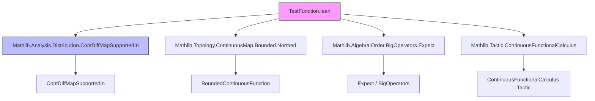

**Technical Metadata Brief: `TestFunction.lean`**

---

### 1. KEY DEFINITIONS & THEOREMS

| Name | Type / Signature | Purpose |
|------|------------------|---------|
| `TestFunction Ω F n` | `Type _` | Bundled $n$-times continuously differentiable maps $E \to F$ with compact support in open set $\Omega$. |
| `𝓓^{n}(Ω, F)` | Notation for `TestFunction Ω F n` | Standard notation for test function space of class $C^n$ with compact support in $\Omega$. |
| `𝓓(Ω, F)` | Notation for `TestFunction Ω F ⊤` | Space of smooth (i.e., $C^\infty$) test functions with compact support in $\Omega$. |
| `TestFunctionClass B Ω F n` | `class` | Abstract interface for types $B$ whose elements are $n$-times continuously differentiable maps $E \to F$ with compact support in $\Omega$. |
| `ofSupportedIn K_sub_Ω f` | `𝓓^{n}_{K}(E, F) → 𝓓^{n}(Ω, F)` | Canonical inclusion of compactly supported $C^n$ functions supported in $K \subseteq \Omega$ into global test functions. |
| `originalTop Ω F n` | `TopologicalSpace 𝓓^{n}(Ω, F)` | Original (non-locally-convex) topology: coinduced limit over compacts $K \subseteq \Omega$. |
| `topologicalSpace Ω F n` | `TopologicalSpace 𝓓^{n}(Ω, F)` | Canonical LF topology: finest locally convex topology coarser than `originalTop`. |
| `continuous_ofSupportedIn K_sub_Ω` | `Continuous (ofSupportedIn …)` | Inclusion maps from each $ \mathcal{D}^n_K $ are continuous. |
| `TestFunction.continuous_iff_continuous_comp` | `∀ K, Continuous (f ∘ ofSupportedIn K) ↔ Continuous f` | Universal property of LF topology: continuity of linear maps out of $\mathcal{D}^n(\Omega,F)$ is determined by compactly supported pieces. |
| `TestFunction.mkCLM` | Constructor for continuous linear maps out of $\mathcal{D}^n(\Omega,F)$ | Enables defining continuous linear maps by checking continuity on each $\mathcal{D}^n_K$. |
| `toBoundedContinuousFunctionCLM` | `𝓓^{n}(Ω, F) →L[𝕜] E →ᵇ F` | Continuous linear inclusion into bounded continuous functions. |
| `postcompCLM T` | `𝓓^{n}(Ω, F) →L[𝕜] 𝓓^{n}(Ω, F')` | Post-composition with a continuous linear map $T : F \to F'$. |

---

### 2. NAMING CONVENTIONS

- **Prefixes**:
  - `ofSupportedIn`: inclusion from compactly supported subspace.
  - `postcompCLM`: post-composition with a continuous linear map.
  - `toBoundedContinuousFunctionCLM`: coercion to bounded continuous functions.
- **Suffixes**:
  - `CLM`: *Continuous Linear Map* (e.g., `ofSupportedInCLM`, `toBoundedContinuousFunctionCLM`, `postcompCLM`).
  - `'` (prime): internal field in structure (e.g., `contDiff'`, `hasCompactSupport'`).
- **Predicates**:
  - `is_`, `has_`, `tsupport_`, `contDiff_`, `continuous_`, `bounded_`, `smul_`, `add_`, `sub_`, `neg_`, `zero_`, `mk_`, `copy_`, `ext_`, `coe_`, `of_`, `ofSupportedIn_`, `originalTop_`, `topologicalSpace_`, `continuous_iff_continuous_comp`.

---

### 3. TACTIC STACK

Frequent tactics used in proofs and instance derivations:

- `ext`, `ext'`, `DFunLike.ext`: extensionality for functions/structures.
- `simp`, `simp only`, `simp_rw`: simplification with definitional equalities.
- `rw`, `rwa`, `convert`: rewriting using lemmas.
- `exact`, `refine`, `apply`: proof construction.
- `cases`, `obtain`, `have`, `suffices`: case analysis and intermediate claims.
- `topologicalSpace_sInf`, `continuousSMul_sInf`, `topologicalAddGroup_sInf`: infrastructure for constructing locally convex topologies.
- `fun_prop`: proposition prover for continuity of function-space constructions.
- `fast_instance%`: fast path for instance synthesis (e.g., `AddCommGroup`, `Module`).
- `rwa [TestFunction.continuous_iff_continuous_comp]`: key for universal property arguments.
- `induction`, `induction'`: not heavily used here (no heavy induction on naturals).
- `aesop`, `linarith`, `ring`: minimal usage; mostly algebraic simplifications.

---

### 4. PROOF LOGIC

- **Structure-based reasoning**: proofs often proceed by destructuring `TestFunction` into its components (`toFun`, `contDiff'`, etc.) and reassembling via `mk` or `copy`.
- **Continuity arguments**: rely on universal property (`continuous_iff_continuous_comp`) — reduce to continuity on each $\mathcal{D}^n_K$, then use `continuous_ofSupportedIn` and `fun_prop`.
- **Topology construction**: use `sInf` over locally convex topologies satisfying algebraic constraints; then prove properties (e.g., `IsTopologicalAddGroup`, `ContinuousSMul`) via `sInf`-based lemmas.
- **Module/Algebra structure**: derived via `DFunLike.coe_injective.*` pattern — transport algebraic structure along injective coercion.
- **Support containment**: handled via `tsupport_*` lemmas (e.g., `tsupport_add`, `tsupport_comp_subset`) and subset transitivity.

---

### 5. IMPORTS

| Module | Purpose |
|--------|---------|
| `Mathlib.Analysis.Distribution.ContDiffMapSupportedIn` | Core theory of $C^n$ maps with compact support on compacts $K$; defines $\mathcal{D}^n_K(E,F)$ and its topology. |
| `Mathlib.Topology.ContinuousMap.Bounded.Normed` | Bounded continuous functions $E \to F$ as a normed space. |
| `Mathlib.Algebra.Order.BigOperators.Expect` | For expectation-like sums over finite sets (used in seminorm families). |
| `Mathlib.Tactic.ContinuousFunctionalCalculus` | Tools for functional calculus (used in continuity proofs). |

---

### 6. DEPENDENCY & THEORY OVERVIEW (Mermaid Diagrams)

#### **Dependency Graph (Top-Level)**



#### **Theory Flow Overview**

```mermaid
flowchart LR
  subgraph TheorySpace
    A[ContDiffMapSupportedIn K] -->|inclusion| B[TestFunction Ω F n]
    B -->|topology| C[LF topology]
    C -->|universal property| D[ContinuousLinearMap 𝓓^n → V]
    D -->|postcomposition| E[𝓓^n(Ω, F')]
    B -->|coercion| F[BoundedContinuousFunction E F]
    F -->|T3| G[TopologicalSpace]
  end

  style A fill:#bbf,stroke:#333
  style B fill:#f9f,stroke:#333
  style C fill:#9cf,stroke:#333
```

#### **Module Scope**

- **Primary theory**: Space of test functions $\mathcal{D}^n(\Omega, F)$, with LF topology.
- **Dual theory** (not in this file): Distributions $\mathcal{D}'(\Omega, F)$ = continuous dual of $\mathcal{D}^n(\Omega, F)$.
- **Related files** (implied): `Distribution.lean`, `ContDiffMapSupportedIn.lean`, `SeminormFamily.lean`.

---

### 7. KEY ALGEBRAIC & TOPOLOGICAL STRUCTURES

| Structure | Instance | Notes |
|----------|----------|-------|
| `AddCommGroup` | `AddCommGroup 𝓓^{n}(Ω, F)` | Via `DFunLike.coe_injective.addCommGroup`. |
| `Module R` | `Module R 𝓓^{n}(Ω, F)` | Requires `SMulCommClass ℝ R F`, `ContinuousConstSMul R F`. |
| `TopologicalSpace` | `topologicalSpace Ω F n` | LF topology: locally convex, inductive limit. |
| `UniformSpace` | `uniformSpace` | Right uniformity from `IsTopologicalAddGroup`. |
| `LocallyConvexSpace` | `LocallyConvexSpace ℝ 𝓓^{n}(Ω, F)` | Built into `topologicalSpace`. |
| `T3Space` | `T3Space 𝓓^{n}(Ω, F)` | Follows from injective continuous map into `E →ᵇ F`. |

---

### 8. TAGS & DOCUMENTATION

- **Tags**: `distributions`, `test function`, `LF topology`, `compact support`, `ContDiff`, `continuous linear map`, `inductive limit`, `locally convex space`.
- **Documentation style**: Formal, precise, with explicit notation (`𝓓^n`, `𝓓`), and usage notes (e.g., `see note [custom simps projection]`).

--- 

Let me know if you'd like a **dependency graph of definitions** (e.g., `TestFunctionClass` → `TestFunction`) or a **proof dependency DAG** for `continuous_iff_continuous_comp`.
